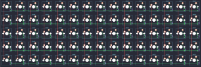

## punk75/punk75

[layout](punk75-kle.json) - [PCB](punk75.kicad_pcb)

{:loading="lazy"}

[Open in keyboard-layout-editor](http://www.keyboard-layout-editor.com/##@@_c=#777777;&=0,0&_c=#cccccc;&=0,1&=0,2&=0,3&=0,4&=0,5&=0,6&=0,7&=0,8&=0,9&=0,10&=0,11&=0,12&=0,13&_c=#aaaaaa;&=0,14;&@=1,0&_c=#cccccc;&=1,1&=1,2&=1,3&=1,4&=1,5&=1,6&=1,7&=1,8&=1,9&=1,10&=1,11&=1,12&=1,13&=1,14;&@_c=#aaaaaa;&=2,0&_c=#cccccc;&=2,1&=2,2&=2,3&=2,4&=2,5&_c=#aaaaaa;&=2,6&=2,7&=2,8&_c=#cccccc;&=2,9&=2,10&=2,11&=2,12&=2,13&_c=#777777;&=2,14;&@_c=#aaaaaa;&=3,0&_c=#cccccc;&=3,1&=3,2&=3,3&=3,4&=3,5&_c=#aaaaaa;&=3,6&_c=#777777;&=3,7&_c=#aaaaaa;&=3,8&_c=#cccccc;&=3,9&=3,10&=3,11&=3,12&=3,13&_c=#aaaaaa;&=3,14;&@=4,0&=4,1&=4,2&=4,3&_c=#cccccc;&=4,4&=4,5&_c=#777777;&=4,6&=4,7&=4,8&_c=#cccccc;&=4,9&=4,10&_c=#aaaaaa;&=4,11&=4,12&=4,13&=4,14)

{:loading="lazy"}

