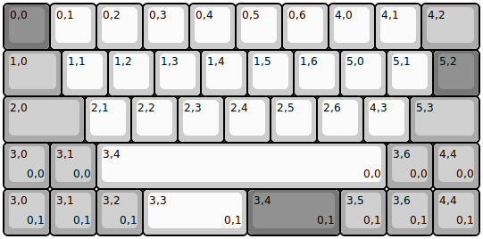
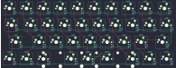

## qaz/qaz

[layout](qaz-kle.json) - [PCB](qaz.kicad_pcb)

{:loading="lazy"}

[Open in keyboard-layout-editor](http://www.keyboard-layout-editor.com/##@@_c=#777777;&=0,0&_c=#cccccc;&=0,1&=0,2&=0,3&=0,4&=0,5&=0,6&=4,0&=4,1&_c=#aaaaaa&w:1.25;&=4,2;&@_w:1.25;&=1,0&_c=#cccccc;&=1,1&=1,2&=1,3&=1,4&=1,5&=1,6&=5,0&=5,1&_c=#777777;&=5,2;&@_c=#aaaaaa&w:1.75;&=2,0&_c=#cccccc;&=2,1&=2,2&=2,3&=2,4&=2,5&=2,6&=4,3&_c=#aaaaaa&w:1.5;&=5,3;&@=3,0%0A%0A%0A0,0&=3,1%0A%0A%0A0,0&_c=#cccccc&w:6.25;&=3,4%0A%0A%0A0,0&_c=#aaaaaa;&=3,6%0A%0A%0A0,0&=4,4%0A%0A%0A0,0;&@=3,0%0A%0A%0A0,1&=3,1%0A%0A%0A0,1&=3,2%0A%0A%0A0,1&_c=#cccccc&w:2.25;&=3,3%0A%0A%0A0,1&_c=#777777&w:2;&=3,4%0A%0A%0A0,1&_c=#aaaaaa;&=3,5%0A%0A%0A0,1&=3,6%0A%0A%0A0,1&=4,4%0A%0A%0A0,1)

{:loading="lazy"}

