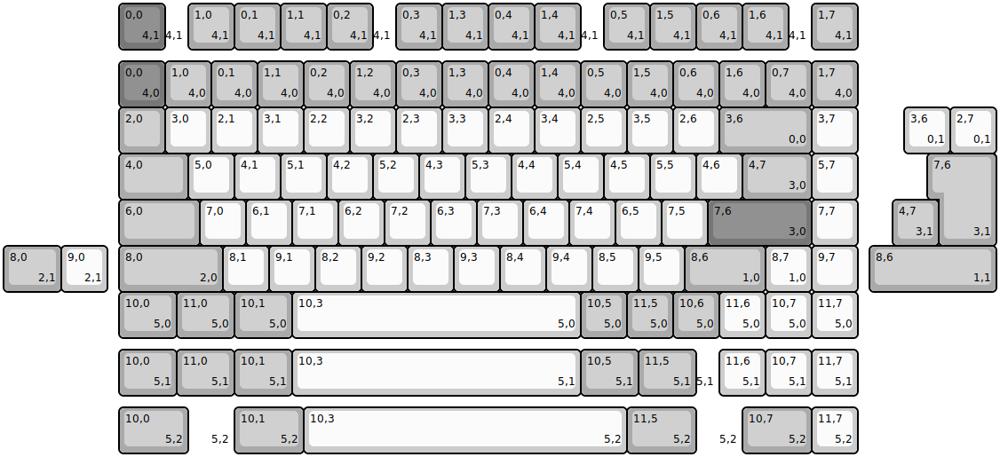
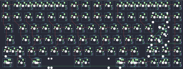

## quad_h/lb75

[layout](lb75-kle.json) - [PCB](lb75.kicad_pcb)

{:loading="lazy"}

[Open in keyboard-layout-editor](http://www.keyboard-layout-editor.com/##@@_x:2.5&y:1.25&c=#777777;&=0,0%0A%0A%0A4,0&_c=#aaaaaa;&=1,0%0A%0A%0A4,0&=0,1%0A%0A%0A4,0&=1,1%0A%0A%0A4,0&=0,2%0A%0A%0A4,0&=1,2%0A%0A%0A4,0&=0,3%0A%0A%0A4,0&=1,3%0A%0A%0A4,0&=0,4%0A%0A%0A4,0&=1,4%0A%0A%0A4,0&=0,5%0A%0A%0A4,0&=1,5%0A%0A%0A4,0&=0,6%0A%0A%0A4,0&=1,6%0A%0A%0A4,0&=0,7%0A%0A%0A4,0&=1,7%0A%0A%0A4,0;&@_x:2.5;&=2,0&_c=#cccccc;&=3,0&=2,1&=3,1&=2,2&=3,2&=2,3&=3,3&=2,4&=3,4&=2,5&=3,5&=2,6&_c=#aaaaaa&w:2;&=3,6%0A%0A%0A0,0&_c=#cccccc;&=3,7;&@_x:2.5&c=#aaaaaa&w:1.5;&=4,0&_c=#cccccc;&=5,0&=4,1&=5,1&=4,2&=5,2&=4,3&=5,3&=4,4&=5,4&=4,5&=5,5&=4,6&_c=#aaaaaa&w:1.5;&=4,7%0A%0A%0A3,0&_c=#cccccc;&=5,7;&@_x:2.5&c=#aaaaaa&w:1.75;&=6,0&_c=#cccccc;&=7,0&=6,1&=7,1&=6,2&=7,2&=6,3&=7,3&=6,4&=7,4&=6,5&=7,5&_c=#777777&w:2.25;&=7,6%0A%0A%0A3,0&_c=#cccccc;&=7,7;&@_x:2.5&c=#aaaaaa&w:2.25;&=8,0%0A%0A%0A2,0&_c=#cccccc;&=8,1&=9,1&=8,2&=9,2&=8,3&=9,3&=8,4&=9,4&=8,5&=9,5&_c=#aaaaaa&w:1.75;&=8,6%0A%0A%0A1,0&_c=#cccccc;&=8,7%0A%0A%0A1,0&=9,7;&@_x:2.5&c=#aaaaaa&w:1.25;&=10,0%0A%0A%0A5,0&_w:1.25;&=11,0%0A%0A%0A5,0&_w:1.25;&=10,1%0A%0A%0A5,0&_c=#cccccc&w:6.25;&=10,3%0A%0A%0A5,0&_c=#aaaaaa;&=10,5%0A%0A%0A5,0&=11,5%0A%0A%0A5,0&=10,6%0A%0A%0A5,0&_c=#cccccc;&=11,6%0A%0A%0A5,0&=10,7%0A%0A%0A5,0&=11,7%0A%0A%0A5,0;&@_x:2.5&y:-7.25&c=#777777;&=0,0%0A%0A%0A4,1&_c=#cccccc&w:0.5&d:true;&=%0A%0A%0A4,1&_c=#aaaaaa;&=1,0%0A%0A%0A4,1&=0,1%0A%0A%0A4,1&=1,1%0A%0A%0A4,1&=0,2%0A%0A%0A4,1&_c=#cccccc&w:0.5&d:true;&=%0A%0A%0A4,1&_c=#aaaaaa;&=0,3%0A%0A%0A4,1&=1,3%0A%0A%0A4,1&=0,4%0A%0A%0A4,1&=1,4%0A%0A%0A4,1&_c=#cccccc&w:0.5&d:true;&=%0A%0A%0A4,1&_c=#aaaaaa;&=0,5%0A%0A%0A4,1&=1,5%0A%0A%0A4,1&=0,6%0A%0A%0A4,1&=1,6%0A%0A%0A4,1&_c=#cccccc&w:0.5&d:true;&=%0A%0A%0A4,1&_c=#aaaaaa;&=1,7%0A%0A%0A4,1;&@_x:19.5&y:1.25&c=#cccccc;&=3,6%0A%0A%0A0,1&=2,7%0A%0A%0A0,1;&@_x:20.25&c=#aaaaaa&w:1.25&h:2&w2:1.5&h2:1&x2:-0.25;&=7,6%0A%0A%0A3,1;&@_x:19.25;&=4,7%0A%0A%0A3,1;&@_w:1.25;&=8,0%0A%0A%0A2,1&_c=#cccccc;&=9,0%0A%0A%0A2,1&_x:16.5&c=#aaaaaa&w:2.75;&=8,6%0A%0A%0A1,1;&@_x:2.5&y:1.25&w:1.25;&=10,0%0A%0A%0A5,1&_w:1.25;&=11,0%0A%0A%0A5,1&_w:1.25;&=10,1%0A%0A%0A5,1&_c=#cccccc&w:6.25;&=10,3%0A%0A%0A5,1&_c=#aaaaaa&w:1.25;&=10,5%0A%0A%0A5,1&_w:1.25;&=11,5%0A%0A%0A5,1&_c=#cccccc&w:0.5&d:true;&=%0A%0A%0A5,1&=11,6%0A%0A%0A5,1&=10,7%0A%0A%0A5,1&=11,7%0A%0A%0A5,1;&@_x:2.5&y:0.25&c=#aaaaaa&w:1.5;&=10,0%0A%0A%0A5,2&_c=#cccccc&d:true;&=%0A%0A%0A5,2&_c=#aaaaaa&w:1.5;&=10,1%0A%0A%0A5,2&_c=#cccccc&w:7;&=10,3%0A%0A%0A5,2&_c=#aaaaaa&w:1.5;&=11,5%0A%0A%0A5,2&_c=#cccccc&d:true;&=%0A%0A%0A5,2&_c=#aaaaaa&w:1.5;&=10,7%0A%0A%0A5,2&_c=#cccccc;&=11,7%0A%0A%0A5,2)

{:loading="lazy"}

