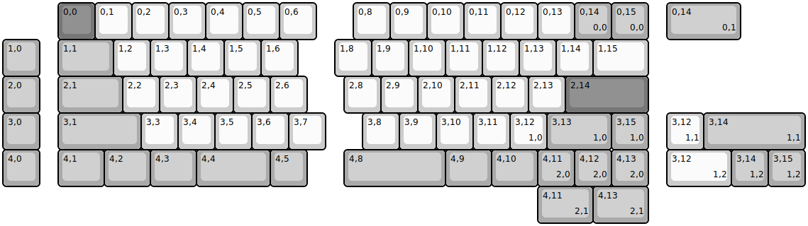
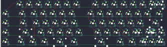

## quantrik/sx60

[layout](sx60-kle.json) - [PCB](sx60.kicad_pcb)

{:loading="lazy"}

[Open in keyboard-layout-editor](http://www.keyboard-layout-editor.com/##@@_x:1.5&c=#777777;&=0,0&_c=#cccccc;&=0,1&=0,2&=0,3&=0,4&=0,5&=0,6&_x:1.0;&=0,8&=0,9&=0,10&=0,11&=0,12&=0,13&_c=#aaaaaa;&=0,14%0A%0A%0A0,0&=0,15%0A%0A%0A0,0;&@=1,0&_x:0.5&w:1.5;&=1,1&_c=#cccccc;&=1,2&=1,3&=1,4&=1,5&=1,6&_x:1.0;&=1,8&=1,9&=1,10&=1,11&=1,12&=1,13&=1,14&_w:1.5;&=1,15;&@_c=#aaaaaa;&=2,0&_x:0.5&w:1.75;&=2,1&_c=#cccccc;&=2,2&=2,3&=2,4&=2,5&=2,6&_x:1.0;&=2,8&=2,9&=2,10&=2,11&=2,12&=2,13&_c=#777777&w:2.25;&=2,14;&@_c=#aaaaaa;&=3,0&_x:0.5&w:2.25;&=3,1&_c=#cccccc;&=3,3&=3,4&=3,5&=3,6&=3,7&_x:1.0;&=3,8&=3,9&=3,10&=3,11&=3,12%0A%0A%0A1,0&_c=#aaaaaa&w:1.75;&=3,13%0A%0A%0A1,0&=3,15%0A%0A%0A1,0;&@=4,0&_x:0.5&w:1.25;&=4,1&_w:1.25;&=4,2&_w:1.25;&=4,3&_w:2;&=4,4&=4,5&_x:1.0&w:2.75;&=4,8&_w:1.25;&=4,9&_w:1.25;&=4,10&=4,11%0A%0A%0A2,0&=4,12%0A%0A%0A2,0&=4,13%0A%0A%0A2,0;&@_x:18.0&y:-5&w:2;&=0,14%0A%0A%0A0,1;&@_x:18.0&y:2&c=#cccccc;&=3,12%0A%0A%0A1,1&_c=#aaaaaa&w:2.75;&=3,14%0A%0A%0A1,1;&@_x:18.0&c=#cccccc&w:1.75;&=3,12%0A%0A%0A1,2&_c=#aaaaaa;&=3,14%0A%0A%0A1,2&=3,15%0A%0A%0A1,2;&@_x:14.5&w:1.5;&=4,11%0A%0A%0A2,1&_w:1.5;&=4,13%0A%0A%0A2,1)

{:loading="lazy"}

