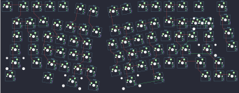

## qwertlekeys/calice

[layout](calice-kle.json) - [PCB](calice.kicad_pcb)

{:loading="lazy"}

[Open in keyboard-layout-editor](http://www.keyboard-layout-editor.com/##@@_x:2&y:1.25;&=1,0&_x:0.25;&=0,0&=1,1&=0,1&=1,2&_x:5.0;&=0,5&=1,5&=0,6&=1,6&_x:0.25;&=0,7&_x:0.75;&=1,7;&@_x:18.5;&=3,7;&@_x:4.75&y:-0.85;&=3,1&_x:8.5;&=2,6;&@_x:2.75&y:-0.9;&=3,0&=2,0&_x:10.5;&=3,6&_c=#aaaaaa&w:2;&=5,6%0A%0A%0A0,0;&@_x:18.75&y:-0.25&c=#cccccc;&=5,7;&@_x:14&y:-0.8;&=5,5;&@_x:2.5&y:-0.95&c=#aaaaaa&w:1.5;&=5,0&_c=#cccccc;&=4,0&_x:10.0;&=4,6&=7,6&_w:1.5;&=4,7;&@_x:19&y:-0.25;&=7,7;&@_x:2.25&y:-0.75&c=#aaaaaa&w:1.75;&=7,0&_c=#cccccc;&=6,0&_x:9.5;&=7,5&=6,6&_c=#aaaaaa&w:2.25;&=6,7;&@_x:2&w:2.25;&=9,0&_c=#cccccc;&=8,0&_x:9.0;&=9,5&=8,6&_c=#aaaaaa&w:1.75;&=9,6&_c=#cccccc;&=8,7;&@_x:2&c=#aaaaaa&w:1.5;&=11,0&_x:13.5&c=#cccccc;&=11,6&=10,7&=11,7;&@_r:10&x:7.75&y:-7.5;&=0,2&=1,3;&@_x:6.25&y:0.5;&=2,1&=3,2&=2,2&=3,3;&@_x:5.7;&=5,1&=4,1&=5,2&=4,2;&@_x:5.85;&=7,1&=6,1&=7,2&=6,2;&@_x:6.35;&=9,1&=8,1&=9,2&=8,2;&@_x:7.5&w:2.25;&=11,2&_c=#aaaaaa;&=10,2;&@_x:6&y:-0.95&w:1.5;&=10,0;&@_r:-10&x:9.5&y:-3.15&c=#cccccc;&=0,4&=1,4;&@_x:9.4&y:0.45;&=2,4&=3,4&=2,5&=3,5;&@_x:9;&=5,3&=4,4&=5,4&=4,5;&@_x:9.35;&=7,3&=6,4&=7,4&=6,5;&@_x:8.9;&=9,3&=8,4&=9,4&=8,5;&@_x:9&w:2.75;&=10,4;&@_x:11.75&y:-0.9&c=#aaaaaa&w:1.5;&=10,5;&@_r:0&x:18.25&y:-7.45&c=#cccccc;&=5,6%0A%0A%0A0,1&=2,7%0A%0A%0A0,1)

{:loading="lazy"}

