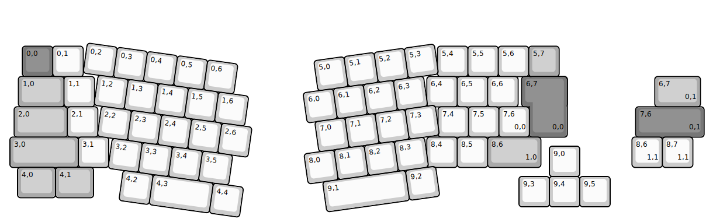
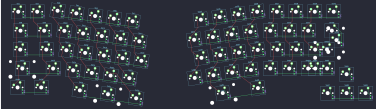

## rabbit_capture_plan/rabbit_capture_plan

[layout](rabbit_capture_plan-kle.json) - [PCB](rabbit_capture_plan.kicad_pcb)

{:loading="lazy"}

[Open in keyboard-layout-editor](http://www.keyboard-layout-editor.com/##@@_x:0.66&y:1.45&c=#777777;&=0,0&_c=#cccccc;&=0,1&_x:11.66;&=5,4&=5,5&=5,6&_c=#aaaaaa;&=5,7;&@_x:0.53&w:1.5;&=1,0&_c=#cccccc;&=1,1&_x:10.94;&=6,4&=6,5&=6,6&_x:0.37&c=#777777&w:1.25&h:2&w2:1.5&h2:1&x2:-0.25;&=6,7%0A%0A%0A0,0;&@_x:0.39&c=#aaaaaa&w:1.75;&=2,0&_c=#cccccc;&=2,1&_x:11.2;&=7,4&=7,5&=7,6%0A%0A%0A0,0;&@_x:0.25&c=#aaaaaa&w:2.25;&=3,0&_c=#cccccc;&=3,1&_x:10.47;&=8,4&=8,5&_c=#aaaaaa&w:1.75;&=8,6%0A%0A%0A1,0;&@_x:18&y:-0.7&c=#cccccc;&=9,0;&@_x:0.5&y:-0.3&c=#aaaaaa&w:1.25;&=4,0&_w:1.25;&=4,1;&@_x:17&y:-0.7&c=#cccccc;&=9,3&=9,4&=9,5;&@_r:8&x:2.97&y:-5.82;&=0,2&=0,3&=0,4&=0,5&=0,6;&@_x:3.47;&=1,2&=1,3&=1,4&=1,5&=1,6;&@_x:3.72;&=2,2&=2,3&=2,4&=2,5&=2,6;&@_x:4.22;&=3,2&=3,3&=3,4&=3,5;&@_x:4.72;&=4,2&_w:2;&=4,3&=4,4;&@_r:-8&x:9.87&y:-2.58;&=5,0&=5,1&=5,2&=5,3;&@_x:9.37;&=6,0&=6,1&=6,2&=6,3;&@_x:9.62;&=7,0&=7,1&=7,2&=7,3;&@_x:9.12;&=8,0&=8,1&=8,2&=8,3;&@_x:9.6&w:2.75;&=9,1&=9,2;&@_r:0&x:21.47&y:-5.9&c=#aaaaaa&w:1.5;&=6,7%0A%0A%0A0,1;&@_x:20.84&c=#777777&w:2.25;&=7,6%0A%0A%0A0,1;&@_x:20.72&c=#cccccc;&=8,6%0A%0A%0A1,1&=8,7%0A%0A%0A1,1)

{:loading="lazy"}

