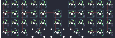

## rainkeeb/rainkeeb

[layout](rainkeeb-kle.json) - [PCB](rainkeeb.kicad_pcb)

{:loading="lazy"}

[Open in keyboard-layout-editor](http://www.keyboard-layout-editor.com/##@@_x:5.5&y:1&c=#777777;&=3,2;&@_x:5.5;&=5,2;&@_c=#aaaaaa;&=6,0&=7,0&=6,1&_w:2;&=7,2&_w:2;&=6,2&_w:2;&=7,3&=6,4&=7,4&=6,5;&@_rx:5&ry:3&x:-5&y:-3&c=#cccccc;&=0,0&=1,0&=0,1&=1,1&=0,2;&@_x:-5;&=2,0&=3,0&=2,1&=3,1&=2,2;&@_x:-5;&=4,0&=5,0&=4,1&=5,1&=4,2;&@_rx:7&ry:4.25&y:-4.25;&=1,3&=0,3&=1,4&=0,4&=1,5;&@=2,3&=3,3&=2,4&=3,4&_c=#777777;&=2,5;&@_c=#cccccc;&=4,3&=5,3&=4,4&=5,4&=4,5)

{:loading="lazy"}

