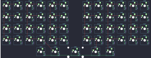

## rart/rart45

[layout](rart45-kle.json) - [PCB](rart45.kicad_pcb)

{:loading="lazy"}

[Open in keyboard-layout-editor](http://www.keyboard-layout-editor.com/##@@=0,0&=4,0&=0,1&=4,1&=0,2&=4,2&_x:1;&=0,3&=4,3&=0,4&=4,4&=0,5&=4,5;&@=1,0&=5,0&=1,1&=5,1&=1,2&=5,2&_x:1;&=1,3&=5,3&=1,4&=5,4&=1,5&=5,5;&@=2,0&=6,0&=2,1&=6,1&=2,2&=6,2&_x:1;&=2,3&=6,3&=2,4&=6,4&=2,5&=6,5;&@=3,0&=7,0&=3,1&=7,1&=3,2&=7,2&_x:1;&=3,3&=7,3&=3,4&=7,4&=3,5&=7,5;&@_x:2.875&w:1.25;&=8,0&_w:1.25;&=8,1&_w:2.25;&=8,2&_w:1.25;&=8,3&_w:1.25;&=8,4)

{:loading="lazy"}

