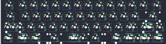

## rart/rartand

[layout](rartand-kle.json) - [PCB](rartand.kicad_pcb)

{:loading="lazy"}

[Open in keyboard-layout-editor](http://www.keyboard-layout-editor.com/##@@_x:2.5&w:1.5;&=0,0&=1,0&=0,1&=1,1&=0,2&=1,2&=0,3&=1,3&=0,4&=1,4&=0,5&=1,5&=0,6&_w:1.5;&=1,6;&@_x:2.5&w:1.75;&=2,0&=3,0&=2,1&=3,1&=2,2&=3,2&=2,3&=3,3&=2,4&=3,4&=2,5&=3,5&_w:2.25;&=3,6;&@_x:2.5&w:2.25;&=4,0%0A%0A%0A0,0&=4,1&=5,1&=4,2&=5,2&=4,3&=5,3&=4,4&=5,4&=4,5&=5,5%0A%0A%0A1,0&_w:2.75;&=4,6%0A%0A%0A1,0;&@_x:2.5&w:1.25;&=6,0%0A%0A%0A2,0&_w:1.25;&=7,0%0A%0A%0A2,0&_w:1.25;&=6,1%0A%0A%0A2,0&_w:6.25;&=6,3%0A%0A%0A2,0&_w:1.25;&=7,4%0A%0A%0A2,0&_w:1.25;&=6,5%0A%0A%0A2,0&_w:1.25;&=6,6%0A%0A%0A2,0&_w:1.25;&=7,6%0A%0A%0A2,0;&@_x:17.75&y:-3;&=5,5%0A%0A%0A1,1&_w:1.75;&=4,6%0A%0A%0A1,1&=5,6%0A%0A%0A1,1;&@_w:1.25;&=4,0%0A%0A%0A0,1&=5,0%0A%0A%0A0,1&_x:15.5&w:1.75;&=5,5%0A%0A%0A1,2&=4,6%0A%0A%0A1,2&=5,6%0A%0A%0A1,2;&@_x:2.25&y:1.25&w:1.25;&=6,0%0A%0A%0A2,1&_w:1.25;&=7,0%0A%0A%0A2,1&_w:1.25;&=6,1%0A%0A%0A2,1&_w:6.25;&=6,3%0A%0A%0A2,1&=7,4%0A%0A%0A2,1&=6,5%0A%0A%0A2,1&=7,5%0A%0A%0A2,1&=6,6%0A%0A%0A2,1&=7,6%0A%0A%0A2,1;&@_x:2.25&w:1.5;&=6,0%0A%0A%0A2,2&_w:1.5;&=6,1%0A%0A%0A2,2&_w:7;&=6,3%0A%0A%0A2,2&=7,4%0A%0A%0A2,2&=6,5%0A%0A%0A2,2&=7,5%0A%0A%0A2,2&=6,6%0A%0A%0A2,2&=7,6%0A%0A%0A2,2;&@_x:2.25&w:1.5;&=6,0%0A%0A%0A2,3&_w:1.5;&=6,1%0A%0A%0A2,3&_w:7;&=6,3%0A%0A%0A2,3&_w:1.25;&=7,4%0A%0A%0A2,3&_w:1.25;&=6,5%0A%0A%0A2,3&_w:1.25;&=6,6%0A%0A%0A2,3&_w:1.25;&=7,6%0A%0A%0A2,3;&@_x:2.25&w:1.25;&=6,0%0A%0A%0A2,4&_w:1.25;&=7,0%0A%0A%0A2,4&_w:1.25;&=6,1%0A%0A%0A2,4&_w:2.25;&=6,2%0A%0A%0A2,4&_w:1.25;&=6,3%0A%0A%0A2,4&_w:2.75;&=6,4%0A%0A%0A2,4&_w:1.25;&=7,4%0A%0A%0A2,4&_w:1.25;&=6,5%0A%0A%0A2,4&_w:1.25;&=6,6%0A%0A%0A2,4&_w:1.25;&=7,6%0A%0A%0A2,4;&@_x:2.25&w:1.25;&=6,0%0A%0A%0A2,5&_w:1.25;&=7,0%0A%0A%0A2,5&_w:1.25;&=6,1%0A%0A%0A2,5&_w:2.25;&=6,2%0A%0A%0A2,5&_w:1.25;&=6,3%0A%0A%0A2,5&_w:2.75;&=6,4%0A%0A%0A2,5&=7,4%0A%0A%0A2,5&=6,5%0A%0A%0A2,5&=7,5%0A%0A%0A2,5&=6,6%0A%0A%0A2,5&=7,6%0A%0A%0A2,5;&@_x:2.25&w:1.5;&=6,0%0A%0A%0A2,6&=7,0%0A%0A%0A2,6&_w:1.5;&=6,1%0A%0A%0A2,6&_w:7;&=6,3%0A%0A%0A2,6&_w:1.5;&=6,5%0A%0A%0A2,6&=6,6%0A%0A%0A2,6&_w:1.5;&=7,6%0A%0A%0A2,6)

{:loading="lazy"}

