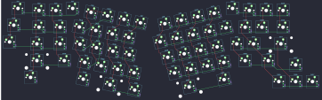

## rart/rartlice

[layout](rartlice-kle.json) - [PCB](rartlice.kicad_pcb)

{:loading="lazy"}

[Open in keyboard-layout-editor](http://www.keyboard-layout-editor.com/##@@_x:0.5&y:0.38&c=#777777;&=0,0&_x:2.25&c=#aaaaaa;&=0,3&_x:8.5;&=0,11;&@_x:1.75&y:-0.88;&=0,1&_c=#cccccc;&=0,2&_x:10.5;&=0,12&_c=#aaaaaa;&=0,13&=0,14;&@_x:0.25&y:-0.12&c=#777777;&=1,0;&@_x:1.5&y:-0.88&c=#aaaaaa&w:1.5;&=1,1&_c=#cccccc;&=1,2&_x:10.0;&=1,12&=1,13&_w:1.5;&=1,14;&@_y:-0.12&c=#777777;&=2,0;&@_x:1.25&y:-0.88&c=#aaaaaa&w:1.75;&=2,1&_c=#cccccc;&=2,2&_x:9.5;&=2,11&=2,12&_c=#777777&w:2.25;&=2,13;&@_x:1&c=#aaaaaa&w:2.25;&=3,1&_c=#cccccc;&=3,2&_x:9.75;&=3,11&_c=#aaaaaa&w:1.75;&=3,12;&@_x:17&y:-0.75;&=3,14;&@_x:1&y:-0.25&w:1.5;&=4,1;&@_x:16&y:-0.75;&=4,12&=4,13&=4,14;&@_r:12&rx:4.75&ry:1.5&y:-1.0&c=#cccccc;&=0,4&=1,4&=0,5&=0,6;&@_x:-0.5;&=1,3&=2,4&=1,5&=1,6;&@_x:-0.25;&=2,3&=3,4&=2,5&=2,6;&@_x:0.25;&=3,3&=4,4&=3,5&=3,6;&@_x:0.25&c=#aaaaaa&w:1.25;&=4,3&_c=#cccccc&w:2;&=4,5&_c=#aaaaaa;&=4,6;&@_r:-12&rx:13.5&x:-4.25&y:-1.0&c=#cccccc;&=0,7&=0,8&=0,9&=0,10;&@_x:-4.75;&=1,7&=1,8&=1,9&=1,10&=1,11;&@_x:-4.5;&=2,7&=2,8&=2,9&=2,10;&@_x:-4.5&y:1.0&w:2.75;&=4,8&_c=#aaaaaa&w:1.5;&=4,10;&@_ry:1.75&x:-4.25&y:1.75&c=#cccccc;&=3,7&=3,8&=3,9&=3,10)

{:loading="lazy"}

