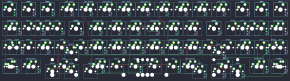

## rart/rartlite

[layout](rartlite-kle.json) - [PCB](rartlite.kicad_pcb)

{:loading="lazy"}

[Open in keyboard-layout-editor](http://www.keyboard-layout-editor.com/##@@=0,0%0A%0A%0A0,0&=1,0%0A%0A%0A0,0&=0,1%0A%0A%0A0,0&=1,1%0A%0A%0A0,0&=0,2%0A%0A%0A0,0&=1,2%0A%0A%0A0,0&=0,3%0A%0A%0A0,0&=1,3%0A%0A%0A0,0&=0,4%0A%0A%0A0,0&=1,4%0A%0A%0A0,0&=3,4%0A%0A%0A0,0&=0,5%0A%0A%0A0,0&_x:0.25;&=1,5%0A%0A%0A0,0&=0,6%0A%0A%0A0,0&=1,6%0A%0A%0A0,0;&@_w:1.5;&=2,0%0A%0A%0A0,0&=3,0%0A%0A%0A0,0&=2,1%0A%0A%0A0,0&=3,1%0A%0A%0A0,0&=2,2%0A%0A%0A0,0&=3,2%0A%0A%0A0,0&=2,3%0A%0A%0A0,0&=3,3%0A%0A%0A0,0&=2,4%0A%0A%0A0,0&=5,4%0A%0A%0A0,0&_w:1.5;&=2,5%0A%0A%0A0,0&_x:0.25;&=3,5%0A%0A%0A0,0&=2,6%0A%0A%0A0,0&=3,6%0A%0A%0A0,0;&@_w:1.75;&=4,0%0A%0A%0A0,0&=5,0%0A%0A%0A0,0&=4,1%0A%0A%0A0,0&=5,1%0A%0A%0A0,0&=4,2%0A%0A%0A0,0&=5,2%0A%0A%0A0,0&=4,3%0A%0A%0A0,0&=5,3%0A%0A%0A0,0&=4,4%0A%0A%0A0,0&=7,4%0A%0A%0A0,0&_x:1.5;&=5,5%0A%0A%0A0,0&=4,6%0A%0A%0A0,0&=5,6%0A%0A%0A0,0;&@_x:11&y:-0.75;&=4,5%0A%0A%0A0,0;&@_y:-0.25&w:1.25;&=6,0%0A%0A%0A0,0&=7,0%0A%0A%0A0,0&_w:2.25;&=6,1%0A%0A%0A0,0&_w:1.25;&=6,2%0A%0A%0A0,0&_w:2.75;&=6,3%0A%0A%0A0,0&_w:1.25;&=7,3%0A%0A%0A0,0&_x:3.5;&=6,6%0A%0A%0A0,0&=7,6%0A%0A%0A0,0;&@_x:10&y:-0.75;&=6,4%0A%0A%0A0,0&=6,5%0A%0A%0A0,0&=7,5%0A%0A%0A0,0;&@=0,0%0A%0A%0A0,1&=1,0%0A%0A%0A0,1&=0,1%0A%0A%0A0,1&=1,1%0A%0A%0A0,1&=0,2%0A%0A%0A0,1&=1,2%0A%0A%0A0,1&=0,3%0A%0A%0A0,1&=1,3%0A%0A%0A0,1&=0,4%0A%0A%0A0,1&=1,4%0A%0A%0A0,1&=3,4%0A%0A%0A0,1&=0,5%0A%0A%0A0,1&_x:0.25;&=1,5%0A%0A%0A0,1&=0,6%0A%0A%0A0,1&=1,6%0A%0A%0A0,1;&@_w:1.5;&=2,0%0A%0A%0A0,1&=3,0%0A%0A%0A0,1&=2,1%0A%0A%0A0,1&=3,1%0A%0A%0A0,1&=2,2%0A%0A%0A0,1&=3,2%0A%0A%0A0,1&=2,3%0A%0A%0A0,1&=3,3%0A%0A%0A0,1&=2,4%0A%0A%0A0,1&=5,4%0A%0A%0A0,1&_w:1.5;&=2,5%0A%0A%0A0,1&_x:0.25;&=3,5%0A%0A%0A0,1&=2,6%0A%0A%0A0,1&=3,6%0A%0A%0A0,1;&@_w:1.75;&=4,0%0A%0A%0A0,1&=5,0%0A%0A%0A0,1&=4,1%0A%0A%0A0,1&=5,1%0A%0A%0A0,1&=4,2%0A%0A%0A0,1&=5,2%0A%0A%0A0,1&=4,3%0A%0A%0A0,1&=5,3%0A%0A%0A0,1&=4,4%0A%0A%0A0,1&=7,4%0A%0A%0A0,1&_x:1.5;&=5,5%0A%0A%0A0,1&=4,6%0A%0A%0A0,1&=5,6%0A%0A%0A0,1;&@_x:11&y:-0.75;&=4,5%0A%0A%0A0,1;&@_y:-0.25&w:1.25;&=6,0%0A%0A%0A0,1&=7,0%0A%0A%0A0,1&_w:6.25;&=6,2%0A%0A%0A0,1&_w:1.25;&=7,3%0A%0A%0A0,1&_x:3.5;&=6,6%0A%0A%0A0,1&=7,6%0A%0A%0A0,1;&@_x:10&y:-0.75;&=6,4%0A%0A%0A0,1&=6,5%0A%0A%0A0,1&=7,5%0A%0A%0A0,1;&@=1,6%0A%0A%0A0,2&=0,6%0A%0A%0A0,2&=1,5%0A%0A%0A0,2&_x:0.25;&=0,5%0A%0A%0A0,2&=3,4%0A%0A%0A0,2&=1,4%0A%0A%0A0,2&=0,4%0A%0A%0A0,2&=1,3%0A%0A%0A0,2&=0,3%0A%0A%0A0,2&=1,2%0A%0A%0A0,2&=0,2%0A%0A%0A0,2&=1,1%0A%0A%0A0,2&=0,1%0A%0A%0A0,2&=1,0%0A%0A%0A0,2&=0,0%0A%0A%0A0,2;&@=3,6%0A%0A%0A0,2&=2,6%0A%0A%0A0,2&=3,5%0A%0A%0A0,2&_x:0.25&w:1.5;&=2,5%0A%0A%0A0,2&=5,4%0A%0A%0A0,2&=2,4%0A%0A%0A0,2&=3,3%0A%0A%0A0,2&=2,3%0A%0A%0A0,2&=3,2%0A%0A%0A0,2&=2,2%0A%0A%0A0,2&=3,1%0A%0A%0A0,2&=2,1%0A%0A%0A0,2&=3,0%0A%0A%0A0,2&_w:1.5;&=2,0%0A%0A%0A0,2;&@=5,6%0A%0A%0A0,2&=4,6%0A%0A%0A0,2&=5,5%0A%0A%0A0,2&_x:1.5;&=7,4%0A%0A%0A0,2&=4,4%0A%0A%0A0,2&=5,3%0A%0A%0A0,2&=4,3%0A%0A%0A0,2&=5,2%0A%0A%0A0,2&=4,2%0A%0A%0A0,2&=5,1%0A%0A%0A0,2&=4,1%0A%0A%0A0,2&=5,0%0A%0A%0A0,2&_w:1.75;&=4,0%0A%0A%0A0,2;&@_x:3.25&y:-0.75;&=4,5%0A%0A%0A0,2;&@_y:-0.25;&=7,6%0A%0A%0A0,2&=6,6%0A%0A%0A0,2&_x:3.5&w:1.25;&=7,3%0A%0A%0A0,2&_w:2.75;&=6,3%0A%0A%0A0,2&_w:1.25;&=6,2%0A%0A%0A0,2&_w:2.25;&=6,1%0A%0A%0A0,2&=7,0%0A%0A%0A0,2&_w:1.25;&=6,0%0A%0A%0A0,2;&@_x:2.25&y:-0.75;&=7,5%0A%0A%0A0,2&=6,5%0A%0A%0A0,2&=6,4%0A%0A%0A0,2;&@=1,6%0A%0A%0A0,3&=0,6%0A%0A%0A0,3&=1,5%0A%0A%0A0,3&_x:0.25;&=0,5%0A%0A%0A0,3&=3,4%0A%0A%0A0,3&=1,4%0A%0A%0A0,3&=0,4%0A%0A%0A0,3&=1,3%0A%0A%0A0,3&=0,3%0A%0A%0A0,3&=1,2%0A%0A%0A0,3&=0,2%0A%0A%0A0,3&=1,1%0A%0A%0A0,3&=0,1%0A%0A%0A0,3&=1,0%0A%0A%0A0,3&=0,0%0A%0A%0A0,3;&@=3,6%0A%0A%0A0,3&=2,6%0A%0A%0A0,3&=3,5%0A%0A%0A0,3&_x:0.25&w:1.5;&=2,5%0A%0A%0A0,3&=5,4%0A%0A%0A0,3&=2,4%0A%0A%0A0,3&=3,3%0A%0A%0A0,3&=2,3%0A%0A%0A0,3&=3,2%0A%0A%0A0,3&=2,2%0A%0A%0A0,3&=3,1%0A%0A%0A0,3&=2,1%0A%0A%0A0,3&=3,0%0A%0A%0A0,3&_w:1.5;&=2,0%0A%0A%0A0,3;&@=5,6%0A%0A%0A0,3&=4,6%0A%0A%0A0,3&=5,5%0A%0A%0A0,3&_x:1.5;&=7,4%0A%0A%0A0,3&=4,4%0A%0A%0A0,3&=5,3%0A%0A%0A0,3&=4,3%0A%0A%0A0,3&=5,2%0A%0A%0A0,3&=4,2%0A%0A%0A0,3&=5,1%0A%0A%0A0,3&=4,1%0A%0A%0A0,3&=5,0%0A%0A%0A0,3&_w:1.75;&=4,0%0A%0A%0A0,3;&@_x:3.25&y:-0.75;&=4,5%0A%0A%0A0,3;&@_y:-0.25;&=7,6%0A%0A%0A0,3&=6,6%0A%0A%0A0,3&_x:3.5&w:1.25;&=7,3%0A%0A%0A0,3&_w:6.25;&=6,2%0A%0A%0A0,3&=7,0%0A%0A%0A0,3&_w:1.25;&=6,0%0A%0A%0A0,3;&@_x:2.25&y:-0.75;&=7,5%0A%0A%0A0,3&=6,5%0A%0A%0A0,3&=6,4%0A%0A%0A0,3)

{:loading="lazy"}

