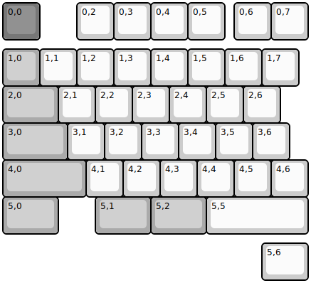
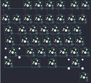

## recompile_keys/mio

[layout](mio-kle.json) - [PCB](mio.kicad_pcb)

{:loading="lazy"}

[Open in keyboard-layout-editor](http://www.keyboard-layout-editor.com/##@@_c=#777777;&=0,0&_x:1&c=#cccccc;&=0,2&=0,3&=0,4&=0,5&_x:0.25;&=0,6&=0,7;&@_y:0.25&c=#aaaaaa;&=1,0&_c=#cccccc;&=1,1&=1,2&=1,3&=1,4&=1,5&=1,6&=1,7;&@_c=#aaaaaa&w:1.5;&=2,0&_c=#cccccc;&=2,1&=2,2&=2,3&=2,4&=2,5&=2,6;&@_c=#aaaaaa&w:1.75;&=3,0&_c=#cccccc;&=3,1&=3,2&=3,3&=3,4&=3,5&=3,6;&@_c=#aaaaaa&w:2.25;&=4,0&_c=#cccccc;&=4,1&=4,2&=4,3&=4,4&=4,5&=4,6;&@_c=#aaaaaa&w:1.5;&=5,0&_x:1.0&w:1.5;&=5,1&_w:1.5;&=5,2&_c=#cccccc&w:2.75;&=5,5;&@_x:7&y:0.25&w:1.25;&=5,6)

{:loading="lazy"}

