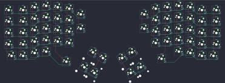

## redox/redox

[layout](redox-kle.json) - [PCB](redox.kicad_pcb)

{:loading="lazy"}

[Open in keyboard-layout-editor](http://www.keyboard-layout-editor.com/##@@_x:3.5;&=0,3&_x:10.5;&=5,3;&@_x:2.5&y:-0.875;&=0,2&_x:1.0;&=0,4&_x:8.5;&=5,4&_x:1.0;&=5,2;&@_x:5.5&y:-0.875;&=0,5&_x:6.5;&=5,5;&@_y:-0.875&c=#777777&w:1.5;&=0,0&_c=#cccccc;&=0,1&_x:14.5;&=5,1&_c=#aaaaaa&w:1.5;&=5,0;&@_x:6.5&y:-0.625&c=#cccccc;&=0,6&_x:4.5;&=5,6;&@_x:3.5&y:-0.75;&=1,3&_x:10.5;&=6,3;&@_x:2.5&y:-0.875;&=1,2&_x:1.0;&=1,4&_x:8.5;&=6,4&_x:1.0;&=6,2;&@_x:5.5&y:-0.875;&=1,5&_x:6.5;&=6,5;&@_y:-0.875&c=#aaaaaa&w:1.5;&=1,0&_c=#cccccc;&=1,1&_x:14.5;&=6,1&_c=#aaaaaa&w:1.5;&=6,0;&@_x:6.5&y:-0.625&c=#cccccc&h:1.5;&=1,6&_x:4.5&h:1.5;&=6,6;&@_x:3.5&y:-0.75;&=2,3&_x:10.5;&=7,3;&@_x:2.5&y:-0.875;&=2,2&_x:1.0;&=2,4&_x:8.5;&=7,4&_x:1.0;&=7,2;&@_x:5.5&y:-0.875;&=2,5&_x:6.5;&=7,5;&@_y:-0.875&c=#aaaaaa&w:1.5;&=2,0&_c=#cccccc;&=2,1&_x:14.5;&=7,1&_c=#aaaaaa&w:1.5;&=7,0;&@_x:3.5&y:-0.375&c=#cccccc;&=3,3&_x:10.5;&=8,3;&@_x:2.5&y:-0.875;&=3,2&_x:1.0;&=3,4&_x:8.5;&=8,4&_x:1.0;&=8,2;&@_x:5.5&y:-0.875;&=3,5&_x:6.5;&=8,5;&@_y:-0.875&c=#aaaaaa&w:1.5;&=3,0&_c=#cccccc;&=3,1&_x:14.5;&=8,1&_c=#aaaaaa&w:1.5;&=8,0;&@_x:3.5&y:-0.375;&=4,3&_x:10.5;&=9,3;&@_x:2.5&y:-0.875;&=4,2&_x:12.5;&=9,2;&@_x:0.5&y:-0.75;&=4,0&=4,1&_x:14.5;&=9,1&=9,0;&@_x:13.5&y:-0.745;&=9,4;&@_x:5.25&y:-0.75;&=4,4;&@_r:30&rx:6.5&ry:4.25&x:1.0&y:-1.0;&=2,6&=3,6;&@_x:1.0&c=#777777&h:2;&=4,5&_c=#aaaaaa&h:2;&=4,6;&@_r:-30&rx:13&x:-3&y:-1.0;&=8,6&=7,6;&@_x:-3&h:2;&=9,6&_c=#777777&h:2;&=9,5)

{:loading="lazy"}

