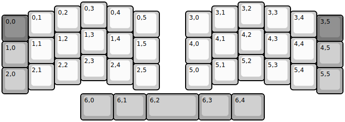
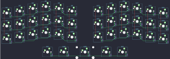

## reviung41/reviung41

[layout](reviung41-kle.json) - [PCB](reviung41.kicad_pcb)

{:loading="lazy"}

[Open in keyboard-layout-editor](http://www.keyboard-layout-editor.com/##@@_x:3;&=0,3&_x:5;&=3,2;&@_x:2&y:-0.85;&=0,2&_x:1;&=0,4&_x:3;&=3,1&_x:1;&=3,3;&@_x:1&y:-0.8;&=0,1&_x:3;&=0,5&_x:1;&=3,0&_x:3;&=3,4;&@_y:-0.85&c=#777777;&=0,0&_x:11;&=3,5;&@_x:3&y:-0.5&c=#cccccc;&=1,3&_x:5;&=4,2;&@_x:2&y:-0.85;&=1,2&_x:1;&=1,4&_x:3;&=4,1&_x:1;&=4,3;&@_x:1&y:-0.8;&=1,1&_x:3;&=1,5&_x:1;&=4,0&_x:3;&=4,4;&@_y:-0.85&c=#aaaaaa;&=1,0&_x:11;&=4,5;&@_x:3&y:-0.5&c=#cccccc;&=2,3&_x:5;&=5,2;&@_x:2&y:-0.85;&=2,2&_x:1;&=2,4&_x:3;&=5,1&_x:1;&=5,3;&@_x:1&y:-0.8;&=2,1&_x:3;&=2,5&_x:1;&=5,0&_x:3;&=5,4;&@_y:-0.85&c=#aaaaaa;&=2,0&_x:11;&=5,5;&@_x:3&w:1.25;&=6,0&_w:1.25;&=6,1&_w:2;&=6,2&_w:1.25;&=6,3&_w:1.25;&=6,4)

{:loading="lazy"}

