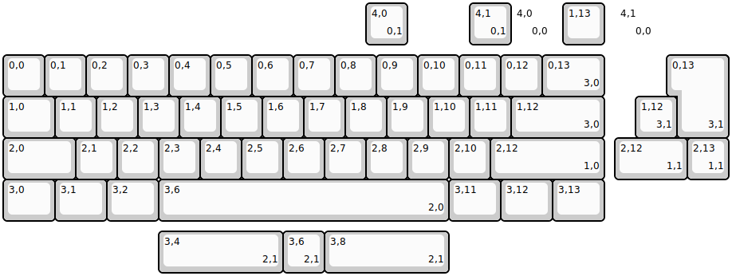
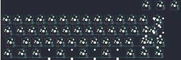

## rmi_kb/chevron

[layout](chevron-kle.json) - [PCB](chevron.kicad_pcb)

{:loading="lazy"}

[Open in keyboard-layout-editor](http://www.keyboard-layout-editor.com/##@@_x:12.25&d:true;&=4,0%0A%0A%0A0,0&_x:0.25;&=1,13&_x:0.25&d:true;&=4,1%0A%0A%0A0,0;&@_y:0.25;&=0,0&=0,1&=0,2&=0,3&=0,4&=0,5&=0,6&=0,7&=0,8&=0,9&=0,10&=0,11&=0,12&_w:1.5;&=0,13%0A%0A%0A3,0;&@_w:1.25;&=1,0&=1,1&=1,2&=1,3&=1,4&=1,5&=1,6&=1,7&=1,8&=1,9&=1,10&=1,11&_w:2.25;&=1,12%0A%0A%0A3,0;&@_w:1.75;&=2,0&=2,1&=2,2&=2,3&=2,4&=2,5&=2,6&=2,7&=2,8&=2,9&=2,10&_w:2.75;&=2,12%0A%0A%0A1,0;&@_w:1.25;&=3,0&_w:1.25;&=3,1&_w:1.25;&=3,2&_w:7;&=3,6%0A%0A%0A2,0&_w:1.25;&=3,11&_w:1.25;&=3,12&_w:1.25;&=3,13;&@_x:8.75&y:-5.25;&=4,0%0A%0A%0A0,1&_x:1.5;&=4,1%0A%0A%0A0,1;&@_x:16.25&y:0.25&w:1.25&h:2&w2:1.5&h2:1&x2:-0.25;&=0,13%0A%0A%0A3,1;&@_x:15.25;&=1,12%0A%0A%0A3,1;&@_x:14.75&w:1.75;&=2,12%0A%0A%0A1,1&=2,13%0A%0A%0A1,1;&@_x:3.75&y:1.25&w:3;&=3,4%0A%0A%0A2,1&=3,6%0A%0A%0A2,1&_w:3;&=3,8%0A%0A%0A2,1)

{:loading="lazy"}

