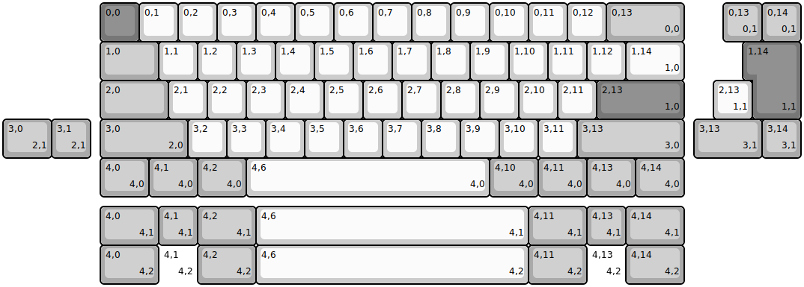
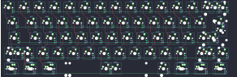
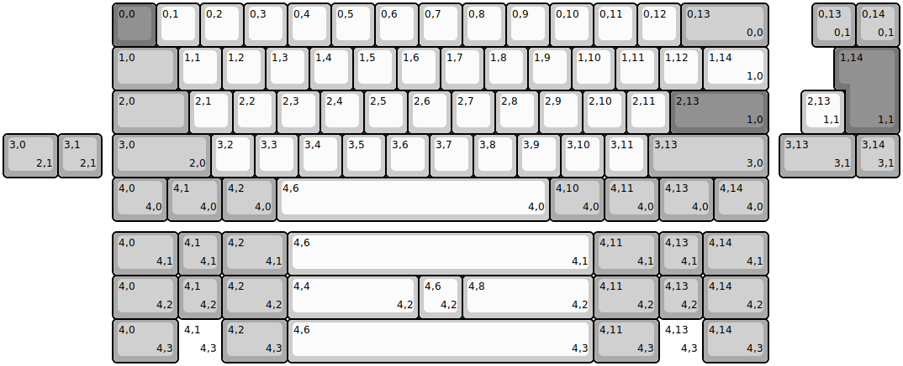
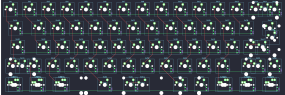
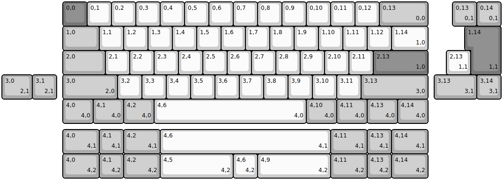
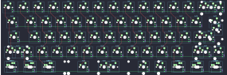

## rmi_kb/mona/mona_v1

[layout](mona_v1-kle.json) - [PCB](mona_v1.kicad_pcb)

{:loading="lazy"}

[Open in keyboard-layout-editor](http://www.keyboard-layout-editor.com/##@@_x:2.5&c=#777777;&=0,0&_c=#cccccc;&=0,1&=0,2&=0,3&=0,4&=0,5&=0,6&=0,7&=0,8&=0,9&=0,10&=0,11&=0,12&_c=#aaaaaa&w:2;&=0,13%0A%0A%0A0,0;&@_x:2.5&w:1.5;&=1,0&_c=#cccccc;&=1,1&=1,2&=1,3&=1,4&=1,5&=1,6&=1,7&=1,8&=1,9&=1,10&=1,11&=1,12&_w:1.5;&=1,14%0A%0A%0A1,0;&@_x:2.5&c=#aaaaaa&w:1.75;&=2,0&_c=#cccccc;&=2,1&=2,2&=2,3&=2,4&=2,5&=2,6&=2,7&=2,8&=2,9&=2,10&=2,11&_c=#777777&w:2.25;&=2,13%0A%0A%0A1,0;&@_x:2.5&c=#aaaaaa&w:2.25;&=3,0%0A%0A%0A2,0&_c=#cccccc;&=3,2&=3,3&=3,4&=3,5&=3,6&=3,7&=3,8&=3,9&=3,10&=3,11&_c=#aaaaaa&w:2.75;&=3,13%0A%0A%0A3,0;&@_x:2.5&w:1.25;&=4,0%0A%0A%0A4,0&_w:1.25;&=4,1%0A%0A%0A4,0&_w:1.25;&=4,2%0A%0A%0A4,0&_c=#cccccc&w:6.25;&=4,6%0A%0A%0A4,0&_c=#aaaaaa&w:1.25;&=4,10%0A%0A%0A4,0&_w:1.25;&=4,11%0A%0A%0A4,0&_w:1.25;&=4,13%0A%0A%0A4,0&_w:1.25;&=4,14%0A%0A%0A4,0;&@_x:18.5&y:-5;&=0,13%0A%0A%0A0,1&=0,14%0A%0A%0A0,1;&@_x:19.25&c=#777777&w:1.25&h:2&w2:1.5&h2:1&x2:-0.25;&=1,14%0A%0A%0A1,1;&@_x:18.25&c=#cccccc;&=2,13%0A%0A%0A1,1;&@_c=#aaaaaa&w:1.25;&=3,0%0A%0A%0A2,1&=3,1%0A%0A%0A2,1&_x:15.5&w:1.75;&=3,13%0A%0A%0A3,1&=3,14%0A%0A%0A3,1;&@_x:2.5&y:1.25&w:1.5;&=4,0%0A%0A%0A4,1&=4,1%0A%0A%0A4,1&_w:1.5;&=4,2%0A%0A%0A4,1&_c=#cccccc&w:7;&=4,6%0A%0A%0A4,1&_c=#aaaaaa&w:1.5;&=4,11%0A%0A%0A4,1&=4,13%0A%0A%0A4,1&_w:1.5;&=4,14%0A%0A%0A4,1;&@_x:2.5&w:1.5;&=4,0%0A%0A%0A4,2&_d:true;&=4,1%0A%0A%0A4,2&_w:1.5;&=4,2%0A%0A%0A4,2&_c=#cccccc&w:7;&=4,6%0A%0A%0A4,2&_c=#aaaaaa&w:1.5;&=4,11%0A%0A%0A4,2&_d:true;&=4,13%0A%0A%0A4,2&_w:1.5;&=4,14%0A%0A%0A4,2)

{:loading="lazy"}

## rmi_kb/mona/mona_v1_1

[layout](mona_v1_1-kle.json) - [PCB](mona_v1_1.kicad_pcb)

{:loading="lazy"}

[Open in keyboard-layout-editor](http://www.keyboard-layout-editor.com/##@@_x:2.5&c=#777777;&=0,0&_c=#cccccc;&=0,1&=0,2&=0,3&=0,4&=0,5&=0,6&=0,7&=0,8&=0,9&=0,10&=0,11&=0,12&_c=#aaaaaa&w:2;&=0,13%0A%0A%0A0,0;&@_x:2.5&w:1.5;&=1,0&_c=#cccccc;&=1,1&=1,2&=1,3&=1,4&=1,5&=1,6&=1,7&=1,8&=1,9&=1,10&=1,11&=1,12&_w:1.5;&=1,14%0A%0A%0A1,0;&@_x:2.5&c=#aaaaaa&w:1.75;&=2,0&_c=#cccccc;&=2,1&=2,2&=2,3&=2,4&=2,5&=2,6&=2,7&=2,8&=2,9&=2,10&=2,11&_c=#777777&w:2.25;&=2,13%0A%0A%0A1,0;&@_x:2.5&c=#aaaaaa&w:2.25;&=3,0%0A%0A%0A2,0&_c=#cccccc;&=3,2&=3,3&=3,4&=3,5&=3,6&=3,7&=3,8&=3,9&=3,10&=3,11&_c=#aaaaaa&w:2.75;&=3,13%0A%0A%0A3,0;&@_x:2.5&w:1.25;&=4,0%0A%0A%0A4,0&_w:1.25;&=4,1%0A%0A%0A4,0&_w:1.25;&=4,2%0A%0A%0A4,0&_c=#cccccc&w:6.25;&=4,6%0A%0A%0A4,0&_c=#aaaaaa&w:1.25;&=4,10%0A%0A%0A4,0&_w:1.25;&=4,11%0A%0A%0A4,0&_w:1.25;&=4,13%0A%0A%0A4,0&_w:1.25;&=4,14%0A%0A%0A4,0;&@_x:18.5&y:-5;&=0,13%0A%0A%0A0,1&=0,14%0A%0A%0A0,1;&@_x:19.25&c=#777777&w:1.25&h:2&w2:1.5&h2:1&x2:-0.25;&=1,14%0A%0A%0A1,1;&@_x:18.25&c=#cccccc;&=2,13%0A%0A%0A1,1;&@_c=#aaaaaa&w:1.25;&=3,0%0A%0A%0A2,1&=3,1%0A%0A%0A2,1&_x:15.5&w:1.75;&=3,13%0A%0A%0A3,1&=3,14%0A%0A%0A3,1;&@_x:2.5&y:1.25&w:1.5;&=4,0%0A%0A%0A4,1&=4,1%0A%0A%0A4,1&_w:1.5;&=4,2%0A%0A%0A4,1&_c=#cccccc&w:7;&=4,6%0A%0A%0A4,1&_c=#aaaaaa&w:1.5;&=4,11%0A%0A%0A4,1&=4,13%0A%0A%0A4,1&_w:1.5;&=4,14%0A%0A%0A4,1;&@_x:2.5&w:1.5;&=4,0%0A%0A%0A4,2&=4,1%0A%0A%0A4,2&_w:1.5;&=4,2%0A%0A%0A4,2&_c=#cccccc&w:3;&=4,4%0A%0A%0A4,2&=4,6%0A%0A%0A4,2&_w:3;&=4,8%0A%0A%0A4,2&_c=#aaaaaa&w:1.5;&=4,11%0A%0A%0A4,2&=4,13%0A%0A%0A4,2&_w:1.5;&=4,14%0A%0A%0A4,2;&@_x:2.5&w:1.5;&=4,0%0A%0A%0A4,3&_d:true;&=4,1%0A%0A%0A4,3&_w:1.5;&=4,2%0A%0A%0A4,3&_c=#cccccc&w:7;&=4,6%0A%0A%0A4,3&_c=#aaaaaa&w:1.5;&=4,11%0A%0A%0A4,3&_d:true;&=4,13%0A%0A%0A4,3&_w:1.5;&=4,14%0A%0A%0A4,3)

{:loading="lazy"}

## rmi_kb/mona/mona_v32a

[layout](mona_v32a-kle.json) - [PCB](mona_v32a.kicad_pcb)

{:loading="lazy"}

[Open in keyboard-layout-editor](http://www.keyboard-layout-editor.com/##@@_x:2.5&c=#777777;&=0,0&_c=#cccccc;&=0,1&=0,2&=0,3&=0,4&=0,5&=0,6&=0,7&=0,8&=0,9&=0,10&=0,11&=0,12&_c=#aaaaaa&w:2;&=0,13%0A%0A%0A0,0;&@_x:2.5&w:1.5;&=1,0&_c=#cccccc;&=1,1&=1,2&=1,3&=1,4&=1,5&=1,6&=1,7&=1,8&=1,9&=1,10&=1,11&=1,12&_w:1.5;&=1,14%0A%0A%0A1,0;&@_x:2.5&c=#aaaaaa&w:1.75;&=2,0&_c=#cccccc;&=2,1&=2,2&=2,3&=2,4&=2,5&=2,6&=2,7&=2,8&=2,9&=2,10&=2,11&_c=#777777&w:2.25;&=2,13%0A%0A%0A1,0;&@_x:2.5&c=#aaaaaa&w:2.25;&=3,0%0A%0A%0A2,0&_c=#cccccc;&=3,2&=3,3&=3,4&=3,5&=3,6&=3,7&=3,8&=3,9&=3,10&=3,11&_c=#aaaaaa&w:2.75;&=3,13%0A%0A%0A3,0;&@_x:2.5&w:1.25;&=4,0%0A%0A%0A4,0&_w:1.25;&=4,1%0A%0A%0A4,0&_w:1.25;&=4,2%0A%0A%0A4,0&_c=#cccccc&w:6.25;&=4,6%0A%0A%0A4,0&_c=#aaaaaa&w:1.25;&=4,10%0A%0A%0A4,0&_w:1.25;&=4,11%0A%0A%0A4,0&_w:1.25;&=4,13%0A%0A%0A4,0&_w:1.25;&=4,14%0A%0A%0A4,0;&@_x:18.5&y:-5;&=0,13%0A%0A%0A0,1&=0,14%0A%0A%0A0,1;&@_x:19.25&c=#777777&w:1.25&h:2&w2:1.5&h2:1&x2:-0.25;&=1,14%0A%0A%0A1,1;&@_x:18.25&c=#cccccc;&=2,13%0A%0A%0A1,1;&@_c=#aaaaaa&w:1.25;&=3,0%0A%0A%0A2,1&=3,1%0A%0A%0A2,1&_x:15.5&w:1.75;&=3,13%0A%0A%0A3,1&=3,14%0A%0A%0A3,1;&@_x:2.5&y:1.25&w:1.5;&=4,0%0A%0A%0A4,1&=4,1%0A%0A%0A4,1&_w:1.5;&=4,2%0A%0A%0A4,1&_c=#cccccc&w:7;&=4,6%0A%0A%0A4,1&_c=#aaaaaa&w:1.5;&=4,11%0A%0A%0A4,1&=4,13%0A%0A%0A4,1&_w:1.5;&=4,14%0A%0A%0A4,1;&@_x:2.5&w:1.5;&=4,0%0A%0A%0A4,2&=4,1%0A%0A%0A4,2&_w:1.5;&=4,2%0A%0A%0A4,2&_c=#cccccc&w:3;&=4,5%0A%0A%0A4,2&=4,6%0A%0A%0A4,2&_w:3;&=4,9%0A%0A%0A4,2&_c=#aaaaaa&w:1.5;&=4,11%0A%0A%0A4,2&=4,13%0A%0A%0A4,2&_w:1.5;&=4,14%0A%0A%0A4,2)

{:loading="lazy"}

