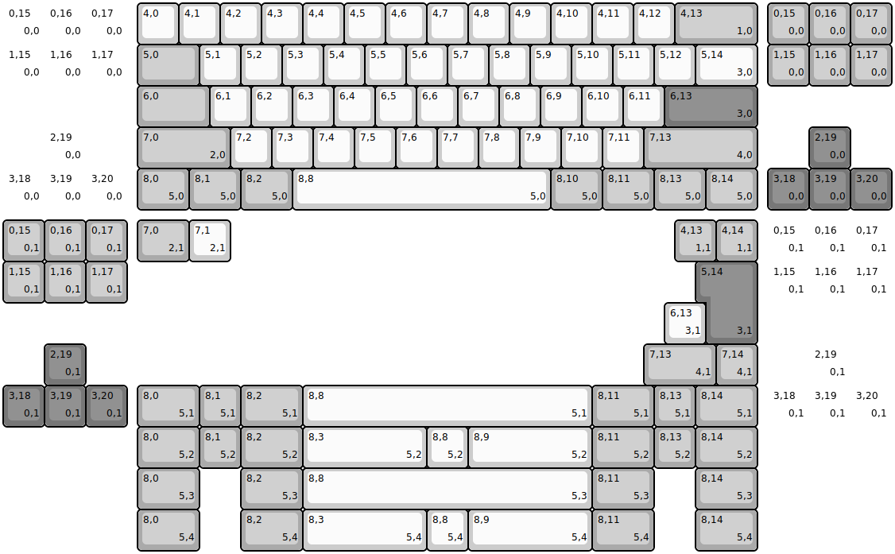
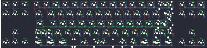

## rmi_kb/squishyfrl

[layout](squishyfrl-kle.json) - [PCB](squishyfrl.kicad_pcb)

{:loading="lazy"}

[Open in keyboard-layout-editor](http://www.keyboard-layout-editor.com/##@@_c=#aaaaaa&d:true;&=0,15%0A%0A%0A0,0&_d:true;&=0,16%0A%0A%0A0,0&_d:true;&=0,17%0A%0A%0A0,0&_x:0.25&c=#cccccc;&=4,0&=4,1&=4,2&=4,3&=4,4&=4,5&=4,6&=4,7&=4,8&=4,9&=4,10&=4,11&=4,12&_c=#aaaaaa&w:2;&=4,13%0A%0A%0A1,0&_x:0.25;&=0,15%0A%0A%0A0,0&=0,16%0A%0A%0A0,0&=0,17%0A%0A%0A0,0;&@_d:true;&=1,15%0A%0A%0A0,0&_d:true;&=1,16%0A%0A%0A0,0&_d:true;&=1,17%0A%0A%0A0,0&_x:0.25&w:1.5;&=5,0&_c=#cccccc;&=5,1&=5,2&=5,3&=5,4&=5,5&=5,6&=5,7&=5,8&=5,9&=5,10&=5,11&=5,12&_w:1.5;&=5,14%0A%0A%0A3,0&_x:0.25&c=#aaaaaa;&=1,15%0A%0A%0A0,0&=1,16%0A%0A%0A0,0&=1,17%0A%0A%0A0,0;&@_x:3.25&w:1.75;&=6,0&_c=#cccccc;&=6,1&=6,2&=6,3&=6,4&=6,5&=6,6&=6,7&=6,8&=6,9&=6,10&=6,11&_c=#777777&w:2.25;&=6,13%0A%0A%0A3,0;&@_x:1&d:true;&=2,19%0A%0A%0A0,0&_x:1.25&c=#aaaaaa&w:2.25;&=7,0%0A%0A%0A2,0&_c=#cccccc;&=7,2&=7,3&=7,4&=7,5&=7,6&=7,7&=7,8&=7,9&=7,10&=7,11&_c=#aaaaaa&w:2.75;&=7,13%0A%0A%0A4,0&_x:1.25&c=#777777;&=2,19%0A%0A%0A0,0;&@_d:true;&=3,18%0A%0A%0A0,0&_d:true;&=3,19%0A%0A%0A0,0&_d:true;&=3,20%0A%0A%0A0,0&_x:0.25&c=#aaaaaa&w:1.25;&=8,0%0A%0A%0A5,0&_w:1.25;&=8,1%0A%0A%0A5,0&_w:1.25;&=8,2%0A%0A%0A5,0&_c=#cccccc&w:6.25;&=8,8%0A%0A%0A5,0&_c=#aaaaaa&w:1.25;&=8,10%0A%0A%0A5,0&_w:1.25;&=8,11%0A%0A%0A5,0&_w:1.25;&=8,13%0A%0A%0A5,0&_w:1.25;&=8,14%0A%0A%0A5,0&_x:0.25&c=#777777;&=3,18%0A%0A%0A0,0&=3,19%0A%0A%0A0,0&=3,20%0A%0A%0A0,0;&@_y:0.25&c=#aaaaaa;&=0,15%0A%0A%0A0,1&=0,16%0A%0A%0A0,1&=0,17%0A%0A%0A0,1&_x:0.25&w:1.25;&=7,0%0A%0A%0A2,1&_c=#cccccc;&=7,1%0A%0A%0A2,1&_x:10.75&c=#aaaaaa;&=4,13%0A%0A%0A1,1&=4,14%0A%0A%0A1,1&_x:0.25&d:true;&=0,15%0A%0A%0A0,1&_d:true;&=0,16%0A%0A%0A0,1&_d:true;&=0,17%0A%0A%0A0,1;&@=1,15%0A%0A%0A0,1&=1,16%0A%0A%0A0,1&=1,17%0A%0A%0A0,1&_x:14&c=#777777&w:1.25&h:2&w2:1.5&h2:1&x2:-0.25;&=5,14%0A%0A%0A3,1&_x:0.25&c=#aaaaaa&d:true;&=1,15%0A%0A%0A0,1&_d:true;&=1,16%0A%0A%0A0,1&_d:true;&=1,17%0A%0A%0A0,1;&@_x:16&c=#cccccc;&=6,13%0A%0A%0A3,1;&@_x:1&c=#777777;&=2,19%0A%0A%0A0,1&_x:13.5&c=#aaaaaa&w:1.75;&=7,13%0A%0A%0A4,1&=7,14%0A%0A%0A4,1&_x:1.25&c=#777777&d:true;&=2,19%0A%0A%0A0,1;&@=3,18%0A%0A%0A0,1&=3,19%0A%0A%0A0,1&=3,20%0A%0A%0A0,1&_x:0.25&c=#aaaaaa&w:1.5;&=8,0%0A%0A%0A5,1&=8,1%0A%0A%0A5,1&_w:1.5;&=8,2%0A%0A%0A5,1&_c=#cccccc&w:7;&=8,8%0A%0A%0A5,1&_c=#aaaaaa&w:1.5;&=8,11%0A%0A%0A5,1&=8,13%0A%0A%0A5,1&_w:1.5;&=8,14%0A%0A%0A5,1&_x:0.25&c=#777777&d:true;&=3,18%0A%0A%0A0,1&_d:true;&=3,19%0A%0A%0A0,1&_d:true;&=3,20%0A%0A%0A0,1;&@_x:3.25&c=#aaaaaa&w:1.5;&=8,0%0A%0A%0A5,2&=8,1%0A%0A%0A5,2&_w:1.5;&=8,2%0A%0A%0A5,2&_c=#cccccc&w:3;&=8,3%0A%0A%0A5,2&=8,8%0A%0A%0A5,2&_w:3;&=8,9%0A%0A%0A5,2&_c=#aaaaaa&w:1.5;&=8,11%0A%0A%0A5,2&=8,13%0A%0A%0A5,2&_w:1.5;&=8,14%0A%0A%0A5,2;&@_x:3.25&w:1.5;&=8,0%0A%0A%0A5,3&_x:1.0&w:1.5;&=8,2%0A%0A%0A5,3&_c=#cccccc&w:7;&=8,8%0A%0A%0A5,3&_c=#aaaaaa&w:1.5;&=8,11%0A%0A%0A5,3&_x:1.0&w:1.5;&=8,14%0A%0A%0A5,3;&@_x:3.25&w:1.5;&=8,0%0A%0A%0A5,4&_x:1.0&w:1.5;&=8,2%0A%0A%0A5,4&_c=#cccccc&w:3;&=8,3%0A%0A%0A5,4&=8,8%0A%0A%0A5,4&_w:3;&=8,9%0A%0A%0A5,4&_c=#aaaaaa&w:1.5;&=8,11%0A%0A%0A5,4&_x:1.0&w:1.5;&=8,14%0A%0A%0A5,4)

{:loading="lazy"}

