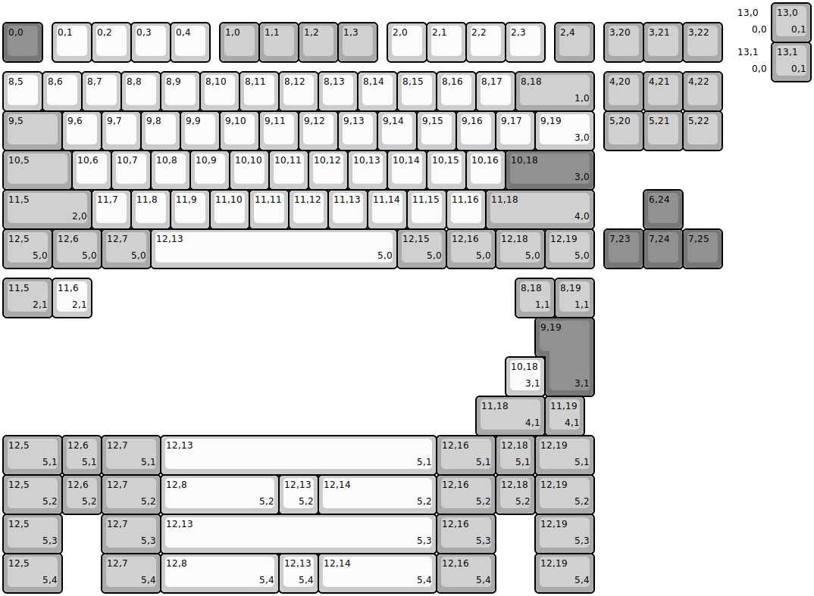
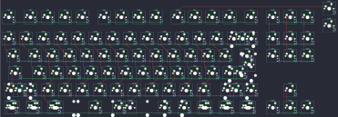

## rmi_kb/squishytkl

[layout](squishytkl-kle.json) - [PCB](squishytkl.kicad_pcb)

{:loading="lazy"}

[Open in keyboard-layout-editor](http://www.keyboard-layout-editor.com/##@@_x:18.5&d:true;&=13,0%0A%0A%0A0,0;&@_y:-0.5&c=#777777;&=0,0&_x:0.25&c=#cccccc;&=0,1&=0,2&=0,3&=0,4&_x:0.25&c=#aaaaaa;&=1,0&=1,1&=1,2&=1,3&_x:0.25&c=#cccccc;&=2,0&=2,1&=2,2&=2,3&_x:0.25&c=#aaaaaa;&=2,4&_x:0.25;&=3,20&=3,21&=3,22;&@_x:18.5&y:-0.5&c=#cccccc&d:true;&=13,1%0A%0A%0A0,0;&@_y:-0.25;&=8,5&=8,6&=8,7&=8,8&=8,9&=8,10&=8,11&=8,12&=8,13&=8,14&=8,15&=8,16&=8,17&_c=#aaaaaa&w:2;&=8,18%0A%0A%0A1,0&_x:0.25;&=4,20&=4,21&=4,22;&@_w:1.5;&=9,5&_c=#cccccc;&=9,6&=9,7&=9,8&=9,9&=9,10&=9,11&=9,12&=9,13&=9,14&=9,15&=9,16&=9,17&_w:1.5;&=9,19%0A%0A%0A3,0&_x:0.25&c=#aaaaaa;&=5,20&=5,21&=5,22;&@_w:1.75;&=10,5&_c=#cccccc;&=10,6&=10,7&=10,8&=10,9&=10,10&=10,11&=10,12&=10,13&=10,14&=10,15&=10,16&_c=#777777&w:2.25;&=10,18%0A%0A%0A3,0;&@_c=#aaaaaa&w:2.25;&=11,5%0A%0A%0A2,0&_c=#cccccc;&=11,7&=11,8&=11,9&=11,10&=11,11&=11,12&=11,13&=11,14&=11,15&=11,16&_c=#aaaaaa&w:2.75;&=11,18%0A%0A%0A4,0&_x:1.25&c=#777777;&=6,24;&@_c=#aaaaaa&w:1.25;&=12,5%0A%0A%0A5,0&_w:1.25;&=12,6%0A%0A%0A5,0&_w:1.25;&=12,7%0A%0A%0A5,0&_c=#cccccc&w:6.25;&=12,13%0A%0A%0A5,0&_c=#aaaaaa&w:1.25;&=12,15%0A%0A%0A5,0&_w:1.25;&=12,16%0A%0A%0A5,0&_w:1.25;&=12,18%0A%0A%0A5,0&_w:1.25;&=12,19%0A%0A%0A5,0&_x:0.25&c=#777777;&=7,23&=7,24&=7,25;&@_x:19.5&y:-6.75&c=#aaaaaa;&=13,0%0A%0A%0A0,1;&@_x:19.5;&=13,1%0A%0A%0A0,1;&@_y:5.0&w:1.25;&=11,5%0A%0A%0A2,1&_c=#cccccc;&=11,6%0A%0A%0A2,1&_x:10.75&c=#aaaaaa;&=8,18%0A%0A%0A1,1&=8,19%0A%0A%0A1,1;&@_x:13.75&c=#777777&w:1.25&h:2&w2:1.5&h2:1&x2:-0.25;&=9,19%0A%0A%0A3,1;&@_x:12.75&c=#cccccc;&=10,18%0A%0A%0A3,1;&@_x:12&c=#aaaaaa&w:1.75;&=11,18%0A%0A%0A4,1&=11,19%0A%0A%0A4,1;&@_w:1.5;&=12,5%0A%0A%0A5,1&=12,6%0A%0A%0A5,1&_w:1.5;&=12,7%0A%0A%0A5,1&_c=#cccccc&w:7;&=12,13%0A%0A%0A5,1&_c=#aaaaaa&w:1.5;&=12,16%0A%0A%0A5,1&=12,18%0A%0A%0A5,1&_w:1.5;&=12,19%0A%0A%0A5,1;&@_w:1.5;&=12,5%0A%0A%0A5,2&=12,6%0A%0A%0A5,2&_w:1.5;&=12,7%0A%0A%0A5,2&_c=#cccccc&w:3;&=12,8%0A%0A%0A5,2&=12,13%0A%0A%0A5,2&_w:3;&=12,14%0A%0A%0A5,2&_c=#aaaaaa&w:1.5;&=12,16%0A%0A%0A5,2&=12,18%0A%0A%0A5,2&_w:1.5;&=12,19%0A%0A%0A5,2;&@_w:1.5;&=12,5%0A%0A%0A5,3&_x:1.0&w:1.5;&=12,7%0A%0A%0A5,3&_c=#cccccc&w:7;&=12,13%0A%0A%0A5,3&_c=#aaaaaa&w:1.5;&=12,16%0A%0A%0A5,3&_x:1.0&w:1.5;&=12,19%0A%0A%0A5,3;&@_w:1.5;&=12,5%0A%0A%0A5,4&_x:1.0&w:1.5;&=12,7%0A%0A%0A5,4&_c=#cccccc&w:3;&=12,8%0A%0A%0A5,4&=12,13%0A%0A%0A5,4&_w:3;&=12,14%0A%0A%0A5,4&_c=#aaaaaa&w:1.5;&=12,16%0A%0A%0A5,4&_x:1.0&w:1.5;&=12,19%0A%0A%0A5,4)

{:loading="lazy"}

