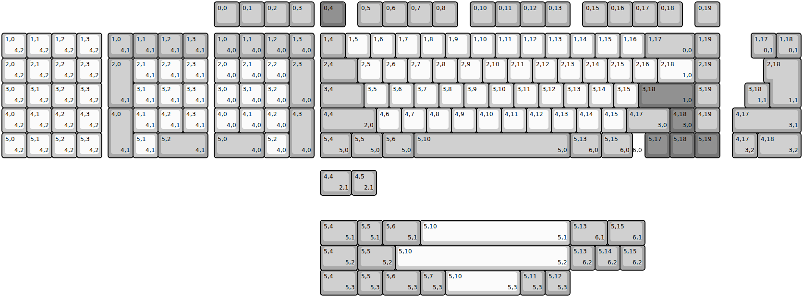
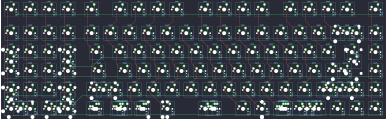
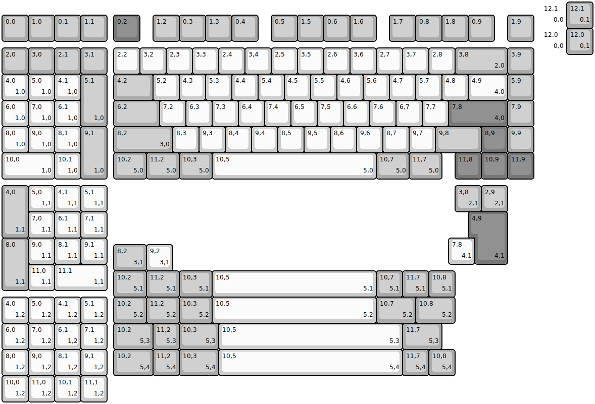
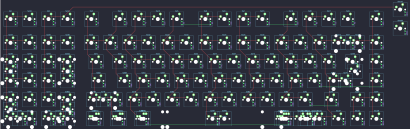

## rmi_kb/wete

[layout](wete-kle.json) - [PCB](wete.kicad_pcb)

{:loading="lazy"}

[Open in keyboard-layout-editor](http://www.keyboard-layout-editor.com/##@@_x:8.5&c=#aaaaaa;&=0,0&=0,1&=0,2&=0,3&_x:0.25&c=#777777;&=0,4&_x:0.5&c=#aaaaaa;&=0,5&=0,6&=0,7&=0,8&_x:0.5;&=0,10&=0,11&=0,12&=0,13&_x:0.5;&=0,15&=0,16&=0,17&=0,18&_x:0.5;&=0,19;&@_x:8.5&y:0.25;&=1,0%0A%0A%0A4,0&=1,1%0A%0A%0A4,0&=1,2%0A%0A%0A4,0&=1,3%0A%0A%0A4,0&_x:0.25;&=1,4&_c=#cccccc;&=1,5&=1,6&=1,7&=1,8&=1,9&=1,10&=1,11&=1,12&=1,13&=1,14&=1,15&=1,16&_c=#aaaaaa&w:2;&=1,17%0A%0A%0A0,0&=1,19;&@_x:8.5&c=#cccccc;&=2,0%0A%0A%0A4,0&=2,1%0A%0A%0A4,0&=2,2%0A%0A%0A4,0&_c=#aaaaaa&h:2;&=2,3%0A%0A%0A4,0&_x:0.25&w:1.5;&=2,4&_c=#cccccc;&=2,5&=2,6&=2,7&=2,8&=2,9&=2,10&=2,11&=2,12&=2,13&=2,14&=2,15&=2,16&_w:1.5;&=2,18%0A%0A%0A1,0&_c=#aaaaaa;&=2,19;&@_x:8.5&c=#cccccc;&=3,0%0A%0A%0A4,0&_n:true;&=3,1%0A%0A%0A4,0&=3,2%0A%0A%0A4,0&_x:1.25&c=#aaaaaa&w:1.75;&=3,4&_c=#cccccc;&=3,5&=3,6&=3,7&_n:true;&=3,8&=3,9&=3,10&_n:true;&=3,11&=3,12&=3,13&=3,14&=3,15&_c=#777777&w:2.25;&=3,18%0A%0A%0A1,0&_c=#aaaaaa;&=3,19;&@_x:8.5&c=#cccccc;&=4,0%0A%0A%0A4,0&=4,1%0A%0A%0A4,0&=4,2%0A%0A%0A4,0&_c=#aaaaaa&h:2;&=4,3%0A%0A%0A4,0&_x:0.25&w:2.25;&=4,4%0A%0A%0A2,0&_c=#cccccc;&=4,6&=4,7&=4,8&=4,9&=4,10&=4,11&=4,12&=4,13&=4,14&=4,15&_c=#aaaaaa&w:1.75;&=4,17%0A%0A%0A3,0&_c=#777777;&=4,18%0A%0A%0A3,0&_c=#aaaaaa;&=4,19;&@_x:8.5&w:2;&=5,0%0A%0A%0A4,0&_c=#cccccc;&=5,2%0A%0A%0A4,0&_x:1.25&c=#aaaaaa&w:1.25;&=5,4%0A%0A%0A5,0&_w:1.25;&=5,5%0A%0A%0A5,0&_w:1.25;&=5,6%0A%0A%0A5,0&_w:6.25;&=5,10%0A%0A%0A5,0&_w:1.25;&=5,13%0A%0A%0A6,0&_w:1.25;&=5,15%0A%0A%0A6,0&_c=#cccccc&w:0.5&d:true;&=%0A%0A%0A6,0&_c=#777777;&=5,17&=5,18&=5,19;&@_y:-5.0&c=#cccccc;&=1,0%0A%0A%0A4,2&=1,1%0A%0A%0A4,2&=1,2%0A%0A%0A4,2&=1,3%0A%0A%0A4,2&_x:0.25&c=#aaaaaa;&=1,0%0A%0A%0A4,1&=1,1%0A%0A%0A4,1&=1,2%0A%0A%0A4,1&=1,3%0A%0A%0A4,1&_x:21.75;&=1,17%0A%0A%0A0,1&=1,18%0A%0A%0A0,1;&@_c=#cccccc;&=2,0%0A%0A%0A4,2&=2,1%0A%0A%0A4,2&=2,2%0A%0A%0A4,2&=2,3%0A%0A%0A4,2&_x:0.25&c=#aaaaaa&h:2;&=2,0%0A%0A%0A4,1&_c=#cccccc;&=2,1%0A%0A%0A4,1&=2,2%0A%0A%0A4,1&=2,3%0A%0A%0A4,1&_x:22.5&c=#aaaaaa&w:1.25&h:2&w2:1.5&h2:1&x2:-0.25;&=2,18%0A%0A%0A1,1;&@_c=#cccccc;&=3,0%0A%0A%0A4,2&_n:true;&=3,1%0A%0A%0A4,2&=3,2%0A%0A%0A4,2&=3,3%0A%0A%0A4,2&_x:1.25&n:true;&=3,1%0A%0A%0A4,1&=3,2%0A%0A%0A4,1&=3,3%0A%0A%0A4,1&_x:21.5&c=#aaaaaa;&=3,18%0A%0A%0A1,1;&@_c=#cccccc;&=4,0%0A%0A%0A4,2&=4,1%0A%0A%0A4,2&=4,2%0A%0A%0A4,2&=4,3%0A%0A%0A4,2&_x:0.25&c=#aaaaaa&h:2;&=4,0%0A%0A%0A4,1&_c=#cccccc;&=4,1%0A%0A%0A4,1&=4,2%0A%0A%0A4,1&=4,3%0A%0A%0A4,1&_x:21.0&c=#aaaaaa&w:2.75;&=4,17%0A%0A%0A3,1;&@_c=#cccccc;&=5,0%0A%0A%0A4,2&=5,1%0A%0A%0A4,2&=5,2%0A%0A%0A4,2&=5,3%0A%0A%0A4,2&_x:1.25;&=5,1%0A%0A%0A4,1&_c=#aaaaaa&w:2;&=5,2%0A%0A%0A4,1&_x:21.0;&=4,17%0A%0A%0A3,2&_w:1.75;&=4,18%0A%0A%0A3,2;&@_x:12.75&y:0.5&w:1.25;&=4,4%0A%0A%0A2,1&=4,5%0A%0A%0A2,1;&@_x:12.75&y:1.0&w:1.5;&=5,4%0A%0A%0A5,1&=5,5%0A%0A%0A5,1&_w:1.5;&=5,6%0A%0A%0A5,1&_c=#cccccc&w:6;&=5,10%0A%0A%0A5,1&_c=#aaaaaa&w:1.5;&=5,13%0A%0A%0A6,1&_w:1.5;&=5,15%0A%0A%0A6,1;&@_x:12.75&w:1.5;&=5,4%0A%0A%0A5,2&_w:1.5;&=5,5%0A%0A%0A5,2&_c=#cccccc&w:7;&=5,10%0A%0A%0A5,2&_c=#aaaaaa;&=5,13%0A%0A%0A6,2&=5,14%0A%0A%0A6,2&=5,15%0A%0A%0A6,2;&@_x:12.75&w:1.5;&=5,4%0A%0A%0A5,3&=5,5%0A%0A%0A5,3&_w:1.5;&=5,6%0A%0A%0A5,3&=5,7%0A%0A%0A5,3&_c=#cccccc&w:3;&=5,10%0A%0A%0A5,3&_c=#aaaaaa;&=5,11%0A%0A%0A5,3&=5,12%0A%0A%0A5,3)

{:loading="lazy"}

## rmi_kb/wete/wete_v2

[layout](wete_v2-kle.json) - [PCB](wete_v2.kicad_pcb)

{:loading="lazy"}

[Open in keyboard-layout-editor](http://www.keyboard-layout-editor.com/##@@_x:20.5&d:true;&=12,1%0A%0A%0A0,0;&@_y:-0.5&c=#aaaaaa;&=0,0&=1,0&=0,1&=1,1&_x:0.25&c=#777777;&=0,2&_x:0.5&c=#aaaaaa;&=1,2&=0,3&=1,3&=0,4&_x:0.5;&=0,5&=1,5&=0,6&=1,6&_x:0.5;&=1,7&=0,8&=1,8&=0,9&_x:0.5;&=1,9;&@_x:20.5&y:-0.5&c=#cccccc&d:true;&=12,0%0A%0A%0A0,0;&@_y:-0.25&c=#aaaaaa;&=2,0&=3,0&=2,1&=3,1&_x:0.25&c=#cccccc;&=2,2&=3,2&=2,3&=3,3&=2,4&=3,4&=2,5&=3,5&=2,6&=3,6&=2,7&=3,7&=2,8&_c=#aaaaaa&w:2;&=3,8%0A%0A%0A2,0&=3,9;&@_c=#cccccc;&=4,0%0A%0A%0A1,0&=5,0%0A%0A%0A1,0&=4,1%0A%0A%0A1,0&_c=#aaaaaa&h:2;&=5,1%0A%0A%0A1,0&_x:0.25&w:1.5;&=4,2&_c=#cccccc;&=5,2&=4,3&=5,3&=4,4&=5,4&=4,5&=5,5&=4,6&=5,6&=4,7&=5,7&=4,8&_w:1.5;&=4,9%0A%0A%0A4,0&_c=#aaaaaa;&=5,9;&@_c=#cccccc;&=6,0%0A%0A%0A1,0&=7,0%0A%0A%0A1,0&=6,1%0A%0A%0A1,0&_x:1.25&c=#aaaaaa&w:1.75;&=6,2&_c=#cccccc;&=7,2&=6,3&=7,3&=6,4&=7,4&=6,5&=7,5&=6,6&=7,6&=6,7&=7,7&_c=#777777&w:2.25;&=7,8%0A%0A%0A4,0&_c=#aaaaaa;&=7,9;&@_c=#cccccc;&=8,0%0A%0A%0A1,0&=9,0%0A%0A%0A1,0&=8,1%0A%0A%0A1,0&_c=#aaaaaa&h:2;&=9,1%0A%0A%0A1,0&_x:0.25&w:2.25;&=8,2%0A%0A%0A3,0&_c=#cccccc;&=8,3&=9,3&=8,4&=9,4&=8,5&=9,5&=8,6&=9,6&=8,7&=9,7&_c=#aaaaaa&w:1.75;&=9,8&_c=#777777;&=8,9&_c=#aaaaaa;&=9,9;&@_c=#cccccc&w:2;&=10,0%0A%0A%0A1,0&=10,1%0A%0A%0A1,0&_x:1.25&c=#aaaaaa&w:1.25;&=10,2%0A%0A%0A5,0&_w:1.25;&=11,2%0A%0A%0A5,0&_w:1.25;&=10,3%0A%0A%0A5,0&_c=#cccccc&w:6.25;&=10,5%0A%0A%0A5,0&_c=#aaaaaa&w:1.25;&=10,7%0A%0A%0A5,0&_w:1.25;&=11,7%0A%0A%0A5,0&_x:0.5&c=#777777;&=11,8&=10,9&=11,9;&@_x:21.5&y:-6.75&c=#aaaaaa;&=12,1%0A%0A%0A0,1;&@_x:21.5;&=12,0%0A%0A%0A0,1;&@_y:5.0&h:2;&=4,0%0A%0A%0A1,1&_c=#cccccc;&=5,0%0A%0A%0A1,1&=4,1%0A%0A%0A1,1&=5,1%0A%0A%0A1,1&_x:13.25&c=#aaaaaa;&=3,8%0A%0A%0A2,1&=2,9%0A%0A%0A2,1;&@_x:1&c=#cccccc;&=7,0%0A%0A%0A1,1&=6,1%0A%0A%0A1,1&=7,1%0A%0A%0A1,1&_x:14&c=#777777&w:1.25&h:2&w2:1.5&h2:1&x2:-0.25;&=4,9%0A%0A%0A4,1;&@_c=#aaaaaa&h:2;&=8,0%0A%0A%0A1,1&_c=#cccccc;&=9,0%0A%0A%0A1,1&=8,1%0A%0A%0A1,1&=9,1%0A%0A%0A1,1&_x:13;&=7,8%0A%0A%0A4,1;&@_x:4.25&y:-0.75&c=#aaaaaa&w:1.25;&=8,2%0A%0A%0A3,1&_c=#cccccc;&=9,2%0A%0A%0A3,1;&@_x:1&y:-0.25;&=11,0%0A%0A%0A1,1&_w:2;&=11,1%0A%0A%0A1,1;&@_x:4.25&y:-0.75&c=#aaaaaa&w:1.25;&=10,2%0A%0A%0A5,1&_w:1.25;&=11,2%0A%0A%0A5,1&_w:1.25;&=10,3%0A%0A%0A5,1&_c=#cccccc&w:6.25;&=10,5%0A%0A%0A5,1&_c=#aaaaaa;&=10,7%0A%0A%0A5,1&=11,7%0A%0A%0A5,1&=10,8%0A%0A%0A5,1;&@_c=#cccccc;&=4,0%0A%0A%0A1,2&=5,0%0A%0A%0A1,2&=4,1%0A%0A%0A1,2&=5,1%0A%0A%0A1,2&_x:0.25&c=#aaaaaa&w:1.25;&=10,2%0A%0A%0A5,2&_w:1.25;&=11,2%0A%0A%0A5,2&_w:1.25;&=10,3%0A%0A%0A5,2&_c=#cccccc&w:6.25;&=10,5%0A%0A%0A5,2&_c=#aaaaaa&w:1.5;&=10,7%0A%0A%0A5,2&_w:1.5;&=10,8%0A%0A%0A5,2;&@_c=#cccccc;&=6,0%0A%0A%0A1,2&=7,0%0A%0A%0A1,2&=6,1%0A%0A%0A1,2&=7,1%0A%0A%0A1,2&_x:0.25&c=#aaaaaa&w:1.5;&=10,2%0A%0A%0A5,3&=11,2%0A%0A%0A5,3&_w:1.5;&=10,3%0A%0A%0A5,3&_c=#cccccc&w:7;&=10,5%0A%0A%0A5,3&_c=#aaaaaa&w:1.5;&=11,7%0A%0A%0A5,3;&@_c=#cccccc;&=8,0%0A%0A%0A1,2&=9,0%0A%0A%0A1,2&=8,1%0A%0A%0A1,2&=9,1%0A%0A%0A1,2&_x:0.25&c=#aaaaaa&w:1.5;&=10,2%0A%0A%0A5,4&=11,2%0A%0A%0A5,4&_w:1.5;&=10,3%0A%0A%0A5,4&_c=#cccccc&w:7;&=10,5%0A%0A%0A5,4&_c=#aaaaaa;&=11,7%0A%0A%0A5,4&=10,8%0A%0A%0A5,4;&@_c=#cccccc;&=10,0%0A%0A%0A1,2&=11,0%0A%0A%0A1,2&=10,1%0A%0A%0A1,2&=11,1%0A%0A%0A1,2)

{:loading="lazy"}

