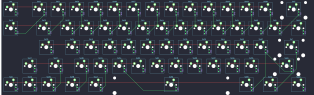

## rpiguy9907/Southpaw66

[layout](Southpaw66-kle.json) - [PCB](Southpaw66.kicad_pcb)

{:loading="lazy"}

[Open in keyboard-layout-editor](http://www.keyboard-layout-editor.com/##@@_c=#aaaaaa;&=0,0&_x:0.5&c=#777777;&=1,0&_c=#cccccc;&=2,0&=3,0&=4,0&=5,0&=6,0&=0,1&=1,1&=2,1&=3,1&=4,1&=5,1&=6,1&_c=#aaaaaa&w:2;&=0,2;&@=1,2&_x:0.5&w:1.5;&=2,2&_c=#cccccc;&=3,2&=4,2&=5,2&=6,2&=0,3&=1,3&=2,3&=3,3&=4,3&=5,3&=6,3&=0,4&_w:1.5;&=1,4;&@_x:1.5&c=#aaaaaa&w:1.75;&=2,4&_c=#cccccc;&=3,4&=4,4&=5,4&=6,4&=0,5&=1,5&=2,5&=3,5&=4,5&=5,5&=6,5&_c=#777777&w:2.25;&=0,6;&@_x:1&c=#aaaaaa;&=1,6&_w:1.75;&=2,6&_c=#cccccc;&=3,6&=4,6&=5,6&=6,6&=0,7&=1,7&=2,7&=3,7&=4,7&=5,7&_c=#aaaaaa&w:2.75;&=6,7;&@=0,8&=1,8&=2,8&_w:1.5;&=3,8&=4,8&_c=#cccccc&w:7;&=5,8&_c=#aaaaaa;&=6,8&_w:1.5;&=0,9&_w:1.5;&=1,9)

{:loading="lazy"}

