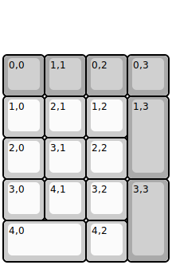
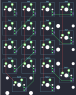
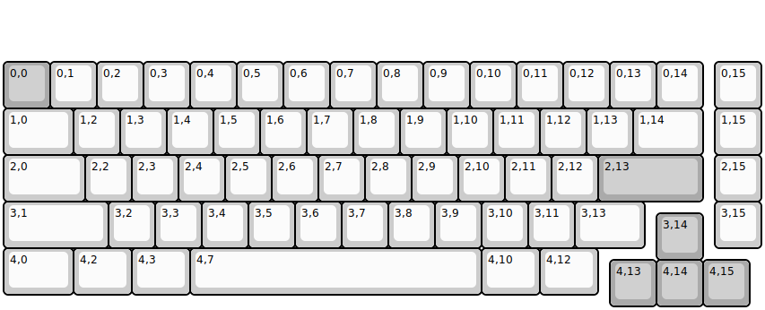
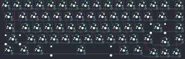
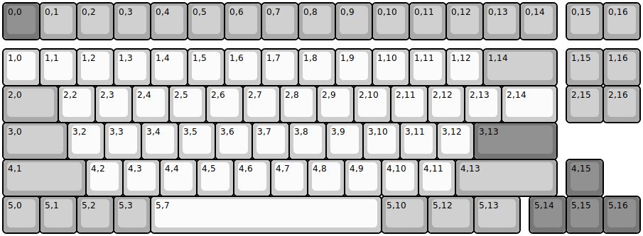
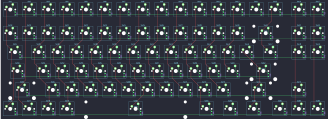

## ryanbaekr/rb18

[layout](rb18-kle.json) - [PCB](rb18.kicad_pcb)

{:loading="lazy"}

[Open in keyboard-layout-editor](http://www.keyboard-layout-editor.com/##@@_y:1.25&c=#aaaaaa;&=0,0&=1,1&=0,2&=0,3;&@_c=#cccccc;&=1,0&=2,1&=1,2&_c=#aaaaaa&h:2;&=1,3;&@_c=#cccccc;&=2,0&=3,1&=2,2;&@=3,0&=4,1&=3,2&_c=#aaaaaa&h:2;&=3,3;&@_c=#cccccc&w:2;&=4,0&=4,2)

{:loading="lazy"}

## ryanbaekr/rb69

[layout](rb69-kle.json) - [PCB](rb69.kicad_pcb)

{:loading="lazy"}

[Open in keyboard-layout-editor](http://www.keyboard-layout-editor.com/##@@_y:1.25&c=#aaaaaa;&=0,0&_c=#cccccc;&=0,1&=0,2&=0,3&=0,4&=0,5&=0,6&=0,7&=0,8&=0,9&=0,10&=0,11&=0,12&=0,13&=0,14&_x:0.25;&=0,15;&@_w:1.5;&=1,0&=1,2&=1,3&=1,4&=1,5&=1,6&=1,7&=1,8&=1,9&=1,10&=1,11&=1,12&=1,13&_w:1.5;&=1,14&_x:0.25;&=1,15;&@_w:1.75;&=2,0&=2,2&=2,3&=2,4&=2,5&=2,6&=2,7&=2,8&=2,9&=2,10&=2,11&=2,12&_c=#aaaaaa&w:2.25;&=2,13&_x:0.25&c=#cccccc;&=2,15;&@_w:2.25;&=3,1&=3,2&=3,3&=3,4&=3,5&=3,6&=3,7&=3,8&=3,9&=3,10&=3,11&_w:1.5;&=3,13&_x:1.5;&=3,15;&@_x:14&y:-0.75&c=#aaaaaa;&=3,14;&@_y:-0.25&c=#cccccc&w:1.5;&=4,0&_w:1.25;&=4,2&_w:1.25;&=4,3&_w:6.25;&=4,7&_w:1.25;&=4,10&_w:1.25;&=4,12;&@_x:13&y:-0.75&c=#aaaaaa;&=4,13&=4,14&=4,15)

{:loading="lazy"}

## ryanbaekr/rb86

[layout](rb86-kle.json) - [PCB](rb86.kicad_pcb)

{:loading="lazy"}

[Open in keyboard-layout-editor](http://www.keyboard-layout-editor.com/##@@_c=#777777;&=0,0&_c=#aaaaaa;&=0,1&=0,2&=0,3&=0,4&=0,5&=0,6&=0,7&=0,8&=0,9&=0,10&=0,11&=0,12&=0,13&=0,14&_x:0.25;&=0,15&=0,16;&@_y:0.25&c=#cccccc;&=1,0&=1,1&=1,2&=1,3&=1,4&=1,5&=1,6&=1,7&=1,8&=1,9&=1,10&=1,11&=1,12&_c=#aaaaaa&w:2;&=1,14&_x:0.25;&=1,15&=1,16;&@_w:1.5;&=2,0&_c=#cccccc;&=2,2&=2,3&=2,4&=2,5&=2,6&=2,7&=2,8&=2,9&=2,10&=2,11&=2,12&=2,13&_w:1.5;&=2,14&_x:0.25&c=#aaaaaa;&=2,15&=2,16;&@_w:1.75;&=3,0&_c=#cccccc;&=3,2&=3,3&=3,4&=3,5&=3,6&=3,7&=3,8&=3,9&=3,10&=3,11&=3,12&_c=#777777&w:2.25;&=3,13;&@_c=#aaaaaa&w:2.25;&=4,1&_c=#cccccc;&=4,2&=4,3&=4,4&=4,5&=4,6&=4,7&=4,8&=4,9&=4,10&=4,11&_c=#aaaaaa&w:2.75;&=4,13&_x:0.25&c=#777777;&=4,15;&@_c=#aaaaaa;&=5,0&=5,1&=5,2&=5,3&_c=#cccccc&w:6.25;&=5,7&_c=#aaaaaa&w:1.25;&=5,10&_w:1.25;&=5,12&_w:1.25;&=5,13&_x:0.25&c=#777777;&=5,14&=5,15&=5,16)

{:loading="lazy"}

