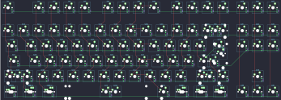

## sam/sam_s80_design load file

[layout](sam_s80_design load file-kle.json) - [PCB](sam_s80_design load file.kicad_pcb)

{:loading="lazy"}

[Open in keyboard-layout-editor](http://www.keyboard-layout-editor.com/##@@_x:2.75&y:1.25&c=#777777;&=0,0&_x:1.0;&=0,2&=0,3&=0,4&=0,5&_x:0.5;&=0,6&=0,7&=0,8&=6,8&_x:0.5;&=6,7&=6,5&=6,4&=6,3&_x:0.25;&=6,6&=6,2&=6,1;&@_x:2.75&y:0.5&c=#cccccc;&=1,0&=1,1&=1,2&=1,3&=1,4&=1,5&=1,6&=1,7&=1,8&=7,8&=7,0&=7,7&=7,5&_c=#aaaaaa&w:2;&=7,3%0A%0A%0A0,0&_x:0.25&c=#777777;&=7,6&=7,2&=7,1;&@_x:2.75&w:1.5;&=2,0&_c=#cccccc;&=2,1&=2,2&=2,3&=2,4&=2,5&=2,6&=2,7&=2,8&=8,8&=8,7&=8,5&=8,4&_w:1.5;&=9,4%0A%0A%0A1,0&_x:0.25&c=#777777;&=8,6&=8,2&=8,1;&@_x:2.75&c=#aaaaaa&w:1.75;&=3,0&_c=#cccccc;&=3,1&=3,2&=3,3&=3,4&=3,5&=3,6&=3,7&=3,8&=9,8&=9,7&=9,5&_c=#777777&w:2.25;&=8,3%0A%0A%0A1,0;&@_x:2.75&c=#aaaaaa&w:2.25;&=4,0%0A%0A%0A2,0&_c=#cccccc;&=4,2&=4,3&=4,4&=4,5&=4,6&=4,7&=4,8&=10,8&=10,7&=10,5&_c=#aaaaaa&w:2.75;&=10,4%0A%0A%0A3,0&_x:1.25&c=#777777;&=9,2;&@_x:2.75&c=#aaaaaa&w:1.25;&=5,0%0A%0A%0A4,0&_w:1.25;&=5,1%0A%0A%0A4,0&_w:1.25;&=5,2%0A%0A%0A4,0&_c=#cccccc&w:6.25;&=5,6%0A%0A%0A4,0&_c=#aaaaaa&w:1.25;&=5,8%0A%0A%0A4,0&_w:1.25;&=5,7%0A%0A%0A4,0&_w:1.25;&=5,4%0A%0A%0A4,0&_w:1.25;&=5,3%0A%0A%0A4,0&_x:0.25&c=#777777;&=10,6&=10,2&=10,1;&@_x:21.75&y:-5.0&c=#aaaaaa;&=7,4%0A%0A%0A0,1&=7,3%0A%0A%0A0,1;&@_x:22.5&c=#777777&w:1.25&h:2&w2:1.5&h2:1&x2:-0.25;&=8,3%0A%0A%0A1,1;&@_x:21.5&c=#cccccc;&=9,4%0A%0A%0A1,1;&@_c=#aaaaaa&w:1.25;&=4,0%0A%0A%0A2,1&_c=#cccccc;&=4,1%0A%0A%0A2,1&_x:18.75&c=#aaaaaa&w:1.75;&=10,4%0A%0A%0A3,1&=10,3%0A%0A%0A3,1;&@_x:2.75&y:1.0&w:1.5;&=5,0%0A%0A%0A4,1&=5,1%0A%0A%0A4,1&_w:1.5;&=5,2%0A%0A%0A4,1&_c=#cccccc&w:7;&=5,6%0A%0A%0A4,1&_c=#aaaaaa&w:1.5;&=5,7%0A%0A%0A4,1&=5,4%0A%0A%0A4,1&_w:1.5;&=5,3%0A%0A%0A4,1;&@_x:2.75&w:1.5;&=5,0%0A%0A%0A4,2&_x:1.0&w:1.5;&=5,2%0A%0A%0A4,2&_c=#cccccc&w:7;&=5,6%0A%0A%0A4,2&_c=#aaaaaa&w:1.5;&=5,7%0A%0A%0A4,2&_x:1.0&w:1.5;&=5,3%0A%0A%0A4,2)

{:loading="lazy"}

