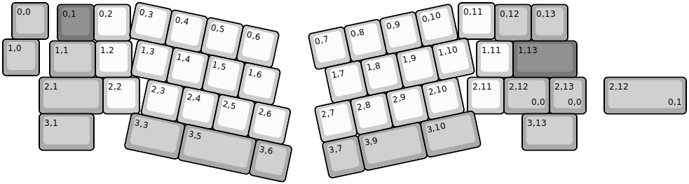
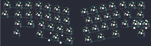

## satt/vision/satt_vision

[layout](satt_vision-kle.json) - [PCB](satt_vision.kicad_pcb)

{:loading="lazy"}

[Open in keyboard-layout-editor](http://www.keyboard-layout-editor.com/##@@_x:0.25&c=#aaaaaa;&=0,0;&@_x:13.5&y:-0.95;&=0,12&=0,13;&@_y:-0.05;&=1,0;&@_x:13&y:-0.95&c=#cccccc;&=1,11&_c=#777777&w:1.75;&=1,13;&@_x:13.75&c=#aaaaaa&w:1.25;&=2,12%0A%0A%0A0,0&=2,13%0A%0A%0A0,0;&@_x:14.25&w:1.5;&=3,13;&@_rx:7&x:-5.5&y:0.05&c=#777777;&=0,1&_c=#cccccc;&=0,2;&@_x:-5.71&c=#aaaaaa&w:1.25;&=1,1&_c=#cccccc;&=1,2;&@_x:-6&c=#aaaaaa&w:1.75;&=2,1&_c=#cccccc;&=2,2;&@_x:-6&c=#aaaaaa&w:1.5;&=3,1;&@_rx:12.5&c=#cccccc;&=0,11;&@_x:0.25&y:1.05;&=2,11;&@_r:12&rx:3.75&ry:3.3&x:-0.75&y:-3.25;&=0,3&=0,4&=0,5&=0,6;&@_x:-0.5;&=1,3&=1,4&=1,5&=1,6;&@=2,3&=2,4&=2,5&=2,6;&@_x:1.25&c=#aaaaaa&w:2;&=3,5&=3,6&_x:-4.5&w:1.5;&=3,3;&@_r:-12&rx:12.5&ry:2.3&x:-3.75&y:-2.25&c=#cccccc;&=0,7&=0,8&=0,9&=0,10;&@_x:-3.5;&=1,7&=1,8&=1,9&=1,10;&@_x:-4.0;&=2,7&=2,8&=2,9&=2,10;&@_x:-4.0&c=#aaaaaa;&=3,7&_w:1.75;&=3,9&_w:1.5;&=3,10;&@_r:0&rx:0&ry:0&x:16.5&y:2.05&w:2.25;&=2,12%0A%0A%0A0,1)

{:loading="lazy"}

