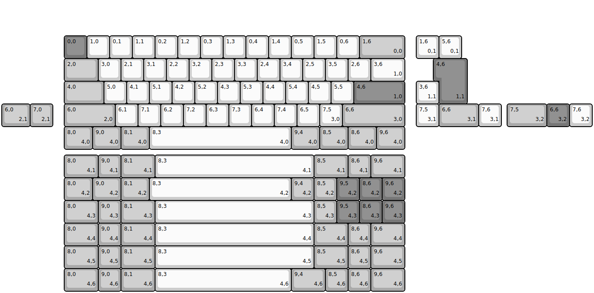
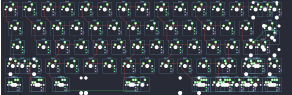
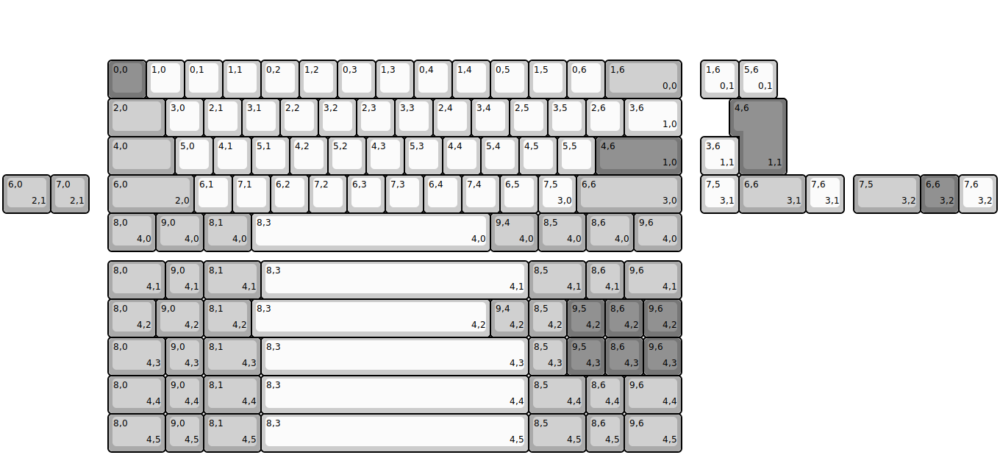
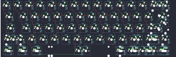

## sawnsprojects/eclipse/eclipse60

[layout](eclipse60-kle.json) - [PCB](eclipse60.kicad_pcb)

{:loading="lazy"}

[Open in keyboard-layout-editor](http://www.keyboard-layout-editor.com/##@@_x:2.75&y:1.5&c=#777777;&=0,0&_c=#cccccc;&=1,0&=0,1&=1,1&=0,2&=1,2&=0,3&=1,3&=0,4&=1,4&=0,5&=1,5&=0,6&_c=#aaaaaa&w:2;&=1,6%0A%0A%0A0,0;&@_x:2.75&w:1.5;&=2,0&_c=#cccccc;&=3,0&=2,1&=3,1&=2,2&=3,2&=2,3&=3,3&=2,4&=3,4&=2,5&=3,5&=2,6&_w:1.5;&=3,6%0A%0A%0A1,0;&@_x:2.75&c=#aaaaaa&w:1.75;&=4,0&_c=#cccccc;&=5,0&=4,1&=5,1&=4,2&=5,2&=4,3&=5,3&=4,4&=5,4&=4,5&=5,5&_c=#777777&w:2.25;&=4,6%0A%0A%0A1,0;&@_x:2.75&c=#aaaaaa&w:2.25;&=6,0%0A%0A%0A2,0&_c=#cccccc;&=6,1&=7,1&=6,2&=7,2&=6,3&=7,3&=6,4&=7,4&=6,5&=7,5%0A%0A%0A3,0&_c=#aaaaaa&w:2.75;&=6,6%0A%0A%0A3,0;&@_x:2.75&w:1.25;&=8,0%0A%0A%0A4,0&_w:1.25;&=9,0%0A%0A%0A4,0&_w:1.25;&=8,1%0A%0A%0A4,0&_c=#cccccc&w:6.25;&=8,3%0A%0A%0A4,0&_c=#aaaaaa&w:1.25;&=9,4%0A%0A%0A4,0&_w:1.25;&=8,5%0A%0A%0A4,0&_w:1.25;&=8,6%0A%0A%0A4,0&_w:1.25;&=9,6%0A%0A%0A4,0;&@_x:18.25&y:-5.0&c=#cccccc;&=1,6%0A%0A%0A0,1&=5,6%0A%0A%0A0,1;&@_x:19.25&c=#777777&w:1.25&h:2&w2:1.5&h2:1&x2:-0.25;&=4,6%0A%0A%0A1,1;&@_x:18.25&c=#cccccc;&=3,6%0A%0A%0A1,1;&@_c=#aaaaaa&w:1.25;&=6,0%0A%0A%0A2,1&=7,0%0A%0A%0A2,1&_x:16.0&c=#cccccc;&=7,5%0A%0A%0A3,1&_c=#aaaaaa&w:1.75;&=6,6%0A%0A%0A3,1&_c=#cccccc;&=7,6%0A%0A%0A3,1&_x:0.25&c=#aaaaaa&w:1.75;&=7,5%0A%0A%0A3,2&_c=#777777;&=6,6%0A%0A%0A3,2&_c=#cccccc;&=7,6%0A%0A%0A3,2;&@_x:2.75&y:1.25&c=#aaaaaa&w:1.5;&=8,0%0A%0A%0A4,1&=9,0%0A%0A%0A4,1&_w:1.5;&=8,1%0A%0A%0A4,1&_c=#cccccc&w:7;&=8,3%0A%0A%0A4,1&_c=#aaaaaa&w:1.5;&=8,5%0A%0A%0A4,1&=8,6%0A%0A%0A4,1&_w:1.5;&=9,6%0A%0A%0A4,1;&@_x:2.75&w:1.25;&=8,0%0A%0A%0A4,2&_w:1.25;&=9,0%0A%0A%0A4,2&_w:1.25;&=8,1%0A%0A%0A4,2&_c=#cccccc&w:6.25;&=8,3%0A%0A%0A4,2&_c=#aaaaaa;&=9,4%0A%0A%0A4,2&=8,5%0A%0A%0A4,2&_c=#777777;&=9,5%0A%0A%0A4,2&=8,6%0A%0A%0A4,2&=9,6%0A%0A%0A4,2;&@_x:2.75&c=#aaaaaa&w:1.5;&=8,0%0A%0A%0A4,3&=9,0%0A%0A%0A4,3&_w:1.5;&=8,1%0A%0A%0A4,3&_c=#cccccc&w:7;&=8,3%0A%0A%0A4,3&_c=#aaaaaa;&=8,5%0A%0A%0A4,3&_c=#777777;&=9,5%0A%0A%0A4,3&=8,6%0A%0A%0A4,3&=9,6%0A%0A%0A4,3;&@_x:2.75&c=#aaaaaa&w:1.5;&=8,0%0A%0A%0A4,4&_g:true;&=9,0%0A%0A%0A4,4&_g:false&w:1.5;&=8,1%0A%0A%0A4,4&_c=#cccccc&w:7;&=8,3%0A%0A%0A4,4&_c=#aaaaaa&w:1.5;&=8,5%0A%0A%0A4,4&_g:true;&=8,6%0A%0A%0A4,4&_g:false&w:1.5;&=9,6%0A%0A%0A4,4;&@_x:2.75&g:true&w:1.5;&=8,0%0A%0A%0A4,5&_g:false;&=9,0%0A%0A%0A4,5&_w:1.5;&=8,1%0A%0A%0A4,5&_c=#cccccc&w:7;&=8,3%0A%0A%0A4,5&_c=#aaaaaa&w:1.5;&=8,5%0A%0A%0A4,5&=8,6%0A%0A%0A4,5&_g:true&w:1.5;&=9,6%0A%0A%0A4,5;&@_x:2.75&g:false&w:1.5;&=8,0%0A%0A%0A4,6&=9,0%0A%0A%0A4,6&_w:1.5;&=8,1%0A%0A%0A4,6&_c=#cccccc&w:6;&=8,3%0A%0A%0A4,6&_c=#aaaaaa&w:1.5;&=9,4%0A%0A%0A4,6&=8,5%0A%0A%0A4,6&=8,6%0A%0A%0A4,6&_w:1.5;&=9,6%0A%0A%0A4,6)

{:loading="lazy"}

## sawnsprojects/eclipse/tinyneko

[layout](tinyneko-kle.json) - [PCB](tinyneko.kicad_pcb)

{:loading="lazy"}

[Open in keyboard-layout-editor](http://www.keyboard-layout-editor.com/##@@_x:2.75&y:1.5&c=#777777;&=0,0&_c=#cccccc;&=1,0&=0,1&=1,1&=0,2&=1,2&=0,3&=1,3&=0,4&=1,4&=0,5&=1,5&=0,6&_c=#aaaaaa&w:2;&=1,6%0A%0A%0A0,0;&@_x:2.75&w:1.5;&=2,0&_c=#cccccc;&=3,0&=2,1&=3,1&=2,2&=3,2&=2,3&=3,3&=2,4&=3,4&=2,5&=3,5&=2,6&_w:1.5;&=3,6%0A%0A%0A1,0;&@_x:2.75&c=#aaaaaa&w:1.75;&=4,0&_c=#cccccc;&=5,0&=4,1&=5,1&=4,2&=5,2&=4,3&=5,3&=4,4&=5,4&=4,5&=5,5&_c=#777777&w:2.25;&=4,6%0A%0A%0A1,0;&@_x:2.75&c=#aaaaaa&w:2.25;&=6,0%0A%0A%0A2,0&_c=#cccccc;&=6,1&=7,1&=6,2&=7,2&=6,3&=7,3&=6,4&=7,4&=6,5&=7,5%0A%0A%0A3,0&_c=#aaaaaa&w:2.75;&=6,6%0A%0A%0A3,0;&@_x:2.75&w:1.25;&=8,0%0A%0A%0A4,0&_w:1.25;&=9,0%0A%0A%0A4,0&_w:1.25;&=8,1%0A%0A%0A4,0&_c=#cccccc&w:6.25;&=8,3%0A%0A%0A4,0&_c=#aaaaaa&w:1.25;&=9,4%0A%0A%0A4,0&_w:1.25;&=8,5%0A%0A%0A4,0&_w:1.25;&=8,6%0A%0A%0A4,0&_w:1.25;&=9,6%0A%0A%0A4,0;&@_x:18.25&y:-5.0&c=#cccccc;&=1,6%0A%0A%0A0,1&=5,6%0A%0A%0A0,1;&@_x:19.25&c=#777777&w:1.25&h:2&w2:1.5&h2:1&x2:-0.25;&=4,6%0A%0A%0A1,1;&@_x:18.25&c=#cccccc;&=3,6%0A%0A%0A1,1;&@_c=#aaaaaa&w:1.25;&=6,0%0A%0A%0A2,1&=7,0%0A%0A%0A2,1&_x:16.0&c=#cccccc;&=7,5%0A%0A%0A3,1&_c=#aaaaaa&w:1.75;&=6,6%0A%0A%0A3,1&_c=#cccccc;&=7,6%0A%0A%0A3,1&_x:0.25&c=#aaaaaa&w:1.75;&=7,5%0A%0A%0A3,2&_c=#777777;&=6,6%0A%0A%0A3,2&_c=#cccccc;&=7,6%0A%0A%0A3,2;&@_x:2.75&y:1.25&c=#aaaaaa&w:1.5;&=8,0%0A%0A%0A4,1&=9,0%0A%0A%0A4,1&_w:1.5;&=8,1%0A%0A%0A4,1&_c=#cccccc&w:7;&=8,3%0A%0A%0A4,1&_c=#aaaaaa&w:1.5;&=8,5%0A%0A%0A4,1&=8,6%0A%0A%0A4,1&_w:1.5;&=9,6%0A%0A%0A4,1;&@_x:2.75&w:1.25;&=8,0%0A%0A%0A4,2&_w:1.25;&=9,0%0A%0A%0A4,2&_w:1.25;&=8,1%0A%0A%0A4,2&_c=#cccccc&w:6.25;&=8,3%0A%0A%0A4,2&_c=#aaaaaa;&=9,4%0A%0A%0A4,2&=8,5%0A%0A%0A4,2&_c=#777777;&=9,5%0A%0A%0A4,2&=8,6%0A%0A%0A4,2&=9,6%0A%0A%0A4,2;&@_x:2.75&c=#aaaaaa&w:1.5;&=8,0%0A%0A%0A4,3&=9,0%0A%0A%0A4,3&_w:1.5;&=8,1%0A%0A%0A4,3&_c=#cccccc&w:7;&=8,3%0A%0A%0A4,3&_c=#aaaaaa;&=8,5%0A%0A%0A4,3&_c=#777777;&=9,5%0A%0A%0A4,3&=8,6%0A%0A%0A4,3&=9,6%0A%0A%0A4,3;&@_x:2.75&c=#aaaaaa&w:1.5;&=8,0%0A%0A%0A4,4&_g:true;&=9,0%0A%0A%0A4,4&_g:false&w:1.5;&=8,1%0A%0A%0A4,4&_c=#cccccc&w:7;&=8,3%0A%0A%0A4,4&_c=#aaaaaa&w:1.5;&=8,5%0A%0A%0A4,4&_g:true;&=8,6%0A%0A%0A4,4&_g:false&w:1.5;&=9,6%0A%0A%0A4,4;&@_x:2.75&g:true&w:1.5;&=8,0%0A%0A%0A4,5&_g:false;&=9,0%0A%0A%0A4,5&_w:1.5;&=8,1%0A%0A%0A4,5&_c=#cccccc&w:7;&=8,3%0A%0A%0A4,5&_c=#aaaaaa&w:1.5;&=8,5%0A%0A%0A4,5&=8,6%0A%0A%0A4,5&_g:true&w:1.5;&=9,6%0A%0A%0A4,5)

{:loading="lazy"}

