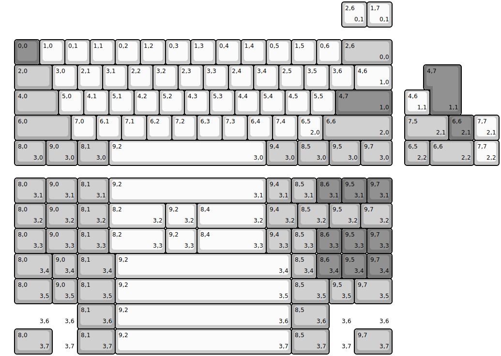
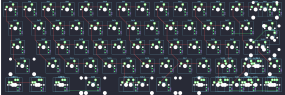

## sawnsprojects/krush60_solder

[layout](krush60_solder-kle.json) - [PCB](krush60_solder.kicad_pcb)

{:loading="lazy"}

[Open in keyboard-layout-editor](http://www.keyboard-layout-editor.com/##@@_x:0.5&y:1.5&c=#777777;&=0,0&_c=#cccccc;&=1,0&=0,1&=1,1&=0,2&=1,2&=0,3&=1,3&=0,4&=1,4&=0,5&=1,5&=0,6&_c=#aaaaaa&w:2;&=2,6%0A%0A%0A0,0;&@_x:0.5&w:1.5;&=2,0&_c=#cccccc;&=3,0&=2,1&=3,1&=2,2&=3,2&=2,3&=3,3&=2,4&=3,4&=2,5&=3,5&=3,6&_w:1.5;&=4,6%0A%0A%0A1,0;&@_x:0.5&c=#aaaaaa&w:1.75;&=4,0&_c=#cccccc;&=5,0&=4,1&=5,1&=4,2&=5,2&=4,3&=5,3&=4,4&=5,4&=4,5&=5,5&_c=#777777&w:2.25;&=4,7%0A%0A%0A1,0;&@_x:0.5&c=#aaaaaa&w:2.25;&=6,0&_c=#cccccc;&=7,0&=6,1&=7,1&=6,2&=7,2&=6,3&=7,3&=6,4&=7,4&=6,5%0A%0A%0A2,0&_c=#aaaaaa&w:2.75;&=6,6%0A%0A%0A2,0;&@_x:0.5&w:1.25;&=8,0%0A%0A%0A3,0&_w:1.25;&=9,0%0A%0A%0A3,0&_w:1.25;&=8,1%0A%0A%0A3,0&_c=#cccccc&w:6.25;&=9,2%0A%0A%0A3,0&_c=#aaaaaa&w:1.25;&=9,4%0A%0A%0A3,0&_w:1.25;&=8,5%0A%0A%0A3,0&_w:1.25;&=9,5%0A%0A%0A3,0&_w:1.25;&=9,7%0A%0A%0A3,0;&@_x:13.5&y:-6.5&c=#cccccc;&=2,6%0A%0A%0A0,1&=1,7%0A%0A%0A0,1;&@_x:17.0&y:1.5&c=#777777&w:1.25&h:2&w2:1.5&h2:1&x2:-0.25;&=4,7%0A%0A%0A1,1;&@_x:16.0&c=#cccccc;&=4,6%0A%0A%0A1,1;&@_x:16.0&c=#aaaaaa&w:1.75;&=7,5%0A%0A%0A2,1&_c=#777777;&=6,6%0A%0A%0A2,1&_c=#cccccc;&=7,7%0A%0A%0A2,1;&@_x:16.0&c=#aaaaaa;&=6,5%0A%0A%0A2,2&_w:1.75;&=6,6%0A%0A%0A2,2&_c=#cccccc;&=7,7%0A%0A%0A2,2;&@_x:0.5&y:0.5&c=#aaaaaa&w:1.25;&=8,0%0A%0A%0A3,1&_w:1.25;&=9,0%0A%0A%0A3,1&_w:1.25;&=8,1%0A%0A%0A3,1&_c=#cccccc&w:6.25;&=9,2%0A%0A%0A3,1&_c=#aaaaaa;&=9,4%0A%0A%0A3,1&=8,5%0A%0A%0A3,1&_c=#777777;&=8,6%0A%0A%0A3,1&=9,5%0A%0A%0A3,1&=9,7%0A%0A%0A3,1;&@_x:0.5&c=#aaaaaa&w:1.25;&=8,0%0A%0A%0A3,2&_w:1.25;&=9,0%0A%0A%0A3,2&_w:1.25;&=8,1%0A%0A%0A3,2&_c=#cccccc&w:2.25;&=8,2%0A%0A%0A3,2&_w:1.25;&=9,2%0A%0A%0A3,2&_w:2.75;&=8,4%0A%0A%0A3,2&_c=#aaaaaa&w:1.25;&=9,4%0A%0A%0A3,2&_w:1.25;&=8,5%0A%0A%0A3,2&_w:1.25;&=9,5%0A%0A%0A3,2&_w:1.25;&=9,7%0A%0A%0A3,2;&@_x:0.5&w:1.25;&=8,0%0A%0A%0A3,3&_w:1.25;&=9,0%0A%0A%0A3,3&_w:1.25;&=8,1%0A%0A%0A3,3&_c=#cccccc&w:2.25;&=8,2%0A%0A%0A3,3&_w:1.25;&=9,2%0A%0A%0A3,3&_w:2.75;&=8,4%0A%0A%0A3,3&_c=#aaaaaa;&=9,4%0A%0A%0A3,3&=8,5%0A%0A%0A3,3&_c=#777777;&=8,6%0A%0A%0A3,3&=9,5%0A%0A%0A3,3&=9,7%0A%0A%0A3,3;&@_x:0.5&c=#aaaaaa&w:1.5;&=8,0%0A%0A%0A3,4&=9,0%0A%0A%0A3,4&_w:1.5;&=8,1%0A%0A%0A3,4&_c=#cccccc&w:7;&=9,2%0A%0A%0A3,4&_c=#aaaaaa;&=8,5%0A%0A%0A3,4&_c=#777777;&=8,6%0A%0A%0A3,4&=9,5%0A%0A%0A3,4&=9,7%0A%0A%0A3,4;&@_x:0.5&c=#aaaaaa&w:1.5;&=8,0%0A%0A%0A3,5&=9,0%0A%0A%0A3,5&_w:1.5;&=8,1%0A%0A%0A3,5&_c=#cccccc&w:7;&=9,2%0A%0A%0A3,5&_c=#aaaaaa&w:1.5;&=8,5%0A%0A%0A3,5&=9,5%0A%0A%0A3,5&_w:1.5;&=9,7%0A%0A%0A3,5;&@_x:0.5&w:1.5&d:true;&=%0A%0A%0A3,6&_d:true;&=%0A%0A%0A3,6&_w:1.5;&=8,1%0A%0A%0A3,6&_c=#cccccc&w:7;&=9,2%0A%0A%0A3,6&_c=#aaaaaa&w:1.5;&=8,5%0A%0A%0A3,6&_d:true;&=%0A%0A%0A3,6&_w:1.5&d:true;&=%0A%0A%0A3,6;&@_x:0.5&w:1.5;&=8,0%0A%0A%0A3,7&_d:true;&=%0A%0A%0A3,7&_w:1.5;&=8,1%0A%0A%0A3,7&_c=#cccccc&w:7;&=9,2%0A%0A%0A3,7&_c=#aaaaaa&w:1.5;&=8,5%0A%0A%0A3,7&_d:true;&=%0A%0A%0A3,7&_w:1.5;&=9,7%0A%0A%0A3,7)

{:loading="lazy"}

