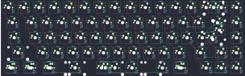

## sawnsprojects/krush65_solder

[layout](krush65_solder-kle.json) - [PCB](krush65_solder.kicad_pcb)

{:loading="lazy"}

[Open in keyboard-layout-editor](http://www.keyboard-layout-editor.com/##@@_x:2.5&y:1.75&c=#777777;&=0,0&_c=#cccccc;&=1,0&=0,1&=1,1&=0,2&=1,2&=0,3&=1,3&=0,4&=1,4&=0,5&=1,5&=0,6&_c=#aaaaaa&w:2;&=2,6%0A%0A%0A0,0&_c=#cccccc;&=0,7;&@_x:2.5&c=#aaaaaa&w:1.5;&=2,0&_c=#cccccc;&=3,0&=2,1&=3,1&=2,2&=3,2&=2,3&=3,3&=2,4&=3,4&=2,5&=3,5&=3,6&_w:1.5;&=4,6%0A%0A%0A1,0&=3,7;&@_x:2.5&c=#aaaaaa&w:1.75;&=4,0&_c=#cccccc;&=5,0&=4,1&=5,1&=4,2&=5,2&=4,3&=5,3&=4,4&=5,4&=4,5&=5,5&_c=#777777&w:2.25;&=4,7%0A%0A%0A1,0&_c=#cccccc;&=5,7;&@_x:2.5&c=#aaaaaa&w:2.25;&=6,0&_c=#cccccc;&=7,0&=6,1&=7,1&=6,2&=7,2&=6,3&=7,3&=6,4&=7,4&=6,5&_c=#aaaaaa&w:1.75;&=7,5&_c=#777777;&=7,7&_c=#cccccc;&=6,7;&@_x:2.5&c=#aaaaaa&w:1.25;&=8,0%0A%0A%0A2,0&_w:1.25;&=9,0%0A%0A%0A2,0&_w:1.25;&=8,1%0A%0A%0A2,0&_c=#777777&w:6.25;&=9,2%0A%0A%0A2,0&_c=#aaaaaa&w:1.25;&=9,4%0A%0A%0A2,0&_w:1.25;&=8,5%0A%0A%0A2,0&_x:0.5&c=#777777;&=9,5&=9,7&=8,7;&@_x:15.5&y:-6.75&c=#cccccc;&=2,6%0A%0A%0A0,1&=1,7%0A%0A%0A0,1;&@_x:19.75&y:1.75&c=#777777&w:1.25&h:2&w2:1.5&h2:1&x2:-0.25;&=4,7%0A%0A%0A1,1;&@_x:18.75&c=#cccccc;&=4,6%0A%0A%0A1,1;&@_x:2.5&y:2.25&c=#aaaaaa&w:1.25;&=8,0%0A%0A%0A2,1&_w:1.25;&=9,0%0A%0A%0A2,1&_w:1.25;&=8,1%0A%0A%0A2,1&_c=#777777&w:2.25;&=8,2%0A%0A%0A2,1&_w:1.25;&=9,2%0A%0A%0A2,1&_w:2.75;&=9,3%0A%0A%0A2,1&_c=#aaaaaa&w:1.25;&=9,4%0A%0A%0A2,1&_w:1.25;&=8,5%0A%0A%0A2,1;&@_x:2.5&y:0.25&w:1.5;&=8,0%0A%0A%0A2,2&=9,0%0A%0A%0A2,2&_w:1.5;&=8,1%0A%0A%0A2,2&_c=#777777&w:7;&=9,2%0A%0A%0A2,2&_c=#aaaaaa&w:1.5;&=8,5%0A%0A%0A2,2)

{:loading="lazy"}

