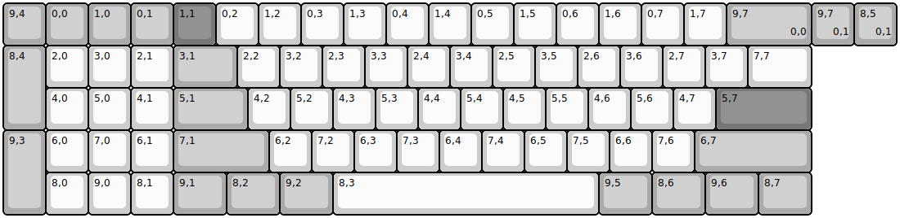
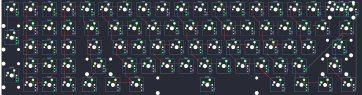

## sendyyeah/bevi

[layout](bevi-kle.json) - [PCB](bevi.kicad_pcb)

{:loading="lazy"}

[Open in keyboard-layout-editor](http://www.keyboard-layout-editor.com/##@@_c=#aaaaaa;&=9,4&=0,0&=1,0&=0,1&_c=#777777;&=1,1&_c=#cccccc;&=0,2&=1,2&=0,3&=1,3&=0,4&=1,4&=0,5&=1,5&=0,6&=1,6&=0,7&=1,7&_c=#aaaaaa&w:2;&=9,7%0A%0A%0A0,0;&@_h:2;&=8,4&_c=#cccccc;&=2,0&=3,0&=2,1&_c=#aaaaaa&w:1.5;&=3,1&_c=#cccccc;&=2,2&=3,2&=2,3&=3,3&=2,4&=3,4&=2,5&=3,5&=2,6&=3,6&=2,7&=3,7&_w:1.5;&=7,7;&@_x:1;&=4,0&=5,0&=4,1&_c=#aaaaaa&w:1.75;&=5,1&_c=#cccccc;&=4,2&=5,2&=4,3&=5,3&=4,4&=5,4&=4,5&=5,5&=4,6&=5,6&=4,7&_c=#777777&w:2.25;&=5,7;&@_c=#aaaaaa&h:2;&=9,3&_c=#cccccc;&=6,0&=7,0&=6,1&_c=#aaaaaa&w:2.25;&=7,1&_c=#cccccc;&=6,2&=7,2&=6,3&=7,3&=6,4&=7,4&=6,5&=7,5&=6,6&=7,6&_c=#aaaaaa&w:2.75;&=6,7;&@_x:1&c=#cccccc;&=8,0&=9,0&=8,1&_c=#aaaaaa&w:1.25;&=9,1&_w:1.25;&=8,2&_w:1.25;&=9,2&_c=#cccccc&w:6.25;&=8,3&_c=#aaaaaa&w:1.25;&=9,5&_w:1.25;&=8,6&_w:1.25;&=9,6&_w:1.25;&=8,7;&@_x:19&y:-5;&=9,7%0A%0A%0A0,1&=8,5%0A%0A%0A0,1)

{:loading="lazy"}

