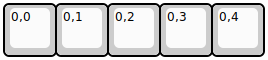
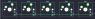

## sendyyeah/pix

[layout](pix-kle.json) - [PCB](pix.kicad_pcb)

{:loading="lazy"}

[Open in keyboard-layout-editor](http://www.keyboard-layout-editor.com/##@@=0,0&=0,1&=0,2&=0,3&=0,4)

{:loading="lazy"}

