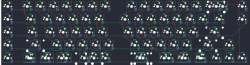
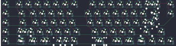

## sirius/uni660

[layout](uni660-kle.json) - [PCB](uni660.kicad_pcb)

{:loading="lazy"}

[Open in keyboard-layout-editor](http://www.keyboard-layout-editor.com/##@_name=Uni660%20VIA;&@_y:1.25&c=#777777;&=0,0&_x:0.5&c=#cccccc;&=0,1&=0,2&=0,3&=0,4&=0,5&=0,6&=4,6&_x:1.0;&=0,8&=0,9&=0,10&=0,11&=0,12&=0,13&_c=#aaaaaa&w:2;&=0,14%0A%0A%0A0,0&_x:0.5;&=3,15;&@=1,0&_x:0.5&w:1.5;&=1,1&_c=#cccccc;&=1,2&=1,3&=1,4&=1,5&=1,6&_x:1.0;&=1,8&=1,9&=1,10&=1,11&=1,12&=1,13&=1,14&_w:1.5;&=1,15&_x:0.5&c=#aaaaaa;&=2,15;&@=2,0&_x:0.5&w:1.75;&=2,1&_c=#cccccc;&=2,2&=2,3&=2,4&=2,5&=2,6&_x:1.0;&=2,8&=2,9&=2,10&=2,11&=2,12&=2,13&_c=#777777&w:2.25;&=2,14;&@_c=#aaaaaa;&=3,0&_x:0.5&w:2.25;&=3,1&_c=#cccccc;&=3,2&=3,3&=3,4&=3,5&=3,6&_x:1.0;&=3,8&=3,9&=3,10&=3,11&=3,12&_c=#aaaaaa&w:2.25;&=3,13&_c=#cccccc;&=3,14;&@_c=#aaaaaa;&=4,0&_x:0.5&w:1.25;&=4,1%0A%0A%0A1,0&_w:1.25;&=4,2%0A%0A%0A1,0&_w:1.25;&=4,3%0A%0A%0A1,0&_c=#cccccc&w:2.25;&=4,4%0A%0A%0A1,0&_c=#aaaaaa;&=4,5%0A%0A%0A1,0&_x:1.0&c=#cccccc&w:2.75;&=4,8%0A%0A%0A1,0&_c=#aaaaaa&w:1.25;&=4,9%0A%0A%0A1,0&_w:1.25;&=4,10%0A%0A%0A1,0&_w:1.25;&=4,12%0A%0A%0A1,0&_c=#cccccc;&=4,13&=4,14&=4,15;&@_x:15.5&y:-6.25&c=#aaaaaa;&=0,14%0A%0A%0A0,1&=0,15%0A%0A%0A0,1;&@_x:1.5&y:5.5&w:1.5;&=4,1%0A%0A%0A1,1&_w:1.25;&=4,2%0A%0A%0A1,1&_w:1.5;&=4,3%0A%0A%0A1,1&_c=#cccccc&w:2.75;&=4,4%0A%0A%0A1,1&_x:1.0&w:2.25;&=4,8%0A%0A%0A1,1&_c=#aaaaaa&w:1.5;&=4,9%0A%0A%0A1,1&_w:1.25;&=4,10%0A%0A%0A1,1&_w:1.5;&=4,12%0A%0A%0A1,1)

{:loading="lazy"}

## sirius/uni660/uni660v2

[layout](uni660v2-kle.json) - [PCB](uni660v2.kicad_pcb)

{:loading="lazy"}

[Open in keyboard-layout-editor](http://www.keyboard-layout-editor.com/##@_name=Uni660%20VIA;&@_y:1.25&c=#777777;&=0,0&_x:0.5&c=#cccccc;&=0,1&=0,2&=0,3&=0,4&=0,5&=0,6&=4,6&_x:1.0;&=0,8&=0,9&=0,10&=0,11&=0,12&=0,13&_c=#aaaaaa&w:2;&=0,14%0A%0A%0A0,0&_x:0.5;&=3,15;&@=1,0&_x:0.5&w:1.5;&=1,1&_c=#cccccc;&=1,2&=1,3&=1,4&=1,5&=1,6&_x:1.0;&=1,8&=1,9&=1,10&=1,11&=1,12&=1,13&=1,14&_w:1.5;&=1,15%0A%0A%0A3,0&_x:0.5&c=#aaaaaa;&=2,15;&@=2,0&_x:0.5&w:1.75;&=2,1&_c=#cccccc;&=2,2&=2,3&=2,4&=2,5&=2,6&_x:1.0;&=2,8&=2,9&=2,10&=2,11&=2,12&=2,13&_c=#777777&w:2.25;&=2,14%0A%0A%0A3,0;&@_c=#aaaaaa;&=3,0&_x:0.5&w:2.25;&=3,1%0A%0A%0A2,0&_c=#cccccc;&=3,2&=3,3&=3,4&=3,5&=3,6&_x:1.0;&=3,8&=3,9&=3,10&=3,11&=3,12&_c=#aaaaaa&w:2.25;&=3,13&_c=#cccccc;&=3,14;&@_c=#aaaaaa;&=4,0&_x:0.5&w:1.25;&=4,1%0A%0A%0A1,0&_w:1.25;&=4,2%0A%0A%0A1,0&_w:1.25;&=4,3%0A%0A%0A1,0&_c=#cccccc&w:2.25;&=4,4%0A%0A%0A1,0&_c=#aaaaaa;&=4,5%0A%0A%0A1,0&_x:1.0&c=#cccccc&w:2.75;&=4,8%0A%0A%0A1,0&_c=#aaaaaa&w:1.25;&=4,9%0A%0A%0A1,0&_w:1.25;&=4,10%0A%0A%0A1,0&_w:1.25;&=4,12%0A%0A%0A1,0&_c=#cccccc;&=4,13&=4,14&=4,15;&@_x:15.5&y:-6.25&c=#aaaaaa;&=0,14%0A%0A%0A0,1&=0,15%0A%0A%0A0,1;&@_x:1.5&y:5.5&w:1.5;&=4,1%0A%0A%0A1,1&_w:1.25;&=4,2%0A%0A%0A1,1&_w:1.5;&=4,3%0A%0A%0A1,1&_c=#cccccc&w:2.75;&=4,4%0A%0A%0A1,1&_x:1.0&w:2.25;&=4,8%0A%0A%0A1,1&_c=#aaaaaa&w:1.5;&=4,9%0A%0A%0A1,1&_w:1.25;&=4,10%0A%0A%0A1,1&_w:1.5;&=4,12%0A%0A%0A1,1;&@_x:1.5&w:1.25;&=3,1%0A%0A%0A2,1&=3,7%0A%0A%0A2,1;&@_x:16&c=#777777&w:1.25&h:2&w2:1&h2:1&x2:-0.25;&=1,15%0A%0A%0A3,1;&@_x:15&c=#cccccc;&=2,14%0A%0A%0A3,1)

{:loading="lazy"}

