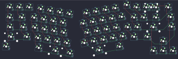

## skergo/skergo

[layout](skergo-kle.json) - [PCB](skergo.kicad_pcb)

{:loading="lazy"}

[Open in keyboard-layout-editor](http://www.keyboard-layout-editor.com/##@@_x:12.5&y:1&f:1&fa@:3;;&=0,11;&@_x:0.5&y:-0.75&c=#777777;&=0,0&_c=#cccccc;&=0,1&_x:11.0;&=0,12&_fa@:3&:0&:0&:3;;&=0,13%0A%0A%0A0,0&=0,14%0A%0A%0A0,0&_x:0.25&f:3;&=1,14;&@_x:17;&=2,14;&@_x:0.25&y:-0.95&c=#aaaaaa&f:1&fa@:3;&w:1.5;&=1,0&_c=#cccccc;&=1,1&_x:10.5;&=1,11&=1,12&_f:3&w:1.5;&=1,13;&@_x:17.1&y:-0.05&f:1&fa@:3;;&=3,14;&@_x:0.15&y:-0.95&c=#aaaaaa&w:1.75;&=2,0&_c=#cccccc;&=2,1&_x:9.7;&=2,10&=2,11&_c=#777777&w:2.25;&=2,12;&@_c=#aaaaaa&w:2.25;&=3,0&_c=#cccccc;&=3,1&_x:10.0;&=3,10&_c=#aaaaaa&w:1.75;&=3,11;&@_x:16.25&y:-0.55&c=#777777;&=3,13;&@_y:-0.45&c=#aaaaaa&w:1.25;&=4,0;&@_x:15.25&y:-0.55&c=#777777;&=4,12&=4,13&=4,14;&@_rx:3&ry:4.25&x:-0.5&y:-3.0&c=#cccccc;&=0,2;&@_r:10&x:0.25&y:-1.0;&=0,3&=0,4&=0,5&=0,6;&@_x:-0.25;&=1,2&=1,3&=1,4&=1,5;&@=2,2&=2,3&=2,4&=2,5;&@_x:0.5;&=3,2&=3,3&=3,4&=3,5;&@_x:0.5&c=#aaaaaa&w:1.5;&=4,2&_c=#cccccc&f:3&w:2;&=4,4&_c=#aaaaaa;&=4,5;&@_r:-10&rx:12.5&x:-3.75&y:-3.0&c=#cccccc&f:1&fa@:3;;&=0,7&=0,8&=0,9&=0,10;&@_x:-4.25;&=1,6&=1,7&=1,8&=1,9&=1,10;&@_x:-4.0;&=2,6&=2,7&=2,8&=2,9;&@_x:-4.5&f:3;&=4,6%0A%0A%0A1,0&_f:1&fa@:3;;&=3,6&=3,7&=3,8&=3,9;&@_x:-4.0&w:2.75;&=4,7&_c=#aaaaaa&w:1.5;&=4,9;&@_r:0&rx:0&ry:0&x:14.5&c=#cccccc&f:3&w:2;&=0,14%0A%0A%0A0,1;&@_r:-10&rx:12.5&ry:4.25&x:-4.5&y:2.25&f:1&fa@:3&:0&:0&:3;&d:true;&=4,6%0A%0A%0A1,1)

{:loading="lazy"}

