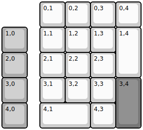
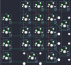

## skippys_custom_pcs/roopad

[layout](roopad-kle.json) - [PCB](roopad.kicad_pcb)

{:loading="lazy"}

[Open in keyboard-layout-editor](http://www.keyboard-layout-editor.com/##@_name=RooPad;&@_x:1.5;&=0,1&=0,2&=0,3&=0,4;&@_c=#aaaaaa;&=1,0&_x:0.5&c=#cccccc;&=1,1&=1,2&=1,3&_h:2;&=1,4;&@_c=#aaaaaa;&=2,0&_x:0.5&c=#cccccc;&=2,1&=2,2&=2,3;&@_c=#aaaaaa;&=3,0&_x:0.5&c=#cccccc;&=3,1&=3,2&=3,3&_c=#777777&h:2;&=3,4;&@_c=#aaaaaa;&=4,0&_x:0.5&c=#cccccc&w:2;&=4,1&=4,3)

{:loading="lazy"}

