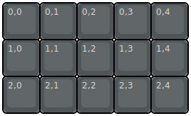
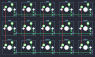

## skmt/15k

[layout](15k-kle.json) - [PCB](15k.kicad_pcb)

{:loading="lazy"}

[Open in keyboard-layout-editor](http://www.keyboard-layout-editor.com/##@@_c=#505557&t=#d9d7d7;&=0,0&=0,1&=0,2&=0,3&=0,4;&@=1,0&=1,1&=1,2&=1,3&=1,4;&@=2,0&=2,1&=2,2&=2,3&=2,4)

{:loading="lazy"}

