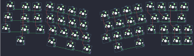

## smallice/smallice

[layout](smallice-kle.json) - [PCB](smallice.kicad_pcb)

{:loading="lazy"}

[Open in keyboard-layout-editor](http://www.keyboard-layout-editor.com/##@@_x:0.4&y:2.15&c=#aaaaaa;&=0,0;&@_x:12.75&y:-0.95&c=#cccccc;&=0,11;&@_x:1.75&y:-0.95&c=#aaaaaa;&=0,1&_c=#cccccc;&=0,2&_x:10.0;&=0,12&=0,13&_c=#aaaaaa;&=0,14;&@_x:0.2&y:-0.1;&=1,0;&@_x:1.55&y:-0.9&w:1.25;&=1,1&_c=#cccccc;&=1,2&_x:9.35;&=1,11&=1,12&_c=#777777&w:1.75;&=1,14;&@_y:-0.1&c=#aaaaaa;&=2,0;&@_x:1.3&y:-0.9&w:1.75;&=2,1&_c=#cccccc;&=2,2&_x:8.81;&=2,11&_x:-0.01&c=#aaaaaa&w:1.25;&=2,12&=2,13&_c=#cccccc;&=2,14;&@_x:1.3&c=#aaaaaa;&=3,1&_x:11.8;&=3,12&=3,13&=3,14;&@_r:12&x:4.35&y:-5.0&c=#cccccc;&=0,3&=0,4&=0,5&=0,6;&@_x:4.6;&=1,3&=1,4&=1,5&=1,6;&@_x:5.05;&=2,3&=2,4&=2,5&=2,6;&@_x:6.35&c=#777777&w:2;&=3,5&_c=#aaaaaa;&=3,6;&@_x:5.05&y:-0.95&w:1.25;&=3,3;&@_r:-12&x:7.8&y:-0.45&c=#cccccc;&=0,7&=0,8&=0,9&=0,10;&@_x:7.95;&=1,7&=1,8&=1,9&=1,10;&@_x:7.5;&=2,7&=2,8&=2,9&=2,10;&@_x:7.5&c=#777777&w:2.75;&=3,8;&@_x:10.3&y:-0.95&c=#aaaaaa;&=3,10)

{:loading="lazy"}

