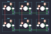

## smallkeyboard/smallkeyboard

[layout](smallkeyboard-kle.json) - [PCB](smallkeyboard.kicad_pcb)

{:loading="lazy"}

[Open in keyboard-layout-editor](http://www.keyboard-layout-editor.com/##@@=0,0&=0,1&=0,2;&@=1,0&=1,1&=1,2)

{:loading="lazy"}

