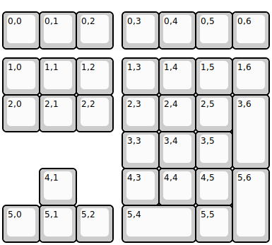
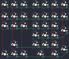

## soda/pocket

[layout](pocket-kle.json) - [PCB](pocket.kicad_pcb)

{:loading="lazy"}

[Open in keyboard-layout-editor](http://www.keyboard-layout-editor.com/##@@_y:0.25;&=0,0&=0,1&=0,2&_x:0.25;&=0,3&=0,4&=0,5&=0,6;&@_y:0.25;&=1,0&=1,1&=1,2&_x:0.25;&=1,3&=1,4&=1,5&=1,6;&@=2,0&=2,1&=2,2&_x:0.25;&=2,3&=2,4&=2,5&_h:2;&=3,6;&@_x:3.25;&=3,3&=3,4&=3,5;&@_x:1;&=4,1&_x:1.25;&=4,3&=4,4&=4,5&_h:2;&=5,6;&@=5,0&=5,1&=5,2&_x:0.25&w:2;&=5,4&=5,5)

{:loading="lazy"}

