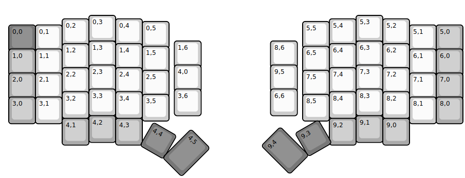
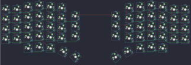

## sofle/keyhive_sofle_rgb

[layout](keyhive_sofle_rgb-kle.json) - [PCB](keyhive_sofle_rgb.kicad_pcb)

{:loading="lazy"}

[Open in keyboard-layout-editor](http://www.keyboard-layout-editor.com/##@@_x:3.25&y:0.5;&=0,3&_x:9.0;&=5,3;&@_x:2.25&y:-0.87;&=0,2&_x:1.0;&=0,4&_x:7.0;&=5,4&_x:1.0;&=5,2;&@_x:5.25&y:-0.9;&=0,5&_x:5.0;&=5,5;&@_x:0.25&y:-0.87&c=#777777;&=0,0&_c=#cccccc;&=0,1&_x:13.0;&=5,1&_c=#aaaaaa;&=5,0;&@_x:3.25&y:-0.4&c=#cccccc;&=1,3&_x:2.2;&=1,6&_x:2.6;&=8,6&_x:2.2;&=6,3;&@_x:2.25&y:-0.9;&=1,2&_x:1.0;&=1,4&_x:7.0;&=6,4&_x:1.0;&=6,2;&@_x:5.25&y:-0.9;&=1,5&_x:5.0;&=6,5;&@_x:0.25&y:-0.9&c=#aaaaaa;&=1,0&_c=#cccccc;&=1,1&_x:13.0;&=6,1&_c=#aaaaaa;&=6,0;&@_x:3.25&y:-0.4&c=#cccccc;&=2,3&_x:2.2;&=4,0&_x:2.6;&=9,5&_x:2.2;&=7,3;&@_x:2.25&y:-0.9;&=2,2&_x:1.0;&=2,4&_x:7.0;&=7,4&_x:1.0;&=7,2;&@_x:5.25&y:-0.9;&=2,5&_x:5.0;&=7,5;&@_x:0.25&y:-0.9&c=#aaaaaa;&=2,0&_c=#cccccc;&=2,1&_x:13.0;&=7,1&_c=#aaaaaa;&=7,0;&@_x:3.25&y:-0.4&c=#cccccc;&=3,3&_x:2.2;&=3,6&_x:2.6;&=6,6&_x:2.2;&=8,3;&@_x:2.25&y:-0.9;&=3,2&_x:1.0;&=3,4&_x:7.0;&=8,4&_x:1.0;&=8,2;&@_x:5.25&y:-0.9;&=3,5&_x:5.0;&=8,5;&@_x:0.25&y:-0.9&c=#aaaaaa;&=3,0&_c=#cccccc;&=3,1&_x:13.0;&=8,1&_c=#aaaaaa;&=8,0;&@_x:3.25&y:-0.3;&=4,2&_x:9.0;&=9,1;&@_x:2.25&y:-0.9;&=4,1&_x:1.0;&=4,3&_x:7.0;&=9,2&_x:1.0;&=9,0;&@_r:30&rx:7.15&x:1.0&y:4.6&c=#777777;&=4,4;&@_r:45&x:3.35&y:-2.25&h:1.5;&=4,5;&@_r:-45&x:-2.08&y:1.3&h:1.5;&=9,4;&@_r:-30&x:0.8&y:-0.45;&=9,3)

{:loading="lazy"}

