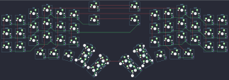
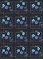

## splitkb/kyria

[layout](kyria-kle.json) - [PCB](kyria.kicad_pcb)

{:loading="lazy"}

[Open in keyboard-layout-editor](http://www.keyboard-layout-editor.com/##@@_x:6.5;&=0,1&_x:2.0;&=1,1;&@_x:3&y:-0.75;&=0,4&_x:9;&=4,4;&@_x:2&y:-0.75;&=0,5&_x:1;&=0,3&_x:7;&=4,3&_x:1;&=4,5;&@_x:5&y:-0.875;&=0,2&_x:5;&=4,2;&@_y:-0.625&c=#aaaaaa;&=0,7&_c=#cccccc;&=0,6&_x:4.5;&=0,0&_x:2.0;&=1,0&_x:4.5;&=4,6&_c=#aaaaaa;&=4,7;&@_x:3&y:-0.75&c=#cccccc;&=1,4&_x:9;&=5,4;&@_x:2&y:-0.75;&=1,5&_x:1;&=1,3&_x:7;&=5,3&_x:1;&=5,5;&@_x:5&y:-0.875;&=1,2&_x:5;&=5,2;&@_y:-0.625&c=#aaaaaa;&=1,7&_c=#cccccc;&=1,6&_x:13;&=5,6&_c=#aaaaaa;&=5,7;&@_x:3&y:-0.75&c=#cccccc;&=2,4&_x:9;&=6,4;&@_x:2&y:-0.75;&=2,5&_x:1;&=2,3&_x:7;&=6,3&_x:1;&=6,5;&@_x:5&y:-0.875;&=2,2&_x:5;&=6,2;&@_y:-0.625&c=#aaaaaa;&=2,7&_c=#cccccc;&=2,6&_x:13;&=6,6&_c=#aaaaaa;&=6,7;&@_x:2.5&y:-0.5;&=3,4&_x:10.0;&=7,4;&@_rx:4&ry:8.175&x:-0.5&y:-4.675;&=3,3;&@_rx:13&x:-0.5&y:-4.675;&=7,3;&@_r:15&rx:4&x:-0.5&y:-4.675;&=3,2;&@_r:30&x:-0.5&y:-2.0;&=2,1%0A%0A%0A0,0;&@_x:-0.5;&=3,1%0A%0A%0A0,0;&@_r:45&x:-0.5&y:-2.0;&=2,0%0A%0A%0A1,0;&@_x:-0.5;&=3,0%0A%0A%0A1,0;&@_r:-45&rx:13&x:-0.5&y:-5.675;&=6,0%0A%0A%0A2,0;&@_x:-0.5;&=7,0%0A%0A%0A2,0;&@_r:-30&x:-0.5&y:-2.0;&=6,1%0A%0A%0A3,0;&@_x:-0.5;&=7,1%0A%0A%0A3,0;&@_r:-15&x:-0.5&y:-1.0;&=7,2;&@_r:30&rx:4&x:-1&y:-3.175&h:2;&=3,1%0A%0A%0A0,1;&@_r:45&y:-1.25&h:2;&=3,0%0A%0A%0A1,1;&@_r:-45&rx:13&x:-1&y:-3.425&h:2;&=7,0%0A%0A%0A2,1;&@_r:-30&y:-0.75&h:2;&=7,1%0A%0A%0A3,1)

{:loading="lazy"}

## splitkb/zima

[layout](zima-kle.json) - [PCB](zima.kicad_pcb)

{:loading="lazy"}

[Open in keyboard-layout-editor](http://www.keyboard-layout-editor.com/##@@=0,0&=0,1&=0,2;&@=1,0&=1,1&=1,2;&@=2,0&=2,1&=2,2;&@=3,0&=3,1&=3,2)

{:loading="lazy"}

