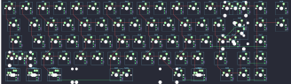
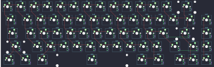
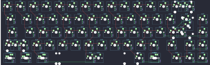

## stello65/stello65_beta

[layout](stello65_beta-kle.json) - [PCB](stello65_beta.kicad_pcb)

{:loading="lazy"}

[Open in keyboard-layout-editor](http://www.keyboard-layout-editor.com/##@@_x:2.5&c=#f1ede6;&=0,0&=1,0&=0,1&=1,1&=0,2&=1,2&=0,3&=1,3&=0,4&=1,4&=0,5&=1,5&=0,6&_w:2;&=1,6%0A%0A%0A1,0&=1,7%0A%0A%0A0,0&_x:0.25&d:true;&=4,6%0A%0A%0A0,0;&@_x:2.5&w:1.5;&=2,0&=3,0&=2,1&=3,1&=2,2&=3,2&=2,3&=3,3&=2,4&=3,4&=2,5&=3,5&=2,6&_w:1.5;&=3,6%0A%0A%0A2,0&=3,7&_x:0.25&d:true;&=4,7%0A%0A%0A0,0;&@_x:2.5&w:1.75;&=4,0&=5,0&=4,1&=5,1&=4,2&=5,2&=4,3&=5,3&=4,4&=5,4&=4,5&=5,5&_w:2.25;&=5,6%0A%0A%0A2,0&=5,7;&@_x:2.5&w:2.25;&=6,0%0A%0A%0A3,0&=6,1&=7,1&=6,2&=7,2&=6,3&=7,3&=6,4&=7,4&=6,5&=7,5&_w:1.75;&=6,6&=7,6&=7,7;&@_x:2.5&w:1.25;&=8,0%0A%0A%0A4,0&_w:1.25;&=9,0%0A%0A%0A4,0&_w:1.25;&=8,1%0A%0A%0A4,0&_w:6.25;&=8,3%0A%0A%0A4,0&_w:1.25;&=9,4%0A%0A%0A4,0&_w:1.25;&=9,5%0A%0A%0A4,0&_x:0.5;&=8,6&=9,6&=9,7;&@_x:19.0&y:-5;&=1,6%0A%0A%0A1,1&=0,7%0A%0A%0A1,1&_x:0.25;&=1,7%0A%0A%0A0,1&_x:0.25;&=4,6%0A%0A%0A0,1;&@_x:19.75&w:1.25&h:2&w2:1.5&h2:1&x2:-0.25;&=5,6%0A%0A%0A2,1&_x:1.5;&=4,7%0A%0A%0A0,1;&@_x:18.75;&=3,6%0A%0A%0A2,1;&@_w:1.25;&=6,0%0A%0A%0A3,1&=7,0%0A%0A%0A3,1;&@_x:2.5&y:1.25&w:1.5;&=8,0%0A%0A%0A4,1&=9,0%0A%0A%0A4,1&_w:1.5;&=8,1%0A%0A%0A4,1&_w:7;&=8,3%0A%0A%0A4,1&_w:1.5;&=9,5%0A%0A%0A4,1)

{:loading="lazy"}

## stello65/stello65_hs_rev1

[layout](stello65_hs_rev1-kle.json) - [PCB](stello65_hs_rev1.kicad_pcb)

{:loading="lazy"}

[Open in keyboard-layout-editor](http://www.keyboard-layout-editor.com/##@@=0,0&=1,0&=0,1&=1,1&=0,2&=1,2&=0,3&=1,3&=0,4&=1,4&=0,5&=1,5&=0,6&_w:2;&=1,6;&@_w:1.5;&=2,0&=3,0&=2,1&=3,1&=2,2&=3,2&=2,3&=3,3&=2,4&=3,4&=2,5&=3,5&=2,6&_w:1.5;&=3,6&=2,7;&@_w:1.75;&=4,0&=5,0&=4,1&=5,1&=4,2&=5,2&=4,3&=5,3&=4,4&=5,4&=4,5&=5,5&_w:2.25;&=5,6&=4,7;&@_w:2.25;&=6,0&=7,0&=6,1&=7,1&=6,2&=7,2&=6,3&=7,3&=6,4&=7,4&=6,5&_w:1.75;&=7,5&=7,6&=6,7;&@_w:1.25;&=8,0&_w:1.25;&=9,0&_w:1.25;&=8,1&_w:6.25;&=9,1&_w:1.25;&=8,5&_w:1.25;&=9,5&_x:0.5;&=8,6&=9,6&=8,7)

{:loading="lazy"}

## stello65/stello65_sl_rev1

[layout](stello65_sl_rev1-kle.json) - [PCB](stello65_sl_rev1.kicad_pcb)

{:loading="lazy"}

[Open in keyboard-layout-editor](http://www.keyboard-layout-editor.com/##@@_x:2.5;&=0,0&=1,0&=0,1&=1,1&=0,2&=1,2&=0,3&=1,3&=0,4&=1,4&=0,5&=1,5&=0,6&_w:2;&=1,6%0A%0A%0A0,0;&@_x:2.5&w:1.5;&=2,0&=3,0&=2,1&=3,1&=2,2&=3,2&=2,3&=3,3&=2,4&=3,4&=2,5&=3,5&=2,6&_w:1.5;&=3,6%0A%0A%0A1,0&=3,7;&@_x:2.5&w:1.75;&=4,0&=5,0&=4,1&=5,1&=4,2&=5,2&=4,3&=5,3&=4,4&=5,4&=4,5&=5,5&_w:2.25;&=5,6%0A%0A%0A1,0&=5,7;&@_x:2.5&w:2.25;&=6,0%0A%0A%0A2,0&=6,1&=7,1&=6,2&=7,2&=6,3&=7,3&=6,4&=7,4&=6,5&=7,5&_w:1.75;&=6,6&=7,6&=7,7;&@_x:2.5&w:1.25;&=8,0%0A%0A%0A3,0&_w:1.25;&=9,0%0A%0A%0A3,0&_w:1.25;&=8,1%0A%0A%0A3,0&_w:6.25;&=8,3%0A%0A%0A3,0&_w:1.25;&=9,4%0A%0A%0A3,0&_w:1.25;&=9,5%0A%0A%0A3,0&_x:0.5;&=8,6&=9,6&=9,7;&@_x:19.0&y:-5;&=1,6%0A%0A%0A0,1&=0,7%0A%0A%0A0,1;&@_x:19.75&w:1.25&h:2&w2:1.5&h2:1&x2:-0.25;&=5,6%0A%0A%0A1,1;&@_x:18.75;&=3,6%0A%0A%0A1,1;&@_w:1.25;&=6,0%0A%0A%0A2,1&=7,0%0A%0A%0A2,1;&@_x:2.5&y:1.25&w:1.5;&=8,0%0A%0A%0A3,1&=9,0%0A%0A%0A3,1&_w:1.5;&=8,1%0A%0A%0A3,1&_w:7;&=8,3%0A%0A%0A3,1&_w:1.5;&=9,5%0A%0A%0A3,1)

{:loading="lazy"}

