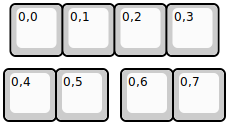
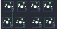

## stickey4/stickey4

[layout](stickey4-kle.json) - [PCB](stickey4.kicad_pcb)

{:loading="lazy"}

[Open in keyboard-layout-editor](http://www.keyboard-layout-editor.com/##@@_x:0.125;&=0,0&=0,1&=0,2&=0,3;&@_y:0.25;&=0,4&=0,5&_x:0.25;&=0,6&=0,7)

{:loading="lazy"}

