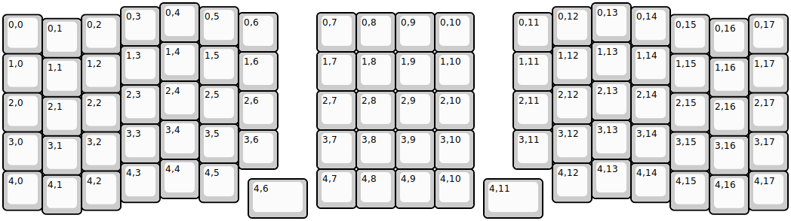
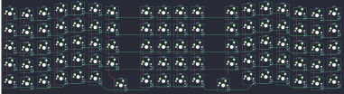

## superlyra/superlyra

[layout](superlyra-kle.json) - [PCB](superlyra.kicad_pcb)

{:loading="lazy"}

[Open in keyboard-layout-editor](http://www.keyboard-layout-editor.com/##@@_x:4;&=0,4&_x:10;&=0,13;&@_x:3&y:-0.9;&=0,3&_x:1;&=0,5&_x:8;&=0,12&_x:1;&=0,14;&@_x:8&y:-0.85;&=0,7&=0,8&=0,9&=0,10&_x:-6;&=0,6&_x:6;&=0,11;&@_y:-0.95;&=0,0&_x:1;&=0,2&_x:14;&=0,15&_x:1;&=0,17;&@_x:1&y:-0.9;&=0,1&_x:16;&=0,16;&@_x:15&y:-0.4;&=1,13&_x:-12;&=1,4;&@_x:3&y:-0.9;&=1,3&_x:1;&=1,5&_x:8;&=1,12&_x:1;&=1,14;&@_x:6&y:-0.85;&=1,6&_x:1;&=1,7&=1,8&=1,9&=1,10&_x:1;&=1,11;&@_y:-0.95;&=1,0&_x:1;&=1,2&_x:14;&=1,15&_x:1;&=1,17;&@_x:1&y:-0.9;&=1,1&_x:16;&=1,16;&@_x:4&y:-0.4;&=2,4&_x:10;&=2,13;&@_x:3&y:-0.9;&=2,3&_x:1;&=2,5&_x:8;&=2,12&_x:1;&=2,14;&@_x:6&y:-0.85;&=2,6&_x:1;&=2,7&=2,8&=2,9&=2,10&_x:1;&=2,11;&@_y:-0.95;&=2,0&_x:1;&=2,2&_x:14;&=2,15&_x:1;&=2,17;&@_x:1&y:-0.9;&=2,1&_x:16;&=2,16;&@_x:4&y:-0.4;&=3,4&_x:10;&=3,13;&@_x:3&y:-0.9;&=3,3&_x:1;&=3,5&_x:8;&=3,12&_x:1;&=3,14;&@_x:6&y:-0.85;&=3,6&_x:6;&=3,11&_x:-6;&=3,7&=3,8&=3,9&=3,10;&@_y:-0.95;&=3,0&_x:1;&=3,2&_x:14;&=3,15&_x:1;&=3,17;&@_x:1&y:-0.9;&=3,1&_x:16;&=3,16;&@_x:4&y:-0.4;&=4,4&_x:10;&=4,13;&@_x:3&y:-0.9;&=4,3&_x:1;&=4,5&_x:8;&=4,12&_x:1;&=4,14;&@_x:8&y:-0.85;&=4,7&=4,8&=4,9&=4,10;&@_y:-0.95;&=4,0&_x:1;&=4,2&_x:14;&=4,15&_x:1;&=4,17;&@_x:1&y:-0.9;&=4,1&_x:16;&=4,16;&@_x:6.25&y:-0.9&w:1.5;&=4,6&_x:4.5&w:1.5;&=4,11)

{:loading="lazy"}

