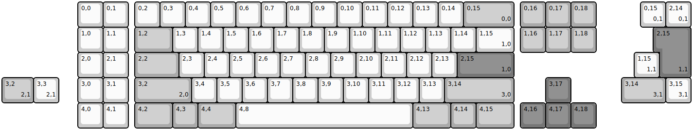
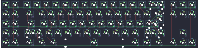

## superuser/ext

[layout](ext-kle.json) - [PCB](ext.kicad_pcb)

{:loading="lazy"}

[Open in keyboard-layout-editor](http://www.keyboard-layout-editor.com/##@@_x:3;&=0,0&=0,1&_x:0.25;&=0,2&=0,3&=0,4&=0,5&=0,6&=0,7&=0,8&=0,9&=0,10&=0,11&=0,12&=0,13&=0,14&_c=#aaaaaa&w:2;&=0,15%0A%0A%0A0,0&_x:0.25;&=0,16&=0,17&=0,18;&@_x:3&c=#cccccc;&=1,0&=1,1&_x:0.25&c=#aaaaaa&w:1.5;&=1,2&_c=#cccccc;&=1,3&=1,4&=1,5&=1,6&=1,7&=1,8&=1,9&=1,10&=1,11&=1,12&=1,13&=1,14&_w:1.5;&=1,15%0A%0A%0A1,0&_x:0.25&c=#aaaaaa;&=1,16&=1,17&=1,18;&@_x:3&c=#cccccc;&=2,0&=2,1&_x:0.25&c=#aaaaaa&w:1.75;&=2,2&_c=#cccccc;&=2,3&=2,4&=2,5&=2,6&=2,7&=2,8&=2,9&=2,10&=2,11&=2,12&=2,13&_c=#777777&w:2.25;&=2,15%0A%0A%0A1,0;&@_x:3.0&c=#cccccc;&=3,0&=3,1&_x:0.25&c=#aaaaaa&w:2.25;&=3,2%0A%0A%0A2,0&_c=#cccccc;&=3,4&=3,5&=3,6&=3,7&=3,8&=3,9&=3,10&=3,11&=3,12&=3,13&_c=#aaaaaa&w:2.75;&=3,14%0A%0A%0A3,0&_x:1.25&c=#777777;&=3,17;&@_x:3&c=#cccccc;&=4,0&=4,1&_x:0.25&c=#aaaaaa&w:1.5;&=4,2&=4,3&_w:1.5;&=4,4&_c=#cccccc&w:7;&=4,8&_c=#aaaaaa&w:1.5;&=4,13&=4,14&_w:1.5;&=4,15&_x:0.25&c=#777777;&=4,16&=4,17&=4,18;&@_x:25.25&y:-5&c=#cccccc;&=0,15%0A%0A%0A0,1&=2,14%0A%0A%0A0,1;&@_x:26.0&c=#777777&w:1.25&h:2&w2:1.5&h2:1&x2:-0.25;&=2,15%0A%0A%0A1,1;&@_x:25.0&c=#cccccc;&=1,15%0A%0A%0A1,1;&@_c=#aaaaaa&w:1.25;&=3,2%0A%0A%0A2,1&_c=#cccccc;&=3,3%0A%0A%0A2,1&_x:22.25&c=#aaaaaa&w:1.75;&=3,14%0A%0A%0A3,1&_c=#cccccc;&=3,15%0A%0A%0A3,1)

{:loading="lazy"}

