## swiftrax/astro65

[layout](astro65-kle.json) - [PCB](astro65.kicad_pcb)

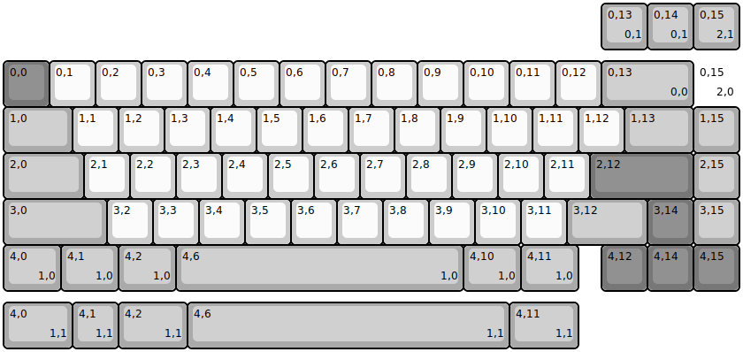{:loading="lazy"}

[Open in keyboard-layout-editor](http://www.keyboard-layout-editor.com/##@@_y:1.25&c=#777777;&=0,0&_c=#cccccc;&=0,1&=0,2&=0,3&=0,4&=0,5&=0,6&=0,7&=0,8&=0,9&=0,10&=0,11&=0,12&_c=#aaaaaa&w:2;&=0,13%0A%0A%0A0,0&_c=#cccccc&d:true;&=0,15%0A%0A%0A2,0;&@_c=#aaaaaa&w:1.5;&=1,0&_c=#cccccc;&=1,1&=1,2&=1,3&=1,4&=1,5&=1,6&=1,7&=1,8&=1,9&=1,10&=1,11&=1,12&_c=#aaaaaa&w:1.5;&=1,13&=1,15;&@_w:1.75;&=2,0&_c=#cccccc;&=2,1&=2,2&=2,3&=2,4&=2,5&=2,6&=2,7&=2,8&=2,9&=2,10&=2,11&_c=#777777&w:2.25;&=2,12&_c=#aaaaaa;&=2,15;&@_w:2.25;&=3,0&_c=#cccccc;&=3,2&=3,3&=3,4&=3,5&=3,6&=3,7&=3,8&=3,9&=3,10&=3,11&_c=#aaaaaa&w:1.75;&=3,12&_c=#777777;&=3,14&_c=#aaaaaa;&=3,15;&@_w:1.25;&=4,0%0A%0A%0A1,0&_w:1.25;&=4,1%0A%0A%0A1,0&_w:1.25;&=4,2%0A%0A%0A1,0&_w:6.25;&=4,6%0A%0A%0A1,0&_w:1.25;&=4,10%0A%0A%0A1,0&_w:1.25;&=4,11%0A%0A%0A1,0&_x:0.5&c=#777777;&=4,12&=4,14&=4,15;&@_x:13&y:-6.25&c=#aaaaaa;&=0,13%0A%0A%0A0,1&=0,14%0A%0A%0A0,1&=0,15%0A%0A%0A2,1;&@_y:5.5&w:1.5;&=4,0%0A%0A%0A1,1&=4,1%0A%0A%0A1,1&_w:1.5;&=4,2%0A%0A%0A1,1&_w:7;&=4,6%0A%0A%0A1,1&_w:1.5;&=4,11%0A%0A%0A1,1)

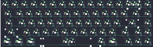{:loading="lazy"}

## swiftrax/bebol

[layout](bebol-kle.json) - [PCB](bebol.kicad_pcb)

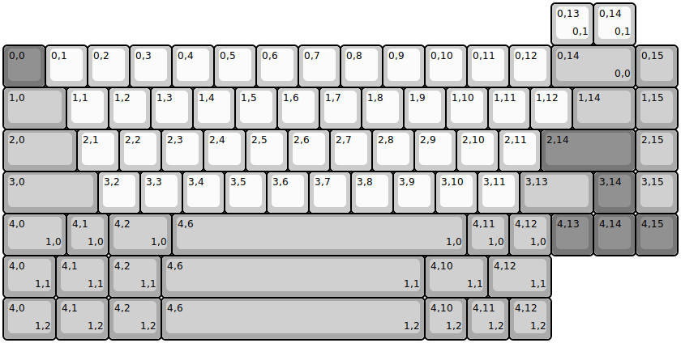{:loading="lazy"}

[Open in keyboard-layout-editor](http://www.keyboard-layout-editor.com/##@@_y:1&c=#777777;&=0,0&_c=#cccccc;&=0,1&=0,2&=0,3&=0,4&=0,5&=0,6&=0,7&=0,8&=0,9&=0,10&=0,11&=0,12&_c=#aaaaaa&w:2;&=0,14%0A%0A%0A0,0&=0,15;&@_w:1.5;&=1,0&_c=#cccccc;&=1,1&=1,2&=1,3&=1,4&=1,5&=1,6&=1,7&=1,8&=1,9&=1,10&=1,11&=1,12&_c=#aaaaaa&w:1.5;&=1,14&=1,15;&@_w:1.75;&=2,0&_c=#cccccc;&=2,1&=2,2&=2,3&=2,4&=2,5&=2,6&=2,7&=2,8&=2,9&=2,10&=2,11&_c=#777777&w:2.25;&=2,14&_c=#aaaaaa;&=2,15;&@_w:2.25;&=3,0&_c=#cccccc;&=3,2&=3,3&=3,4&=3,5&=3,6&=3,7&=3,8&=3,9&=3,10&=3,11&_c=#aaaaaa&w:1.75;&=3,13&_c=#777777;&=3,14&_c=#aaaaaa;&=3,15;&@_w:1.5;&=4,0%0A%0A%0A1,0&=4,1%0A%0A%0A1,0&_w:1.5;&=4,2%0A%0A%0A1,0&_w:7;&=4,6%0A%0A%0A1,0&=4,11%0A%0A%0A1,0&=4,12%0A%0A%0A1,0&_c=#777777;&=4,13&=4,14&=4,15;&@_x:13&y:-6&c=#cccccc;&=0,13%0A%0A%0A0,1&=0,14%0A%0A%0A0,1;&@_y:5&c=#aaaaaa&w:1.25;&=4,0%0A%0A%0A1,1&_w:1.25;&=4,1%0A%0A%0A1,1&_w:1.25;&=4,2%0A%0A%0A1,1&_w:6.25;&=4,6%0A%0A%0A1,1&_w:1.5;&=4,10%0A%0A%0A1,1&_w:1.5;&=4,12%0A%0A%0A1,1;&@_w:1.25;&=4,0%0A%0A%0A1,2&_w:1.25;&=4,1%0A%0A%0A1,2&_w:1.25;&=4,2%0A%0A%0A1,2&_w:6.25;&=4,6%0A%0A%0A1,2&=4,10%0A%0A%0A1,2&=4,11%0A%0A%0A1,2&=4,12%0A%0A%0A1,2)

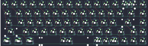{:loading="lazy"}

## swiftrax/beegboy

[layout](beegboy-kle.json) - [PCB](beegboy.kicad_pcb)

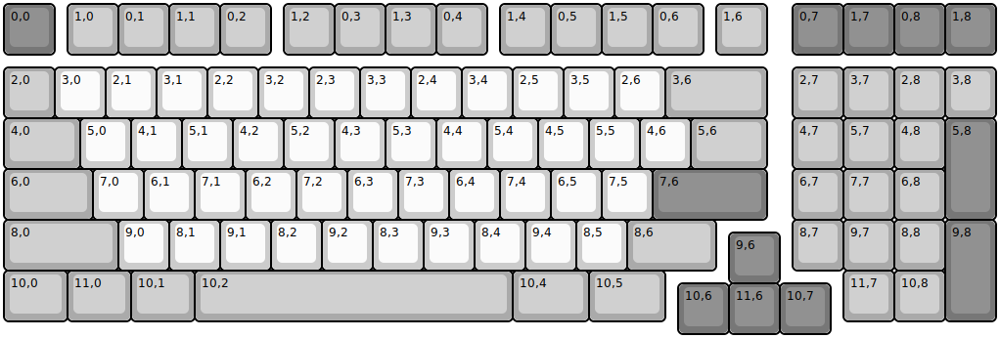{:loading="lazy"}

[Open in keyboard-layout-editor](http://www.keyboard-layout-editor.com/##@@_c=#777777;&=0,0&_x:0.25&c=#aaaaaa;&=1,0&=0,1&=1,1&=0,2&_x:0.25;&=1,2&=0,3&=1,3&=0,4&_x:0.25;&=1,4&=0,5&=1,5&=0,6&_x:0.25;&=1,6&_x:0.5&c=#777777;&=0,7&=1,7&=0,8&=1,8;&@_y:0.25&c=#aaaaaa;&=2,0&_c=#cccccc;&=3,0&=2,1&=3,1&=2,2&=3,2&=2,3&=3,3&=2,4&=3,4&=2,5&=3,5&=2,6&_c=#aaaaaa&w:2;&=3,6&_x:0.5;&=2,7&=3,7&=2,8&=3,8;&@_w:1.5;&=4,0&_c=#cccccc;&=5,0&=4,1&=5,1&=4,2&=5,2&=4,3&=5,3&=4,4&=5,4&=4,5&=5,5&=4,6&_c=#aaaaaa&w:1.5;&=5,6&_x:0.5;&=4,7&=5,7&=4,8&_c=#777777&h:2;&=5,8;&@_c=#aaaaaa&w:1.75;&=6,0&_c=#cccccc;&=7,0&=6,1&=7,1&=6,2&=7,2&=6,3&=7,3&=6,4&=7,4&=6,5&=7,5&_c=#777777&w:2.25;&=7,6&_x:0.5&c=#aaaaaa;&=6,7&=7,7&=6,8;&@_w:2.25;&=8,0&_c=#cccccc;&=9,0&=8,1&=9,1&=8,2&=9,2&=8,3&=9,3&=8,4&=9,4&=8,5&_c=#aaaaaa&w:1.75;&=8,6&_x:1.5;&=8,7&=9,7&=8,8&_c=#777777&h:2;&=9,8;&@_x:14.25&y:-0.75;&=9,6;&@_y:-0.25&c=#aaaaaa&w:1.25;&=10,0&_w:1.25;&=11,0&_w:1.25;&=10,1&_w:6.25;&=10,2&_w:1.5;&=10,4&_w:1.5;&=10,5&_x:3.5;&=11,7&=10,8;&@_x:13.25&y:-0.75&c=#777777;&=10,6&=11,6&=10,7)

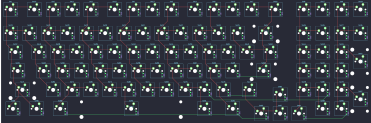{:loading="lazy"}

## swiftrax/bumblebee

[layout](bumblebee-kle.json) - [PCB](bumblebee.kicad_pcb)

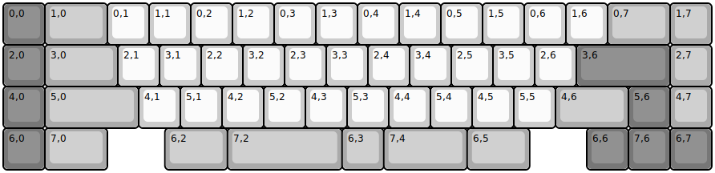{:loading="lazy"}

[Open in keyboard-layout-editor](http://www.keyboard-layout-editor.com/##@@_c=#777777;&=0,0&_c=#aaaaaa&w:1.5;&=1,0&_c=#cccccc;&=0,1&=1,1&=0,2&=1,2&=0,3&=1,3&=0,4&=1,4&=0,5&=1,5&=0,6&=1,6&_c=#aaaaaa&w:1.5;&=0,7&=1,7;&@_c=#777777;&=2,0&_c=#aaaaaa&w:1.75;&=3,0&_c=#cccccc;&=2,1&=3,1&=2,2&=3,2&=2,3&=3,3&=2,4&=3,4&=2,5&=3,5&=2,6&_c=#777777&w:2.25;&=3,6&_c=#aaaaaa;&=2,7;&@_c=#777777;&=4,0&_c=#aaaaaa&w:2.25;&=5,0&_c=#cccccc;&=4,1&=5,1&=4,2&=5,2&=4,3&=5,3&=4,4&=5,4&=4,5&=5,5&_c=#aaaaaa&w:1.75;&=4,6&_c=#777777;&=5,6&_c=#aaaaaa;&=4,7;&@_c=#777777;&=6,0&_c=#aaaaaa&w:1.5;&=7,0&_x:1.38&w:1.5;&=6,2&_w:2.75;&=7,2&=6,3&_w:2;&=7,4&_w:1.5;&=6,5&_x:1.37&c=#777777;&=6,6&=7,6&=6,7)

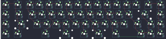{:loading="lazy"}

## swiftrax/cowfish

[layout](cowfish-kle.json) - [PCB](cowfish.kicad_pcb)

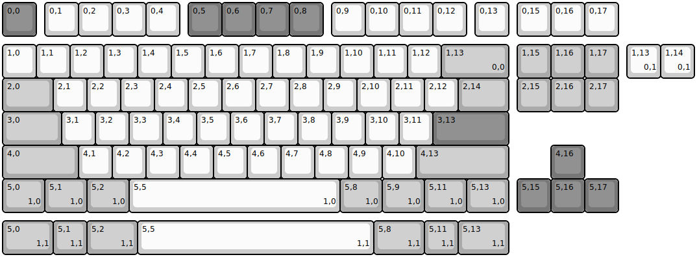{:loading="lazy"}

[Open in keyboard-layout-editor](http://www.keyboard-layout-editor.com/##@@_c=#777777;&=0,0&_x:0.25&c=#cccccc;&=0,1&=0,2&=0,3&=0,4&_x:0.25&c=#777777;&=0,5&=0,6&=0,7&=0,8&_x:0.25&c=#cccccc;&=0,9&=0,10&=0,11&=0,12&_x:0.25;&=0,13&_x:0.25;&=0,15&=0,16&=0,17;&@_y:0.25;&=1,0&=1,1&=1,2&=1,3&=1,4&=1,5&=1,6&=1,7&=1,8&=1,9&=1,10&=1,11&=1,12&_c=#aaaaaa&w:2;&=1,13%0A%0A%0A0,0&_x:0.25;&=1,15&=1,16&=1,17;&@_w:1.5;&=2,0&_c=#cccccc;&=2,1&=2,2&=2,3&=2,4&=2,5&=2,6&=2,7&=2,8&=2,9&=2,10&=2,11&=2,12&_c=#aaaaaa&w:1.5;&=2,14&_x:0.25;&=2,15&=2,16&=2,17;&@_w:1.75;&=3,0&_c=#cccccc;&=3,1&=3,2&=3,3&=3,4&=3,5&=3,6&=3,7&=3,8&=3,9&=3,10&=3,11&_c=#777777&w:2.25;&=3,13;&@_c=#aaaaaa&w:2.25;&=4,0&_c=#cccccc;&=4,1&=4,2&=4,3&=4,4&=4,5&=4,6&=4,7&=4,8&=4,9&=4,10&_c=#aaaaaa&w:2.75;&=4,13&_x:1.25&c=#777777;&=4,16;&@_c=#aaaaaa&w:1.25;&=5,0%0A%0A%0A1,0&_w:1.25;&=5,1%0A%0A%0A1,0&_w:1.25;&=5,2%0A%0A%0A1,0&_c=#cccccc&w:6.25;&=5,5%0A%0A%0A1,0&_c=#aaaaaa&w:1.25;&=5,8%0A%0A%0A1,0&_w:1.25;&=5,9%0A%0A%0A1,0&_w:1.25;&=5,11%0A%0A%0A1,0&_w:1.25;&=5,13%0A%0A%0A1,0&_x:0.25&c=#777777;&=5,15&=5,16&=5,17;&@_x:18.5&y:-5.0&c=#cccccc;&=1,13%0A%0A%0A0,1&=1,14%0A%0A%0A0,1;&@_y:4.25&c=#aaaaaa&w:1.5;&=5,0%0A%0A%0A1,1&=5,1%0A%0A%0A1,1&_w:1.5;&=5,2%0A%0A%0A1,1&_c=#cccccc&w:7;&=5,5%0A%0A%0A1,1&_c=#aaaaaa&w:1.5;&=5,8%0A%0A%0A1,1&=5,11%0A%0A%0A1,1&_w:1.5;&=5,13%0A%0A%0A1,1)

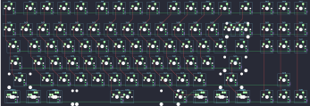{:loading="lazy"}

## swiftrax/digicarp65

[layout](digicarp65-kle.json) - [PCB](digicarp65.kicad_pcb)

{:loading="lazy"}

[Open in keyboard-layout-editor](http://www.keyboard-layout-editor.com/##@@_x:3&c=#777777;&=0,0&_c=#cccccc;&=0,1&=0,2&=0,3&=0,4&=0,5&=0,6&=0,7&=0,8&=0,9&=0,10&=0,11&=0,12&_c=#aaaaaa&w:2;&=0,14%0A%0A%0A0,0&=0,15;&@_x:3&w:1.5;&=1,0&_c=#cccccc;&=1,2&=1,3&=1,4&=1,5&=1,6&=1,7&=1,8&=1,9&=1,10&=1,11&=1,12&=1,13&_w:1.5;&=1,14%0A%0A%0A1,0&_c=#aaaaaa;&=1,15;&@_x:3&w:1.75;&=2,0&_c=#cccccc;&=2,2&=2,3&=2,4&=2,5&=2,6&=2,7&=2,8&=2,9&=2,10&=2,11&=2,12&_c=#777777&w:2.25;&=2,13%0A%0A%0A1,0&_c=#aaaaaa;&=2,15;&@_x:3.0&w:2.25;&=3,0%0A%0A%0A2,0&_c=#cccccc;&=3,2&=3,3&=3,4&=3,5&=3,6&=3,7&=3,8&=3,9&=3,10&=3,11&_c=#aaaaaa&w:1.75;&=3,13&=3,14&=3,15;&@_x:3&w:1.25;&=4,0&_w:1.25;&=4,1&_w:1.25;&=4,2&_c=#777777&w:6.25;&=4,6&_c=#aaaaaa;&=4,10%0A%0A%0A3,0&=4,11%0A%0A%0A3,0&=4,12%0A%0A%0A3,0&=4,13&=4,14&=4,15;&@_x:19.75&y:-5&c=#cccccc;&=0,13%0A%0A%0A0,1&=0,14%0A%0A%0A0,1;&@_x:20.5&c=#777777&w:1.25&h:2&w2:1.5&h2:1&x2:-0.25;&=2,13%0A%0A%0A1,1;&@_x:19.5&c=#cccccc;&=1,14%0A%0A%0A1,1;&@_c=#aaaaaa&w:1.25;&=3,0%0A%0A%0A2,1&_c=#cccccc;&=3,1%0A%0A%0A2,1;&@_x:13&y:1&c=#aaaaaa&w:1.5;&=4,10%0A%0A%0A3,1&_w:1.5;&=4,12%0A%0A%0A3,1)

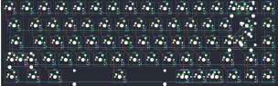{:loading="lazy"}

## swiftrax/digicarpice

[layout](digicarpice-kle.json) - [PCB](digicarpice.kicad_pcb)

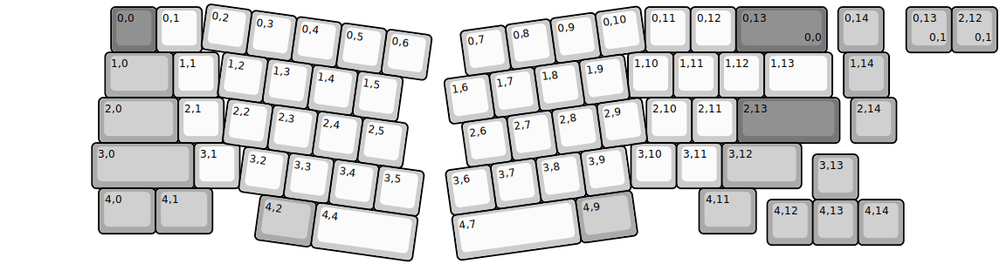{:loading="lazy"}

[Open in keyboard-layout-editor](http://www.keyboard-layout-editor.com/##@@_x:2.37&y:0.08&c=#777777;&=0,0&_c=#cccccc;&=0,1&_x:9.76;&=0,11&=0,12&_c=#777777&w:2;&=0,13%0A%0A%0A0,0&_x:0.25&c=#aaaaaa;&=0,14;&@_x:2.24&w:1.5;&=1,0&_c=#cccccc;&=1,1&_x:9.01;&=1,10&=1,11&=1,12&_w:1.5;&=1,13&_x:0.25&c=#aaaaaa;&=1,14;&@_x:2.1&w:1.75;&=2,0&_c=#cccccc;&=2,1&_x:9.31;&=2,10&=2,11&_c=#777777&w:2.25;&=2,13&_x:0.25&c=#aaaaaa;&=2,14;&@_x:1.95&w:2.25;&=3,0&_c=#cccccc;&=3,1&_x:8.62;&=3,10&=3,11&_c=#aaaaaa&w:1.75;&=3,12;&@_x:17.82&y:-0.75;&=3,13;&@_x:2.1&y:-0.25&w:1.25;&=4,0&_w:1.25;&=4,1&_x:10.72&w:1.25;&=4,11;&@_x:16.82&y:-0.75;&=4,12&=4,13&=4,14;&@_r:8&rx:4.5&c=#cccccc;&=0,2&=0,3&=0,4&=0,5&=0,6;&@_x:0.5;&=1,2&=1,3&=1,4&=1,5;&@_x:0.75;&=2,2&=2,3&=2,4&=2,5;&@_x:1.25;&=3,2&=3,3&=3,4&=3,5;&@_x:1.75&c=#aaaaaa&w:1.25;&=4,2&_c=#cccccc&w:2.25;&=4,4;&@_r:-8&rx:14.5&x:-4.5;&=0,7&=0,8&=0,9&=0,10;&@_x:-5.0;&=1,6&=1,7&=1,8&=1,9;&@_x:-4.75;&=2,6&=2,7&=2,8&=2,9;&@_x:-5.25;&=3,6&=3,7&=3,8&=3,9;&@_x:-5.25&w:2.75;&=4,7&_c=#aaaaaa&w:1.25;&=4,9;&@_r:0&rx:0&x:19.88&y:0.08;&=0,13%0A%0A%0A0,1&=2,12%0A%0A%0A0,1)

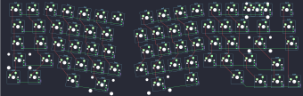{:loading="lazy"}

## swiftrax/equator

[layout](equator-kle.json) - [PCB](equator.kicad_pcb)

{:loading="lazy"}

[Open in keyboard-layout-editor](http://www.keyboard-layout-editor.com/##@@_x:2.37&y:0.08&c=#777777;&=0,0&_c=#cccccc;&=0,1&_x:9.76;&=0,11&=0,12&_c=#aaaaaa&w:2;&=0,13%0A%0A%0A0,0;&@_x:2.24&w:1.5;&=1,0&_c=#cccccc;&=1,1&_x:9.01;&=1,10&=1,11&=1,12&_w:1.5;&=1,13;&@_x:2.1&c=#aaaaaa&w:1.75;&=2,0&_c=#cccccc;&=2,1&_x:9.31;&=2,10&=2,11&_c=#777777&w:2.25;&=2,13;&@_x:1.95&c=#aaaaaa&w:2.25;&=3,0&_c=#cccccc;&=3,1&_x:8.62;&=3,10&=3,11&_c=#aaaaaa&w:2.75;&=3,12%0A%0A%0A1,0;&@_x:2.1&w:1.25;&=4,0&_w:1.25;&=4,1&_x:10.06&w:1.25;&=4,11&_w:1.25;&=4,12&_w:1.25;&=4,13;&@_r:8&rx:4.5&c=#cccccc;&=0,2&=0,3&=0,4&=0,5&=0,6;&@_x:0.5;&=1,2&=1,3&=1,4&=1,5;&@_x:0.75;&=2,2&=2,3&=2,4&=2,5;&@_x:1.25;&=3,2&=3,3&=3,4&=3,5;&@_x:1.75&c=#aaaaaa&w:1.25;&=4,2&_c=#cccccc&w:2.25;&=4,4;&@_r:-8&rx:14.5&x:-4.5;&=0,7&=0,8&=0,9&=0,10;&@_x:-5.0;&=1,6&=1,7&=1,8&=1,9;&@_x:-4.75;&=2,6&=2,7&=2,8&=2,9;&@_x:-5.25;&=3,6&=3,7&=3,8&=3,9;&@_x:-5.25&w:2.25;&=4,7&_c=#aaaaaa&w:1.25;&=4,9;&@_r:0&rx:0&x:18.5&y:0.08;&=0,13%0A%0A%0A0,1&=2,12%0A%0A%0A0,1;&@_x:18.95&y:2.0&w:1.75;&=3,12%0A%0A%0A1,1&=3,13%0A%0A%0A1,1)

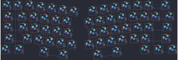{:loading="lazy"}

## swiftrax/glacier

[layout](glacier-kle.json) - [PCB](glacier.kicad_pcb)

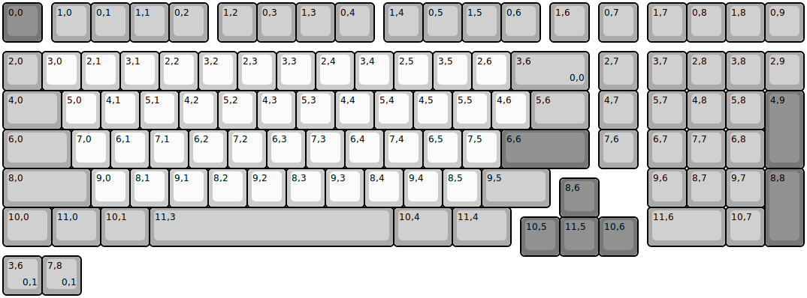{:loading="lazy"}

[Open in keyboard-layout-editor](http://www.keyboard-layout-editor.com/##@@_c=#777777;&=0,0&_x:0.25&c=#aaaaaa;&=1,0&=0,1&=1,1&=0,2&_x:0.25;&=1,2&=0,3&=1,3&=0,4&_x:0.25;&=1,4&=0,5&=1,5&=0,6&_x:0.25;&=1,6&_x:0.25;&=0,7&_x:0.25;&=1,7&=0,8&=1,8&=0,9;&@_y:0.25;&=2,0&_c=#cccccc;&=3,0&=2,1&=3,1&=2,2&=3,2&=2,3&=3,3&=2,4&=3,4&=2,5&=3,5&=2,6&_c=#aaaaaa&w:2;&=3,6%0A%0A%0A0,0&_x:0.25;&=2,7&_x:0.25;&=3,7&=2,8&=3,8&=2,9;&@_w:1.5;&=4,0&_c=#cccccc;&=5,0&=4,1&=5,1&=4,2&=5,2&=4,3&=5,3&=4,4&=5,4&=4,5&=5,5&=4,6&_c=#aaaaaa&w:1.5;&=5,6&_x:0.25;&=4,7&_x:0.25;&=5,7&=4,8&=5,8&_c=#777777&h:2;&=4,9;&@_c=#aaaaaa&w:1.75;&=6,0&_c=#cccccc;&=7,0&=6,1&=7,1&=6,2&=7,2&=6,3&=7,3&=6,4&=7,4&=6,5&=7,5&_c=#777777&w:2.25;&=6,6&_x:0.25&c=#aaaaaa;&=7,6&_x:0.25;&=6,7&=7,7&=6,8;&@_w:2.25;&=8,0&_c=#cccccc;&=9,0&=8,1&=9,1&=8,2&=9,2&=8,3&=9,3&=8,4&=9,4&=8,5&_c=#aaaaaa&w:1.75;&=9,5&_x:2.5;&=9,6&=8,7&=9,7&_c=#777777&h:2;&=8,8;&@_x:14.25&y:-0.75;&=8,6;&@_y:-0.25&c=#aaaaaa&w:1.25;&=10,0&_w:1.25;&=11,0&_w:1.25;&=10,1&_w:6.25;&=11,3&_w:1.5;&=10,4&_w:1.5;&=11,4&_x:3.5&w:2;&=11,6&=10,7;&@_x:13.25&y:-0.75&c=#777777;&=10,5&=11,5&=10,6;&@_c=#aaaaaa;&=3,6%0A%0A%0A0,1&=7,8%0A%0A%0A0,1)

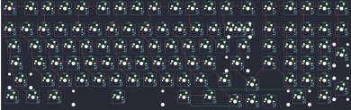{:loading="lazy"}

## swiftrax/joypad

[layout](joypad-kle.json) - [PCB](joypad.kicad_pcb)

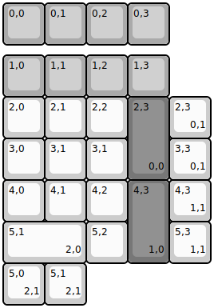{:loading="lazy"}

[Open in keyboard-layout-editor](http://www.keyboard-layout-editor.com/##@@_c=#aaaaaa;&=0,0&=0,1&=0,2&=0,3;&@_y:0.25;&=1,0&=1,1&=1,2&=1,3;&@_c=#cccccc;&=2,0&=2,1&=2,2&_c=#777777&h:2;&=2,3%0A%0A%0A0,0;&@_c=#cccccc;&=3,0&=3,1&=3,1;&@=4,0&=4,1&=4,2&_c=#777777&h:2;&=4,3%0A%0A%0A1,0;&@_c=#cccccc&w:2;&=5,1%0A%0A%0A2,0&=5,2;&@_x:4&y:-4.0;&=2,3%0A%0A%0A0,1;&@_x:4;&=3,3%0A%0A%0A0,1;&@_x:4;&=4,3%0A%0A%0A1,1;&@_x:4;&=5,3%0A%0A%0A1,1;&@=5,0%0A%0A%0A2,1&=5,1%0A%0A%0A2,1)

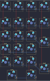{:loading="lazy"}

## swiftrax/koalafications

[layout](koalafications-kle.json) - [PCB](koalafications.kicad_pcb)

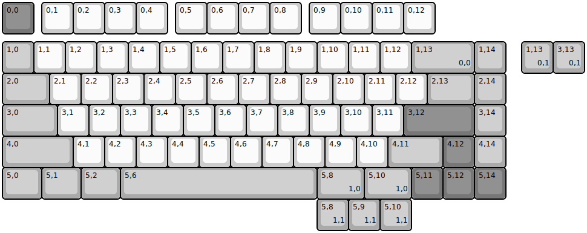{:loading="lazy"}

[Open in keyboard-layout-editor](http://www.keyboard-layout-editor.com/##@@_c=#777777;&=0,0&_x:0.25&c=#cccccc;&=0,1&=0,2&=0,3&=0,4&_x:0.25;&=0,5&=0,6&=0,7&=0,8&_x:0.25;&=0,9&=0,10&=0,11&=0,12;&@_y:0.25&c=#aaaaaa;&=1,0&_c=#cccccc;&=1,1&=1,2&=1,3&=1,4&=1,5&=1,6&=1,7&=1,8&=1,9&=1,10&=1,11&=1,12&_c=#aaaaaa&w:2;&=1,13%0A%0A%0A0,0&=1,14;&@_w:1.5;&=2,0&_c=#cccccc;&=2,1&=2,2&=2,3&=2,4&=2,5&=2,6&=2,7&=2,8&=2,9&=2,10&=2,11&=2,12&_c=#aaaaaa&w:1.5;&=2,13&=2,14;&@_w:1.75;&=3,0&_c=#cccccc;&=3,1&=3,2&=3,3&=3,4&=3,5&=3,6&=3,7&=3,8&=3,9&=3,10&=3,11&_c=#777777&w:2.25;&=3,12&_c=#aaaaaa;&=3,14;&@_w:2.25;&=4,0&_c=#cccccc;&=4,1&=4,2&=4,3&=4,4&=4,5&=4,6&=4,7&=4,8&=4,9&=4,10&_c=#aaaaaa&w:1.75;&=4,11&_c=#777777;&=4,12&_c=#aaaaaa;&=4,14;&@_w:1.25;&=5,0&_w:1.25;&=5,1&_w:1.25;&=5,2&_w:6.25;&=5,6&_w:1.5;&=5,8%0A%0A%0A1,0&_w:1.5;&=5,10%0A%0A%0A1,0&_c=#777777;&=5,11&=5,12&=5,14;&@_x:16.5&y:-5.0&c=#aaaaaa;&=1,13%0A%0A%0A0,1&=3,13%0A%0A%0A0,1;&@_x:10&y:4.0;&=5,8%0A%0A%0A1,1&=5,9%0A%0A%0A1,1&=5,10%0A%0A%0A1,1)

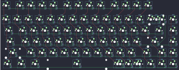{:loading="lazy"}

## swiftrax/nodu

[layout](nodu-kle.json) - [PCB](nodu.kicad_pcb)

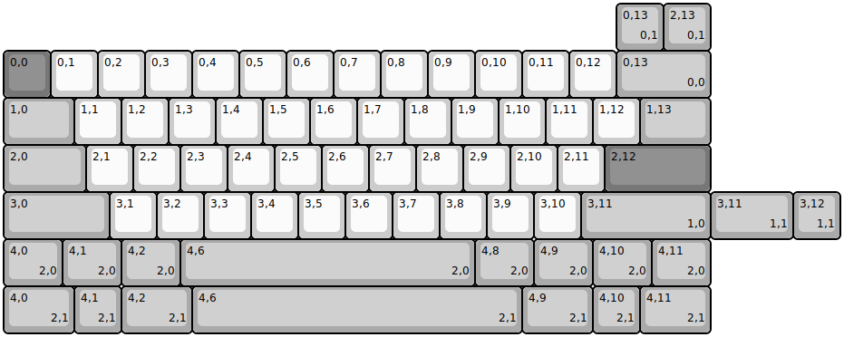{:loading="lazy"}

[Open in keyboard-layout-editor](http://www.keyboard-layout-editor.com/##@@_y:1&c=#777777;&=0,0&_c=#cccccc;&=0,1&=0,2&=0,3&=0,4&=0,5&=0,6&=0,7&=0,8&=0,9&=0,10&=0,11&=0,12&_c=#aaaaaa&w:2;&=0,13%0A%0A%0A0,0;&@_w:1.5;&=1,0&_c=#cccccc;&=1,1&=1,2&=1,3&=1,4&=1,5&=1,6&=1,7&=1,8&=1,9&=1,10&=1,11&=1,12&_c=#aaaaaa&w:1.5;&=1,13;&@_w:1.75;&=2,0&_c=#cccccc;&=2,1&=2,2&=2,3&=2,4&=2,5&=2,6&=2,7&=2,8&=2,9&=2,10&=2,11&_c=#777777&w:2.25;&=2,12;&@_c=#aaaaaa&w:2.25;&=3,0&_c=#cccccc;&=3,1&=3,2&=3,3&=3,4&=3,5&=3,6&=3,7&=3,8&=3,9&=3,10&_c=#aaaaaa&w:2.75;&=3,11%0A%0A%0A1,0;&@_w:1.25;&=4,0%0A%0A%0A2,0&_w:1.25;&=4,1%0A%0A%0A2,0&_w:1.25;&=4,2%0A%0A%0A2,0&_w:6.25;&=4,6%0A%0A%0A2,0&_w:1.25;&=4,8%0A%0A%0A2,0&_w:1.25;&=4,9%0A%0A%0A2,0&_w:1.25;&=4,10%0A%0A%0A2,0&_w:1.25;&=4,11%0A%0A%0A2,0;&@_x:13&y:-6;&=0,13%0A%0A%0A0,1&=2,13%0A%0A%0A0,1;&@_x:15.0&y:3&w:1.75;&=3,11%0A%0A%0A1,1&=3,12%0A%0A%0A1,1;&@_y:1&w:1.5;&=4,0%0A%0A%0A2,1&=4,1%0A%0A%0A2,1&_w:1.5;&=4,2%0A%0A%0A2,1&_w:7;&=4,6%0A%0A%0A2,1&_w:1.5;&=4,9%0A%0A%0A2,1&=4,10%0A%0A%0A2,1&_w:1.5;&=4,11%0A%0A%0A2,1)

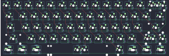{:loading="lazy"}

## swiftrax/pandamic

[layout](pandamic-kle.json) - [PCB](pandamic.kicad_pcb)

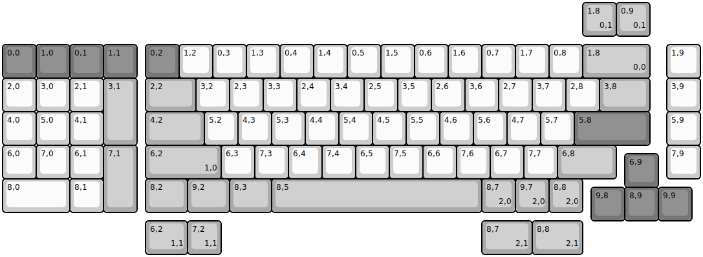{:loading="lazy"}

[Open in keyboard-layout-editor](http://www.keyboard-layout-editor.com/##@@_y:1.25&c=#777777;&=0,0&=1,0&=0,1&=1,1&_x:0.25;&=0,2&_c=#cccccc;&=1,2&=0,3&=1,3&=0,4&=1,4&=0,5&=1,5&=0,6&=1,6&=0,7&=1,7&=0,8&_c=#aaaaaa&w:2;&=1,8%0A%0A%0A0,0&_x:0.5&c=#cccccc;&=1,9;&@=2,0&=3,0&=2,1&_c=#aaaaaa&h:2;&=3,1&_x:0.25&w:1.5;&=2,2&_c=#cccccc;&=3,2&=2,3&=3,3&=2,4&=3,4&=2,5&=3,5&=2,6&=3,6&=2,7&=3,7&=2,8&_c=#aaaaaa&w:1.5;&=3,8&_x:0.5&c=#cccccc;&=3,9;&@=4,0&=5,0&=4,1&_x:1.25&c=#aaaaaa&w:1.75;&=4,2&_c=#cccccc;&=5,2&=4,3&=5,3&=4,4&=5,4&=4,5&=5,5&=4,6&=5,6&=4,7&=5,7&_c=#777777&w:2.25;&=5,8&_x:0.5&c=#cccccc;&=5,9;&@=6,0&=7,0&=6,1&_c=#aaaaaa&h:2;&=7,1&_x:0.25&w:2.25;&=6,2%0A%0A%0A1,0&_c=#cccccc;&=6,3&=7,3&=6,4&=7,4&=6,5&=7,5&=6,6&=7,6&=6,7&=7,7&_c=#aaaaaa&w:1.75;&=6,8&_x:1.5&c=#cccccc;&=7,9;&@_x:18.5&y:-0.75&c=#777777;&=6,9;&@_y:-0.25&c=#cccccc&w:2;&=8,0&=8,1&_x:1.25&c=#aaaaaa&w:1.25;&=8,2&_w:1.25;&=9,2&_w:1.25;&=8,3&_w:6.25;&=8,5&=8,7%0A%0A%0A2,0&=9,7%0A%0A%0A2,0&=8,8%0A%0A%0A2,0;&@_x:17.5&y:-0.75&c=#777777;&=9,8&=8,9&=9,9;&@_x:17.25&y:-6.5&c=#aaaaaa;&=1,8%0A%0A%0A0,1&=0,9%0A%0A%0A0,1;&@_x:4.25&y:5.5&w:1.25;&=6,2%0A%0A%0A1,1&=7,2%0A%0A%0A1,1&_x:7.75&w:1.5;&=8,7%0A%0A%0A2,1&_w:1.5;&=8,8%0A%0A%0A2,1)

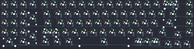{:loading="lazy"}

## swiftrax/retropad

[layout](retropad-kle.json) - [PCB](retropad.kicad_pcb)

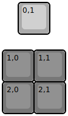{:loading="lazy"}

[Open in keyboard-layout-editor](http://www.keyboard-layout-editor.com/##@@_x:0.5&c=#aaaaaa;&=0,1;&@_y:0.5&c=#777777;&=1,0&=1,1;&@=2,0&=2,1)

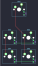{:loading="lazy"}

## swiftrax/the_galleon

[layout](the_galleon-kle.json) - [PCB](the_galleon.kicad_pcb)

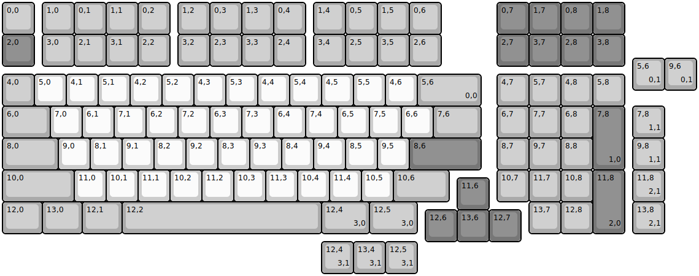{:loading="lazy"}

[Open in keyboard-layout-editor](http://www.keyboard-layout-editor.com/##@@_c=#aaaaaa;&=0,0&_x:0.25;&=1,0&=0,1&=1,1&=0,2&_x:0.25;&=1,2&=0,3&=1,3&=0,4&_x:0.25;&=1,4&=0,5&=1,5&=0,6&_x:1.75&c=#777777;&=0,7&=1,7&=0,8&=1,8;&@=2,0&_x:0.25&c=#aaaaaa;&=3,0&=2,1&=3,1&=2,2&_x:0.25;&=3,2&=2,3&=3,3&=2,4&_x:0.25;&=3,4&=2,5&=3,5&=2,6&_x:1.75&c=#777777;&=2,7&=3,7&=2,8&=3,8;&@_y:0.25&c=#aaaaaa;&=4,0&_c=#cccccc;&=5,0&=4,1&=5,1&=4,2&=5,2&=4,3&=5,3&=4,4&=5,4&=4,5&=5,5&=4,6&_c=#aaaaaa&w:2;&=5,6%0A%0A%0A0,0&_x:0.5;&=4,7&=5,7&=4,8&=5,8;&@_w:1.5;&=6,0&_c=#cccccc;&=7,0&=6,1&=7,1&=6,2&=7,2&=6,3&=7,3&=6,4&=7,4&=6,5&=7,5&=6,6&_c=#aaaaaa&w:1.5;&=7,6&_x:0.5;&=6,7&=7,7&=6,8&_c=#777777&h:2;&=7,8%0A%0A%0A1,0;&@_c=#aaaaaa&w:1.75;&=8,0&_c=#cccccc;&=9,0&=8,1&=9,1&=8,2&=9,2&=8,3&=9,3&=8,4&=9,4&=8,5&=9,5&_c=#777777&w:2.25;&=8,6&_x:0.5&c=#aaaaaa;&=8,7&=9,7&=8,8;&@_w:2.25;&=10,0&_c=#cccccc;&=11,0&=10,1&=11,1&=10,2&=11,2&=10,3&=11,3&=10,4&=11,4&=10,5&_c=#aaaaaa&w:1.75;&=10,6&_x:1.5;&=10,7&=11,7&=10,8&_c=#777777&h:2;&=11,8%0A%0A%0A2,0;&@_x:14.25&y:-0.75;&=11,6;&@_y:-0.25&c=#aaaaaa&w:1.25;&=12,0&_w:1.25;&=13,0&_w:1.25;&=12,1&_w:6.25;&=12,2&_w:1.5;&=12,4%0A%0A%0A3,0&_w:1.5;&=12,5%0A%0A%0A3,0&_x:3.5;&=13,7&=12,8;&@_x:13.25&y:-0.75&c=#777777;&=12,6&=13,6&=12,7;&@_x:19.75&y:-5.75&c=#aaaaaa;&=5,6%0A%0A%0A0,1&=9,6%0A%0A%0A0,1;&@_x:19.75&y:0.5;&=7,8%0A%0A%0A1,1;&@_x:19.75;&=9,8%0A%0A%0A1,1;&@_x:19.75;&=11,8%0A%0A%0A2,1;&@_x:19.75;&=13,8%0A%0A%0A2,1;&@_x:10&y:0.25;&=12,4%0A%0A%0A3,1&=13,4%0A%0A%0A3,1&=12,5%0A%0A%0A3,1)

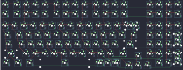{:loading="lazy"}

## swiftrax/unsplit

[layout](unsplit-kle.json) - [PCB](unsplit.kicad_pcb)

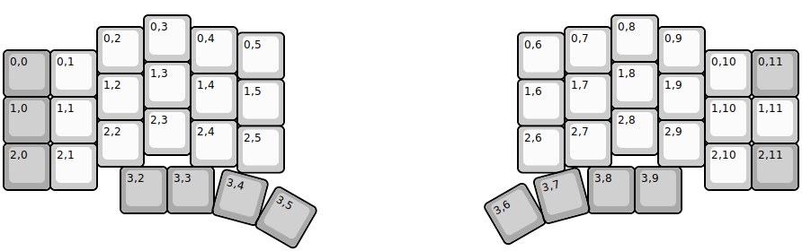{:loading="lazy"}

[Open in keyboard-layout-editor](http://www.keyboard-layout-editor.com/##@@_x:3&y:0.25;&=0,3&_x:9;&=0,8;&@_x:2&y:-0.75;&=0,2&_x:1;&=0,4&_x:7;&=0,7&_x:1;&=0,9;&@_x:5&y:-0.875;&=0,5&_x:5;&=0,6;&@_y:-0.625&c=#aaaaaa;&=0,0&_c=#cccccc;&=0,1&_x:13;&=0,10&_c=#aaaaaa;&=0,11;&@_x:3&y:-0.75&c=#cccccc;&=1,3&_x:9;&=1,8;&@_x:2&y:-0.75;&=1,2&_x:1;&=1,4&_x:7;&=1,7&_x:1;&=1,9;&@_x:5&y:-0.875;&=1,5&_x:5;&=1,6;&@_y:-0.625&c=#aaaaaa;&=1,0&_c=#cccccc;&=1,1&_x:13;&=1,10&=1,11;&@_x:3&y:-0.75;&=2,3&_x:9;&=2,8;&@_x:2&y:-0.75;&=2,2&_x:1;&=2,4&_x:7;&=2,7&_x:1;&=2,9;&@_x:5&y:-0.875;&=2,5&_x:5;&=2,6;&@_y:-0.625&c=#aaaaaa;&=2,0&_c=#cccccc;&=2,1&_x:13;&=2,10&_c=#aaaaaa;&=2,11;&@_x:2.5&y:-0.5;&=3,2&_x:10.0;&=3,9;&@_rx:4&ry:8.175&x:-0.5&y:-4.675;&=3,3;&@_rx:13&x:-0.5&y:-4.675;&=3,8;&@_r:15&rx:4&x:-0.5&y:-4.675;&=3,4;&@_r:30&x:-0.5&y:-1.0;&=3,5;&@_r:-30&rx:13&x:-0.5&y:-4.675;&=3,6;&@_r:-15&x:-0.5&y:-1.0;&=3,7)

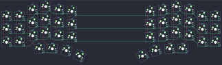{:loading="lazy"}

## swiftrax/walter

[layout](walter-kle.json) - [PCB](walter.kicad_pcb)

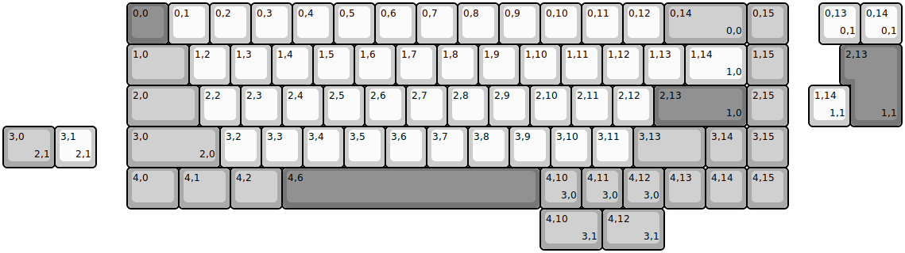{:loading="lazy"}

[Open in keyboard-layout-editor](http://www.keyboard-layout-editor.com/##@@_x:3&c=#777777;&=0,0&_c=#cccccc;&=0,1&=0,2&=0,3&=0,4&=0,5&=0,6&=0,7&=0,8&=0,9&=0,10&=0,11&=0,12&_c=#aaaaaa&w:2;&=0,14%0A%0A%0A0,0&=0,15;&@_x:3&w:1.5;&=1,0&_c=#cccccc;&=1,2&=1,3&=1,4&=1,5&=1,6&=1,7&=1,8&=1,9&=1,10&=1,11&=1,12&=1,13&_w:1.5;&=1,14%0A%0A%0A1,0&_c=#aaaaaa;&=1,15;&@_x:3&w:1.75;&=2,0&_c=#cccccc;&=2,2&=2,3&=2,4&=2,5&=2,6&=2,7&=2,8&=2,9&=2,10&=2,11&=2,12&_c=#777777&w:2.25;&=2,13%0A%0A%0A1,0&_c=#aaaaaa;&=2,15;&@_x:3.0&w:2.25;&=3,0%0A%0A%0A2,0&_c=#cccccc;&=3,2&=3,3&=3,4&=3,5&=3,6&=3,7&=3,8&=3,9&=3,10&=3,11&_c=#aaaaaa&w:1.75;&=3,13&=3,14&=3,15;&@_x:3&w:1.25;&=4,0&_w:1.25;&=4,1&_w:1.25;&=4,2&_c=#777777&w:6.25;&=4,6&_c=#aaaaaa;&=4,10%0A%0A%0A3,0&=4,11%0A%0A%0A3,0&=4,12%0A%0A%0A3,0&=4,13&=4,14&=4,15;&@_x:19.75&y:-5&c=#cccccc;&=0,13%0A%0A%0A0,1&=0,14%0A%0A%0A0,1;&@_x:20.5&c=#777777&w:1.25&h:2&w2:1.5&h2:1&x2:-0.25;&=2,13%0A%0A%0A1,1;&@_x:19.5&c=#cccccc;&=1,14%0A%0A%0A1,1;&@_c=#aaaaaa&w:1.25;&=3,0%0A%0A%0A2,1&_c=#cccccc;&=3,1%0A%0A%0A2,1;&@_x:13&y:1&c=#aaaaaa&w:1.5;&=4,10%0A%0A%0A3,1&_w:1.5;&=4,12%0A%0A%0A3,1)

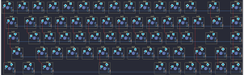{:loading="lazy"}

