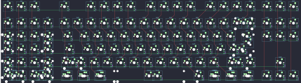

## switchplate/southpaw_fullsize

[layout](southpaw_fullsize-kle.json) - [PCB](southpaw_fullsize.kicad_pcb)

{:loading="lazy"}

[Open in keyboard-layout-editor](http://www.keyboard-layout-editor.com/##@@_c=#777777;&=0,0&_c=#aaaaaa;&=0,1&=0,2&_x:1.25&c=#777777;&=0,4&_x:1.0&c=#cccccc;&=0,6&=0,7&=0,8&=0,9&_x:0.5&c=#aaaaaa;&=0,10&=0,11&=0,12&=0,13&_x:0.5&c=#cccccc;&=0,14&=0,15&=0,16&=0,17&_x:0.25&c=#aaaaaa;&=0,19&=0,20&=0,21;&@_y:0.25;&=1,0&=1,1&=1,2&=1,3&_x:0.25;&=1,4&_c=#cccccc;&=1,5&=1,6&=1,7&=1,8&=1,9&=1,10&=1,11&=1,12&=1,13&=1,14&=1,15&=1,16&_c=#aaaaaa&w:2;&=1,17%0A%0A%0A5,0&_x:0.25;&=1,19&=1,20&=1,21;&@_c=#cccccc;&=2,0%0A%0A%0A0,0&=2,1&=2,2&=2,3%0A%0A%0A2,0&_x:0.25&c=#aaaaaa&w:1.5;&=2,4&_c=#cccccc;&=2,5&=2,6&=2,7&=2,8&=2,9&=2,10&=2,11&=2,12&=2,13&=2,14&=2,15&=2,16&_c=#aaaaaa&w:1.5;&=2,17%0A%0A%0A6,0&_x:0.25;&=2,19&=2,20&=2,21;&@_c=#cccccc;&=3,0%0A%0A%0A0,0&=3,1&=3,2&=3,3%0A%0A%0A2,0&_x:0.25&c=#aaaaaa&w:1.75;&=3,4&_c=#cccccc;&=3,5&=3,6&=3,7&=3,8&=3,9&=3,10&=3,11&=3,12&=3,13&=3,14&=3,15&_c=#777777&w:2.25;&=3,17%0A%0A%0A6,0;&@_c=#cccccc;&=4,0%0A%0A%0A1,0&=4,1&=4,2&=4,3%0A%0A%0A3,0&_x:0.25&c=#aaaaaa&w:2.25;&=4,4%0A%0A%0A4,0&_c=#cccccc;&=4,6&=4,7&=4,8&=4,9&=4,10&=4,11&=4,12&=4,13&=4,14&=4,15&_c=#aaaaaa&w:2.75;&=4,16%0A%0A%0A7,0&_x:1.25;&=4,20;&@_c=#cccccc;&=5,0%0A%0A%0A1,0&=5,1%0A%0A%0A1,0&=5,2%0A%0A%0A3,0&=5,3%0A%0A%0A3,0&_x:0.25&c=#aaaaaa&w:1.5;&=5,4%0A%0A%0A8,0&=5,5%0A%0A%0A8,0&_w:1.5;&=5,6%0A%0A%0A8,0&_c=#cccccc&w:7;&=5,10%0A%0A%0A8,0&_c=#aaaaaa&w:1.5;&=5,14%0A%0A%0A8,0&=5,15%0A%0A%0A8,0&_w:1.5;&=5,16%0A%0A%0A8,0&_x:0.25;&=5,19&=5,20&=5,21;&@_x:4.25&y:0.25&w:1.25;&=5,4%0A%0A%0A8,1&_w:1.25;&=5,5%0A%0A%0A8,1&_w:1.25;&=5,6%0A%0A%0A8,1&_c=#cccccc&w:6.25;&=5,10%0A%0A%0A8,1&_c=#aaaaaa&w:1.25;&=5,13%0A%0A%0A8,1&_w:1.25;&=5,14%0A%0A%0A8,1&_w:1.25;&=5,15%0A%0A%0A8,1&_w:1.25;&=5,16%0A%0A%0A8,1;&@_y:-0.75&h:2;&=2,0%0A%0A%0A0,1&_x:2&h:2;&=2,3%0A%0A%0A2,1;&@_x:17.25;&=1,17%0A%0A%0A5,1&=1,18%0A%0A%0A5,1;&@_x:18&c=#777777&w:1.25&h:2&w2:1.5&h2:1&x2:-0.25;&=3,17%0A%0A%0A6,1;&@_y:-0.75&c=#aaaaaa&h:2;&=4,0%0A%0A%0A1,1&_x:2&h:2;&=4,3%0A%0A%0A3,1;&@_x:17&y:-0.25&c=#cccccc;&=3,16%0A%0A%0A6,1;&@_x:1&y:-0.75;&=5,1%0A%0A%0A1,1&=5,2%0A%0A%0A3,1;&@_x:4.5&y:-0.25&w:1.25;&=4,4%0A%0A%0A4,1&=4,5%0A%0A%0A4,1&_x:9.75&c=#aaaaaa&w:1.75;&=4,16%0A%0A%0A7,1&=4,18%0A%0A%0A7,1;&@_y:-0.5&c=#cccccc;&=4,0%0A%0A%0A1,2&_x:2;&=4,3%0A%0A%0A3,2;&@_w:2;&=5,0%0A%0A%0A1,2&_w:2;&=5,3%0A%0A%0A3,2)

{:loading="lazy"}

