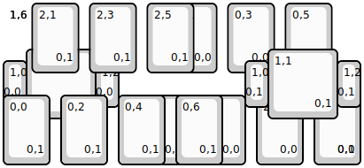
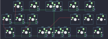

## synthlabs/solo

[layout](solo-kle.json) - [PCB](solo.kicad_pcb)

{:loading="lazy"}

[Open in keyboard-layout-editor](http://www.keyboard-layout-editor.com/##@@_w:7.75&h:3.5&d:true;&=1,6%0A%0A%0A0,0&_x:-4.125&h:1.5;&=0,1%0A%0A%0A0,0&_x:0.25&h:1.5;&=0,3%0A%0A%0A0,0&_x:0.25&h:1.5;&=0,5%0A%0A%0A0,0;&@_x:0.5&w:1.5&h:1.5;&=1,1%0A%0A%0A0,0;&@_y:-0.75&w:0.5;&=1,0%0A%0A%0A0,0&_x:1.5&w:0.5;&=1,2%0A%0A%0A0,0;&@_x:3.0&y:-0.25&h:1.5;&=2,0%0A%0A%0A0,0&_x:0.25&h:1.5;&=2,2%0A%0A%0A0,0&_x:0.25&h:1.5;&=2,4%0A%0A%0A0,0&_x:0.25&h:1.5;&=2,6%0A%0A%0A0,0;&@_y:-3.0&w:7.75&h:3.5&d:true;&=1,6%0A%0A%0A0,1&_x:-7.125&h:1.5;&=2,1%0A%0A%0A0,1&_x:0.25&h:1.5;&=2,3%0A%0A%0A0,1&_x:0.25&h:1.5;&=2,5%0A%0A%0A0,1;&@_x:5.75&w:1.5&h:1.5;&=1,1%0A%0A%0A0,1;&@_x:5.25&y:-0.75&w:0.5;&=1,0%0A%0A%0A0,1&_x:1.5&w:0.5;&=1,2%0A%0A%0A0,1;&@_y:-0.25&h:1.5;&=0,0%0A%0A%0A0,1&_x:0.25&h:1.5;&=0,2%0A%0A%0A0,1&_x:0.25&h:1.5;&=0,4%0A%0A%0A0,1&_x:0.25&h:1.5;&=0,6%0A%0A%0A0,1)

{:loading="lazy"}

