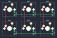

## techkeys/sixkeyboard

[layout](sixkeyboard-kle.json) - [PCB](sixkeyboard.kicad_pcb)

{:loading="lazy"}

[Open in keyboard-layout-editor](http://www.keyboard-layout-editor.com/##@_name=sixkeyboard%20via;&@=0,0&=0,1&=0,2;&@=1,0&=1,1&=1,2)

{:loading="lazy"}

