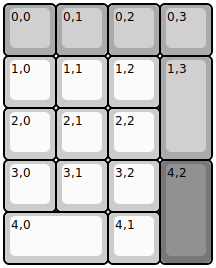
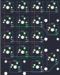

## teleport/numpad

[layout](numpad-kle.json) - [PCB](numpad.kicad_pcb)

{:loading="lazy"}

[Open in keyboard-layout-editor](http://www.keyboard-layout-editor.com/##@@_c=#aaaaaa;&=0,0&=0,1&=0,2&=0,3;&@_c=#cccccc;&=1,0&=1,1&=1,2&_c=#aaaaaa&h:2;&=1,3;&@_c=#cccccc;&=2,0&=2,1&=2,2;&@=3,0&=3,1&=3,2&_c=#777777&h:2;&=4,2;&@_c=#cccccc&w:2;&=4,0&=4,1)

{:loading="lazy"}

