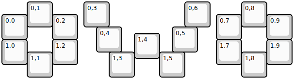
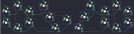

## tender/macrowo_pad

[layout](macrowo_pad-kle.json) - [PCB](macrowo_pad.kicad_pcb)

{:loading="lazy"}

[Open in keyboard-layout-editor](http://www.keyboard-layout-editor.com/##@@_x:1;&=0,1&_x:1.25;&=0,3&_x:3.0;&=0,6&_x:1.25;&=0,8;&@_y:-0.5;&=0,0&_x:1;&=0,2&_x:5.5;&=0,7&_x:1.0;&=0,9;&@_x:3.75&y:-0.5;&=0,4&_x:2.0;&=0,5;&@_x:5.25&y:-0.75;&=1,4;&@_y:-0.75;&=1,0&_x:1;&=1,2&_x:5.5;&=1,7&_x:1.0;&=1,9;&@_x:1&y:-0.5;&=1,1&_x:2.25;&=1,3&_x:1.0;&=1,5&_x:2.25;&=1,8)

{:loading="lazy"}

