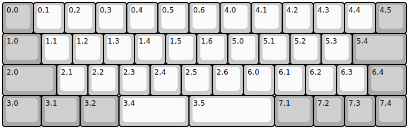
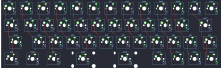

## tg4x/tg4x

[layout](tg4x-kle.json) - [PCB](tg4x.kicad_pcb)

{:loading="lazy"}

[Open in keyboard-layout-editor](http://www.keyboard-layout-editor.com/##@@_c=#aaaaaa;&=0,0&_c=#cccccc;&=0,1&=0,2&=0,3&=0,4&=0,5&=0,6&=4,0&=4,1&=4,2&=4,3&=4,4&_c=#aaaaaa;&=4,5;&@_w:1.25;&=1,0&_c=#cccccc;&=1,1&=1,2&=1,3&=1,4&=1,5&=1,6&=5,0&=5,1&=5,2&=5,3&_c=#aaaaaa&w:1.75;&=5,4;&@_w:1.75;&=2,0&_c=#cccccc;&=2,1&=2,2&=2,3&=2,4&=2,5&=2,6&=6,0&=6,1&=6,2&=6,3&_c=#aaaaaa&w:1.25;&=6,4;&@_w:1.25;&=3,0&_w:1.25;&=3,1&_w:1.25;&=3,2&_c=#cccccc&w:2.25;&=3,4&_w:2.75;&=3,5&_c=#aaaaaa&w:1.25;&=7,1&=7,2&=7,3&=7,4)

{:loading="lazy"}

