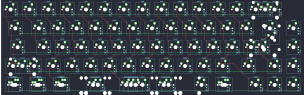
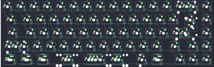
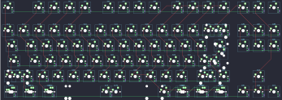
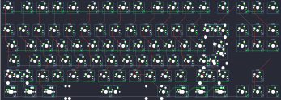
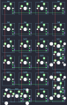

## tgr/910

[layout](910-kle.json) - [PCB](910.kicad_pcb)

{:loading="lazy"}

[Open in keyboard-layout-editor](http://www.keyboard-layout-editor.com/##@@_x:2.75&y:1.5&c=#777777;&=0,0&_c=#cccccc;&=0,1&=0,2&=0,3&=0,4&=0,5&=0,6&=0,7&=0,8&=0,9&=0,10&=0,11&=0,12&_c=#aaaaaa&w:2;&=0,13%0A%0A%0A0,0;&@_x:2.75&w:1.5;&=1,0&_c=#cccccc;&=1,1&=1,2&=1,3&=1,4&=1,5&=1,6&=1,7&=1,8&=1,9&=1,10&=1,11&=1,12&_w:1.5;&=1,13%0A%0A%0A1,0&_c=#aaaaaa;&=5,2;&@_x:2.75&w:1.75;&=2,0&_c=#cccccc;&=2,1&=2,2&=2,3&=2,4&=2,5&=2,6&=2,7&=2,8&=2,9&=2,10&=2,11&_c=#777777&w:2.25;&=2,13%0A%0A%0A1,0&_c=#aaaaaa;&=5,1;&@_x:2.75&w:2.25;&=3,0%0A%0A%0A2,0&_c=#cccccc;&=3,2&=3,3&=3,4&=3,5&=3,6&=3,7&=3,8&=3,9&=3,10&=3,11&_c=#aaaaaa&w:1.75;&=3,12&=3,13&=5,0;&@_x:2.75&w:1.5;&=4,0%0A%0A%0A3,0&=4,1%0A%0A%0A3,0&_w:1.5;&=4,2%0A%0A%0A3,0&_c=#cccccc&w:7;&=4,5%0A%0A%0A3,0&_c=#aaaaaa&w:1.5;&=4,8%0A%0A%0A3,0&_x:0.5;&=4,11&=4,12&=4,13;&@_x:15.75&y:-6.5&c=#cccccc;&=0,13%0A%0A%0A0,1&=6,13%0A%0A%0A0,1;&@_x:20.25&y:1.5&c=#777777&w:1.25&h:2&w2:1.5&h2:1&x2:-0.25;&=2,13%0A%0A%0A1,1;&@_x:19.25&c=#cccccc;&=2,12%0A%0A%0A1,1;&@_c=#aaaaaa&w:1.25;&=3,0%0A%0A%0A2,1&_c=#cccccc;&=3,1%0A%0A%0A2,1;&@_x:2.75&y:1.5&c=#aaaaaa&w:1.25;&=4,0%0A%0A%0A3,1&_w:1.25;&=4,1%0A%0A%0A3,1&_w:1.25;&=4,2%0A%0A%0A3,1&_c=#cccccc&w:6.25;&=4,5%0A%0A%0A3,1&_c=#aaaaaa&w:1.25;&=4,7%0A%0A%0A3,1&_w:1.25;&=4,8%0A%0A%0A3,1;&@_x:2.75&w:1.25;&=4,0%0A%0A%0A3,2&_w:1.25;&=4,1%0A%0A%0A3,2&_w:1.25;&=4,2%0A%0A%0A3,2&_c=#cccccc&w:2.75;&=4,4%0A%0A%0A3,2&_w:1.25;&=4,5%0A%0A%0A3,2&_w:2.25;&=4,6%0A%0A%0A3,2&_c=#aaaaaa&w:1.25;&=4,7%0A%0A%0A3,2&_w:1.25;&=4,8%0A%0A%0A3,2;&@_x:2.75&w:1.25;&=4,0%0A%0A%0A3,3&_w:1.25;&=4,1%0A%0A%0A3,3&_w:1.25;&=4,2%0A%0A%0A3,3&_c=#cccccc&w:2.25;&=4,4%0A%0A%0A3,3&_w:1.25;&=4,5%0A%0A%0A3,3&_w:2.75;&=4,6%0A%0A%0A3,3&_c=#aaaaaa&w:1.25;&=4,7%0A%0A%0A3,3&_w:1.25;&=4,8%0A%0A%0A3,3)

{:loading="lazy"}

## tgr/910ce

[layout](910ce-kle.json) - [PCB](910ce.kicad_pcb)

{:loading="lazy"}

[Open in keyboard-layout-editor](http://www.keyboard-layout-editor.com/##@@_x:2.75&y:1.5&c=#777777;&=0,0&_c=#cccccc;&=0,1&=0,2&=0,3&=0,4&=0,5&=0,6&=0,7&=0,8&=0,9&=0,10&=0,11&=0,12&_c=#aaaaaa&w:2;&=0,13%0A%0A%0A0,0&=5,14;&@_x:2.75&w:1.5;&=1,0&_c=#cccccc;&=1,1&=1,2&=1,3&=1,4&=1,5&=1,6&=1,7&=1,8&=1,9&=1,10&=1,11&=1,12&_w:1.5;&=1,13%0A%0A%0A1,0&_c=#aaaaaa;&=1,14;&@_x:2.75&w:1.75;&=2,0&_c=#cccccc;&=2,1&=2,2&=2,3&=2,4&=2,5&=2,6&=2,7&=2,8&=2,9&=2,10&=2,11&_c=#777777&w:2.25;&=2,13%0A%0A%0A1,0&_c=#aaaaaa;&=2,14;&@_x:2.75&w:2.25;&=3,0%0A%0A%0A2,0&_c=#cccccc;&=3,2&=3,3&=3,4&=3,5&=3,6&=3,7&=3,8&=3,9&=3,10&=3,11&_c=#aaaaaa&w:1.75;&=3,12&=3,13&=3,14;&@_x:2.75&w:1.5;&=4,0%0A%0A%0A3,0&=4,1%0A%0A%0A3,0&_w:1.5;&=4,2%0A%0A%0A3,0&_c=#cccccc&w:7;&=4,5%0A%0A%0A3,0&_c=#aaaaaa&w:1.5;&=4,8%0A%0A%0A3,0&_x:0.5;&=4,12&=4,13&=4,14;&@_x:15.75&y:-6.5&c=#cccccc;&=0,13%0A%0A%0A0,1&=0,14%0A%0A%0A0,1;&@_x:20.25&y:1.5&c=#777777&w:1.25&h:2&w2:1.5&h2:1&x2:-0.25;&=2,13%0A%0A%0A1,1;&@_x:19.25&c=#cccccc;&=2,12%0A%0A%0A1,1;&@_c=#aaaaaa&w:1.25;&=3,0%0A%0A%0A2,1&_c=#cccccc;&=3,1%0A%0A%0A2,1;&@_x:2.75&y:1.5&c=#aaaaaa&w:1.25;&=4,0%0A%0A%0A3,1&_w:1.25;&=4,1%0A%0A%0A3,1&_w:1.25;&=4,2%0A%0A%0A3,1&_c=#cccccc&w:6.25;&=4,5%0A%0A%0A3,1&_c=#aaaaaa&w:1.25;&=4,9%0A%0A%0A3,1&_w:1.25;&=4,8%0A%0A%0A3,1;&@_x:2.75&w:1.25;&=4,0%0A%0A%0A3,2&_w:1.25;&=4,1%0A%0A%0A3,2&_w:1.25;&=4,2%0A%0A%0A3,2&_c=#cccccc&w:2.75;&=4,4%0A%0A%0A3,2&_w:1.25;&=4,5%0A%0A%0A3,2&_w:2.25;&=4,7%0A%0A%0A3,2&_c=#aaaaaa&w:1.25;&=4,9%0A%0A%0A3,2&_w:1.25;&=4,8%0A%0A%0A3,2;&@_x:2.75&w:1.25;&=4,0%0A%0A%0A3,3&_w:1.25;&=4,1%0A%0A%0A3,3&_w:1.25;&=4,2%0A%0A%0A3,3&_c=#cccccc&w:2.25;&=4,4%0A%0A%0A3,3&_w:1.25;&=4,5%0A%0A%0A3,3&_w:2.75;&=4,7%0A%0A%0A3,3&_c=#aaaaaa&w:1.25;&=4,9%0A%0A%0A3,3&_w:1.25;&=4,8%0A%0A%0A3,3)

{:loading="lazy"}

## tgr/janev2

[layout](janev2-kle.json) - [PCB](janev2.kicad_pcb)

{:loading="lazy"}

[Open in keyboard-layout-editor](http://www.keyboard-layout-editor.com/##@@_x:3&y:1.5&c=#777777;&=0,0&_x:1&c=#cccccc;&=0,1&=0,2&=0,3&=0,4&_x:0.5&c=#aaaaaa;&=0,5&=0,6&=0,7&=0,8&_x:0.5&c=#cccccc;&=0,9&=0,10&=0,11&=0,12&_x:0.25&c=#aaaaaa;&=0,13&=0,14&=6,11;&@_x:3&y:0.5&c=#cccccc;&=1,0&=1,1&=1,2&=1,3&=1,4&=1,5&=1,6&=1,7&=1,8&=1,9&=1,10&=1,11&=1,12&_c=#aaaaaa&w:2;&=1,13%0A%0A%0A0,0&_x:0.25;&=6,12&=6,13&=6,14;&@_x:3&w:1.5;&=2,0&_c=#cccccc;&=2,1&=2,2&=2,3&=2,4&=2,5&=2,6&=2,7&=2,8&=2,9&=2,10&=2,11&=2,12&_w:1.5;&=2,13%0A%0A%0A1,0&_x:0.25&c=#aaaaaa;&=7,12&=7,13&=7,14;&@_x:3&w:1.75;&=3,0&_c=#cccccc;&=3,1&=3,2&=3,3&=3,4&=3,5&=3,6&=3,7&=3,8&=3,9&=3,10&=3,11&_c=#777777&w:2.25;&=3,13%0A%0A%0A1,0;&@_x:3.0&c=#aaaaaa&w:2.25;&=4,0%0A%0A%0A2,0&_c=#cccccc;&=4,2&=4,3&=4,4&=4,5&=4,6&=4,7&=4,8&=4,9&=4,10&=4,11&_c=#aaaaaa&w:2.75;&=4,12%0A%0A%0A3,0&_x:1.25;&=2,14;&@_x:3&w:1.25;&=5,0%0A%0A%0A4,0&_w:1.25;&=5,1%0A%0A%0A4,0&_w:1.25;&=5,2%0A%0A%0A4,0&_c=#cccccc&w:6.25;&=5,5%0A%0A%0A4,0&_c=#aaaaaa&w:1.25;&=5,8%0A%0A%0A4,0&_w:1.25;&=5,9%0A%0A%0A4,0&_w:1.25;&=5,10%0A%0A%0A4,0&_w:1.25;&=5,13%0A%0A%0A4,0&_x:0.25;&=5,14&=3,14&=4,14;&@_x:16&y:-8.0&c=#cccccc;&=1,13%0A%0A%0A0,1&=1,14%0A%0A%0A0,1;&@_x:22.5&y:3.0&c=#777777&w:1.25&h:2&w2:1.5&h2:1&x2:-0.25;&=3,13%0A%0A%0A1,1;&@_x:21.5&c=#cccccc;&=3,12%0A%0A%0A1,1;&@_c=#aaaaaa&w:1.25;&=4,0%0A%0A%0A2,1&_c=#cccccc;&=4,1%0A%0A%0A2,1&_x:19.25&c=#aaaaaa&w:1.75;&=4,12%0A%0A%0A3,1&=4,13%0A%0A%0A3,1;&@_x:3&y:1.5&w:1.5;&=5,0%0A%0A%0A4,1&=5,1%0A%0A%0A4,1&_w:1.5;&=5,2%0A%0A%0A4,1&_c=#cccccc&w:7;&=5,5%0A%0A%0A4,1&_c=#aaaaaa&w:1.5;&=5,8%0A%0A%0A4,1&=5,9%0A%0A%0A4,1&_w:1.5;&=5,10%0A%0A%0A4,1;&@_x:3&w:1.5;&=5,0%0A%0A%0A4,2&_d:true;&=%0A%0A%0A4,2&_w:1.5;&=5,2%0A%0A%0A4,2&_c=#cccccc&w:7;&=5,5%0A%0A%0A4,2&_c=#aaaaaa&w:1.5;&=5,8%0A%0A%0A4,2&_d:true;&=%0A%0A%0A4,2&_w:1.5;&=5,10%0A%0A%0A4,2)

{:loading="lazy"}

## tgr/janev2ce

[layout](janev2ce-kle.json) - [PCB](janev2ce.kicad_pcb)

{:loading="lazy"}

[Open in keyboard-layout-editor](http://www.keyboard-layout-editor.com/##@@_x:3&y:1.5&c=#777777;&=0,0&_x:0.25&c=#cccccc;&=0,1&=0,2&=0,3&=0,4&_x:0.25&c=#aaaaaa;&=0,5&=0,6&=0,7&=0,8&_x:0.25&c=#cccccc;&=0,9&=0,10&=0,11&=0,12&_x:0.25;&=6,10&_x:0.25&c=#aaaaaa;&=0,13&=0,14&=6,11;&@_x:3&y:0.5&c=#cccccc;&=1,0&=1,1&=1,2&=1,3&=1,4&=1,5&=1,6&=1,7&=1,8&=1,9&=1,10&=1,11&=1,12&_c=#aaaaaa&w:2;&=1,13%0A%0A%0A0,0&_x:0.25;&=6,12&=6,13&=6,14;&@_x:3&w:1.5;&=2,0&_c=#cccccc;&=2,1&=2,2&=2,3&=2,4&=2,5&=2,6&=2,7&=2,8&=2,9&=2,10&=2,11&=2,12&_w:1.5;&=2,13%0A%0A%0A1,0&_x:0.25&c=#aaaaaa;&=7,12&=7,13&=7,14;&@_x:3&w:1.75;&=3,0&_c=#cccccc;&=3,1&=3,2&=3,3&=3,4&=3,5&=3,6&=3,7&=3,8&=3,9&=3,10&=3,11&_c=#777777&w:2.25;&=3,13%0A%0A%0A1,0;&@_x:3.0&c=#aaaaaa&w:2.25;&=4,0%0A%0A%0A2,0&_c=#cccccc;&=4,2&=4,3&=4,4&=4,5&=4,6&=4,7&=4,8&=4,9&=4,10&=4,11&_c=#aaaaaa&w:2.75;&=4,12%0A%0A%0A3,0&_x:1.25;&=2,14;&@_x:3&w:1.25;&=5,0%0A%0A%0A4,0&_w:1.25;&=5,1%0A%0A%0A4,0&_w:1.25;&=5,2%0A%0A%0A4,0&_c=#cccccc&w:6.25;&=5,5%0A%0A%0A4,0&_c=#aaaaaa&w:1.25;&=5,8%0A%0A%0A4,0&_w:1.25;&=5,9%0A%0A%0A4,0&_w:1.25;&=5,10%0A%0A%0A4,0&_w:1.25;&=5,13%0A%0A%0A4,0&_x:0.25;&=5,14&=3,14&=4,14;&@_x:16&y:-8.0&c=#cccccc;&=1,13%0A%0A%0A0,1&=1,14%0A%0A%0A0,1;&@_x:22.5&y:3.0&c=#777777&w:1.25&h:2&w2:1.5&h2:1&x2:-0.25;&=3,13%0A%0A%0A1,1;&@_x:21.5&c=#cccccc;&=3,12%0A%0A%0A1,1;&@_c=#aaaaaa&w:1.25;&=4,0%0A%0A%0A2,1&_c=#cccccc;&=4,1%0A%0A%0A2,1&_x:19.25&c=#aaaaaa&w:1.75;&=4,12%0A%0A%0A3,1&=4,13%0A%0A%0A3,1;&@_x:3&y:1.5&w:1.5;&=5,0%0A%0A%0A4,1&=5,1%0A%0A%0A4,1&_w:1.5;&=5,2%0A%0A%0A4,1&_c=#cccccc&w:7;&=5,5%0A%0A%0A4,1&_c=#aaaaaa&w:1.5;&=5,8%0A%0A%0A4,1&=5,9%0A%0A%0A4,1&_w:1.5;&=5,10%0A%0A%0A4,1;&@_x:3&w:1.5;&=5,0%0A%0A%0A4,2&_d:true;&=%0A%0A%0A4,2&_w:1.5;&=5,2%0A%0A%0A4,2&_c=#cccccc&w:7;&=5,5%0A%0A%0A4,2&_c=#aaaaaa&w:1.5;&=5,8%0A%0A%0A4,2&_d:true;&=%0A%0A%0A4,2&_w:1.5;&=5,10%0A%0A%0A4,2)

{:loading="lazy"}

## tgr/tris

[layout](tris-kle.json) - [PCB](tris.kicad_pcb)

{:loading="lazy"}

[Open in keyboard-layout-editor](http://www.keyboard-layout-editor.com/##@@_c=#aaaaaa;&=0,0&=0,1&=0,2&=0,3;&@_y:0.25&c=#cccccc;&=1,0&=1,1&=1,2&_c=#aaaaaa;&=1,3;&@_c=#cccccc;&=2,0&=2,1&=2,2;&@=3,0&=3,1&=3,2;&@_x:3&y:-2.0&c=#aaaaaa&h:2;&=3,3%0A%0A%0A1,0;&@_y:1.0&c=#cccccc;&=4,0&=4,1&=4,2;&@_w:2;&=5,0%0A%0A%0A0,0&=5,2;&@_x:3&y:-2.0&c=#777777&h:2;&=4,3%0A%0A%0A2,0;&@_x:4.25&y:-3.0&c=#aaaaaa;&=2,3%0A%0A%0A1,1;&@_x:4.25;&=3,3%0A%0A%0A1,1;&@_x:4.25;&=4,3%0A%0A%0A2,1;&@_x:4.25;&=5,3%0A%0A%0A2,1;&@_y:0.25&c=#cccccc;&=5,0%0A%0A%0A0,1&=5,1%0A%0A%0A0,1)

{:loading="lazy"}

