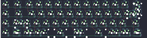

## the_royal/liminal

[layout](liminal-kle.json) - [PCB](liminal.kicad_pcb)

{:loading="lazy"}

[Open in keyboard-layout-editor](http://www.keyboard-layout-editor.com/##@@_x:2.5&c=#777777;&=0,0&_c=#aaaaaa&w:1.5;&=0,1&_c=#cccccc;&=0,2&=0,3&=0,4&=0,5&=0,6&=0,7&=0,8&=0,9&=0,10&=0,11&=0,12&_c=#aaaaaa&w:1.5;&=0,13%0A%0A%0A0,0;&@_x:2.5;&=1,0&_w:1.75;&=1,1&_c=#cccccc;&=1,2&=1,3&=1,4&=1,5&=1,6&=1,7&=1,8&=1,9&=1,10&=1,11&_c=#777777&w:2.25;&=1,13%0A%0A%0A0,0;&@_x:2.5&c=#aaaaaa;&=2,0&_w:2.25;&=2,1%0A%0A%0A1,0&_c=#cccccc;&=2,3&=2,4&=2,5&=2,6&=2,7&=2,8&=2,9&=2,10&=2,11&=2,12&_c=#aaaaaa&w:1.75;&=2,13;&@_x:2.5;&=3,0%0A%0A%0A2,0&_w:1.25;&=3,1%0A%0A%0A2,0&=3,2%0A%0A%0A2,0&_w:1.25;&=3,3%0A%0A%0A2,0&_c=#cccccc&w:7;&=3,7%0A%0A%0A2,0&_c=#aaaaaa&w:1.25;&=3,10%0A%0A%0A2,0&=3,12%0A%0A%0A2,0&_w:1.25;&=3,13%0A%0A%0A2,0;&@_x:18.75&y:-4&c=#777777&w:1.25&h:2&w2:1.5&h2:1&x2:-0.25;&=0,13%0A%0A%0A0,1&_x:1.0&c=#aaaaaa&w:1.5;&=0,13%0A%0A%0A0,2;&@_x:17.75&c=#cccccc;&=1,12%0A%0A%0A0,1&_x:1.5;&=1,12%0A%0A%0A0,2&_c=#777777&w:1.25;&=1,13%0A%0A%0A0,2;&@_c=#aaaaaa&w:1.25;&=2,1%0A%0A%0A1,1&_c=#cccccc;&=2,2%0A%0A%0A1,1;&@_x:2.5&y:1.5&c=#aaaaaa;&=3,0%0A%0A%0A2,1&_w:1.5;&=3,1%0A%0A%0A2,1&_w:1.25;&=3,2%0A%0A%0A2,1&_w:1.5;&=3,3%0A%0A%0A2,1&_c=#cccccc&w:2;&=3,5%0A%0A%0A2,1&_w:2.25;&=3,7%0A%0A%0A2,1&_c=#aaaaaa&w:1.5;&=3,9%0A%0A%0A2,1&_w:1.25;&=3,10%0A%0A%0A2,1&_w:1.25;&=3,12%0A%0A%0A2,1&_w:1.5;&=3,13%0A%0A%0A2,1)

{:loading="lazy"}

